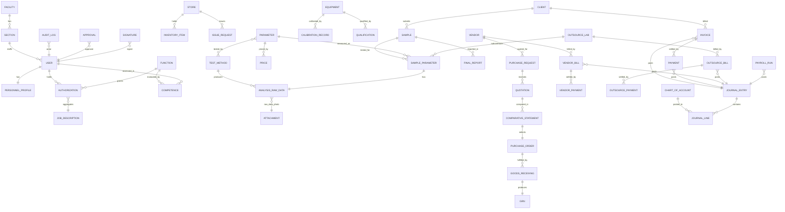
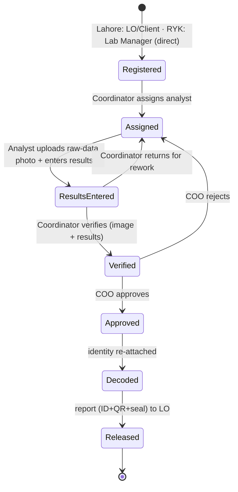
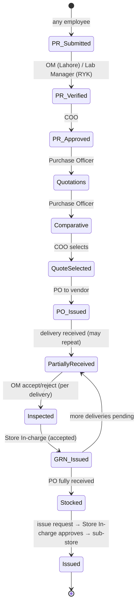

# BECS Analytics LIMS — Single Source of Truth (SSOT)

> **Status:** v2 (living) — reconciled with the implemented build · **Owner:** BECS Analytics · **Audience:** product, engineering, QA, lab management
>
> This is the **authoritative** reference for everything cross-cutting in the LIMS. Module specs ([docs/modules/](modules/)) reference this document and must not duplicate or contradict it. When a rule changes, change it **here first**.
>
> **Implementation note:** all six modules are under active development against a running Next.js + PostgreSQL build; sections below marked with implementation specifics reflect the current code. An application super-admin role (`ADMIN`, §5) exists outside the SSOT role matrix for platform administration.

---

## 1. Purpose & Product Vision

BECS Analytics operates testing/QC laboratories that need to replace manual, paper-based workflows with a single web application that enforces controlled, auditable processes end to end. The LIMS will:

- Register clients and samples, route them through **blinded** testing, and produce **traceable, sealed, QR-stamped reports**.
- Enforce **role-based approval chains** (most terminating at the COO) for personnel, procurement, and reporting.
- Maintain **inventory, procurement, equipment calibration/qualification, and finance** in one system scoped per facility and section.
- Provide an **audit trail and traceability** suitable for an accredited testing environment (ISO/IEC 17025-aligned in spirit).

**Intended outcome:** every test result is reproducibly traceable to a method, a calibrated instrument, and an authorized analyst; every approval is recorded; and no privileged data crosses section/facility boundaries without authorization.

## 2. Scope

**In scope (this build) — 6 modules:**

| # | Module | One-line scope |
|---|---|---|
| 1 | Personnel | HR profile, functions, competence, authorization, attendance, leave, undertakings |
| 2 | Inventory & Procurement | Main store + sub-stores (Lahore, RYK), per-item reorder thresholds & automatic stock status, issue requests, procurement workflow, vendors |
| 3 | Samples & Client | Client/sample registration, blinding, third-party reporting, parameters & prices, quotations, invoices, outsourced parameters |
| 4 | Testing & Reporting | Test methods, raw-data capture, verification, approval, final reports |
| 5 | Equipment & Traceability | Calibration, equipment repair/gate-pass/qualification, chemicals, glassware, lab supplies |
| 6 | Finance & Payroll | Double-entry GL, client receivables & payments, vendor + external-lab payables, utilities/expenses, payroll (FBR salary tax) |

**Deferred (extensibility hooks only — see §16):** staff Training, QMS/CAPA (Non-Compliance, Corrective Action), Quality Control (control charts, intermediate checks, interlab comparisons), Environment & Facilities, Risk Assessment, Internal Audit.

## 3. Glossary & Domain Terminology

| Term | Meaning |
|---|---|
| **SSOT** | This document — the single source of truth |
| **Facility** | A physical lab location: **Lahore** (Parent Lab) or **RYK** (Rahimyar Khan, on-site QC Sub-Lab) |
| **Section** | An organizational unit: **Lahore Lab**, **RYK Lab**, **Management** |
| **Blinding** | Concealing client/customer identity from analysts and the OM; samples are seen as coded IDs only |
| **Decoding** | Re-attaching client identity to a sample/report, unlocked only after COO approval, for the Liaison Officer |
| **Function** | A discrete authorized task (e.g. "run method TM-014", "sign final reports", "operate ICP") |
| **Competence** | An evaluation that a person can perform a Function; precondition for Authorization |
| **Authorization** | A COO-granted right to perform a Function; only authorized Functions are visible/actionable |
| **Accredited parameter** | A test parameter the lab is formally accredited to report |
| **GRN** | Goods Receiving Note — issued by the Store In-charge after accepted inspection |
| **PR / PO** | Purchase Request / Purchase Order |
| **Comparative Statement** | Side-by-side comparison of vendor quotations used to select a quote |
| **Issue request** | A request to move stock from the Main Store to a sub-store; **approved by the Store In-charge** (approval moves the on-hand balance) |
| **Reorder threshold** | The per-item on-hand level at or below which an item's status becomes **Reorder** (or **Out** at zero); drives the reorder / PR prompts |
| **Outsource Lab** | An external subcontractor laboratory that runs parameters the lab outsources; what we owe it is tracked as **external-lab bills** (payables), and it enters results via an outsource portal |
| **CoA** | Certificate of Analysis (for chemicals/reference materials) |
| **MSDS** | Material Safety Data Sheet |
| **CRM** | Certified Reference Material — a reference standard with a certified value, lot, and expiry. Procured via Inventory & Procurement (full path) and tracked with its reference certificate in Equipment & Traceability; also the QC reference material used by the deferred Quality Control module |
| **IQ / OQ / PQ** | Installation / Operational / Performance Qualification of equipment |
| **Citrate-Soluble P₂O₅** | Citrate-soluble phosphorus pentoxide — a fertilizer phosphate-availability parameter |
| **Total Zinc** | Total zinc content parameter (e.g. on Raw Zinc) |
| **Zabardast Urea, Raw Zinc, AOM, MPF, BAZ** | BECS product / sample / parameter codes used in RYK on-site QC. Seeded as **named master-data values** (parameters are **accredited**); exact technical definitions, units, and test methods to be supplied by BECS before go-live. |
| **Bio Tech Fertilizers (Pvt) Ltd** | The client billed by the RYK on-site QC lab; receives a **monthly consolidated invoice** for all RYK testing (see §5, [Module 06](modules/06-finance-and-payroll.md)) |

> **Open item (deferred, non-blocking):** BECS to supply precise definitions, units, and test methods for BAZ, AOM, MPF, Zabardast Urea, and Raw Zinc so the (accredited) parameter master data is finalized. They are recorded as named values until then.

## 4. Organization, Facilities & Sections

**Facilities:** Lahore (Parent Lab) · RYK (on-site QC Sub-Lab).
**Sections:** Lahore Lab · RYK Lab · Management (Management is located at Lahore).

**Technical hierarchy:** COO → Operations Manager (OM) → Lab Manager (RYK) → Analyst → Lab Assistant → Lab Attendant.

**Management hierarchy:** COO → Operations Manager (OM) → { Liaison Officer · Accountant · Purchase Officer · Store In-charge · IT Officer · Sales & Marketing Officer }.

The **COO** is the top approving authority for nearly all controlled actions. The **OM** is the primary operational coordinator at **Lahore** (creates profile shells, inspects goods, assigns samples, verifies results). At **RYK** there is **no Liaison Officer and no OM-portal step**: the **Lab Manager (RYK)** performs the local coordinating roles — sample registration, analyst assignment, result verification, and PR verification — with the COO still approving.

## 5. Roles, Designations & Approval Matrix

This table is the **source of truth for who initiates vs. who approves**. Module specs must reference it rather than restate it.

| Action | Initiator | Reviews / Verifies | Approves / Authorizes | Result |
|---|---|---|---|---|
| HR profile creation | OM (shell: name, contact, email, designation, joining date) | User completes own detail | **COO** | User account created; user active |
| Function add/remove/edit | OM | — | **COO** | Function available for authorization |
| Competence evaluation | OM / designated evaluator | — | — | Competence record (precondition for authorization) |
| Authorization to a Function | OM (proposes) | — | **COO** | User may perform that Function; it appears in their UI |
| Resignation | OM | — | — | User tagged **non-active** |
| Daily attendance | User (e-sign **check-in & check-out**) | — | — | Attendance record (leave/holiday auto-integrated) |
| Leave application | User | — | Approver per hierarchy | Leave approved/rejected (applications only — no quota tracking) |
| Purchase Request (PR) | Any employee | **OM** (Lahore) / **Lab Manager** (RYK) verifies | **COO** | PR approved → quotations may be requested |
| Quotations | Purchase Officer | — | — | Quotations recorded against PR |
| Comparative Statement | Purchase Officer | — | **COO** (selects a quote) | PO may be generated |
| Purchase Order (PO) | Purchase Officer | — | (per COO quote selection) | PO sent to vendor |
| Simplified PO (stationery/sanitary/furniture/PPE/utilities) | Any employee / Purchase Officer | — | **COO** | PO directly (no quotation/comparative) |
| Goods receiving | Purchase Officer (marks received) | **OM** inspects (accept/reject) | — | Accepted items → GRN |
| GRN | **Store In-charge** | — | — | Goods enter main store |
| Issue request (main → sub-store) | Any personnel | — | **Store In-charge** | Item issued to sub-store |
| Vendor registration | Accountant | — | — | Vendor available for procurement |
| Invoice (vendor side) | Accountant / Purchase Officer | — | — | Payment status tracked |
| Client registration | Liaison Officer | — | — | Client available |
| Test request / sample registration | **Lahore:** Client or Liaison Officer · **RYK:** Lab Manager (RYK) (direct) | — | — | Sample registered, coded Lab ID assigned |
| Sample → analyst assignment | **Lahore:** OM (OM Portal) · **RYK:** Lab Manager (RYK) | — | — | Analyst can test |
| Raw data + results | Analyst (blinded) — **uploads photo of raw-data sheet + enters results** | **Lahore:** OM verifies · **RYK:** Lab Manager (RYK) verifies (reviews image + results) | **COO** | Report approved → decode |
| Final report release | System (on COO approval) | — | — | Decoded report shown to Liaison Officer (unique ID + QR + seal) |
| Client quotation | Liaison Officer / Sales & Marketing Officer | — | — | Quotation issued to client |
| Client invoice | Liaison Officer | — | — | Invoice issued; revenue recorded |
| Client payment (incoming) | **Accountant or Liaison Officer** | — | — | Payment recorded; receivable settled |
| Outgoing payment (vendor/utility/payroll) | Accountant | — | **COO** (every payment) | Payment disbursed |
| Payroll run (monthly) | Accountant | — | **COO** | Payroll approved & disbursed |

> **Application super-admin (`ADMIN`).** An implementation role that sits **outside** this matrix: full view/edit/delete across every module for platform administration (a generic Admin data panel, login auditing). It **bypasses the Tier-1 designation gates** in §6, but **every action is still written to the immutable audit log** (BR-5). It is not a lab/management designation and never participates in approval chains.
>
> **External portal logins.** `CLIENT`, `VENDOR`, and `OUTSOURCE_LAB` are Users with their own portals (own samples/reports, own POs/quotations, own outsourced results) and are excluded from staff rosters (personnel, payroll, competence).

## 6. Authorization Model

Two tiers, both enforced server-side:

1. **Tier 1 — Role/Designation permissions:** what module/screen a user may access at all (e.g. only the Accountant registers vendors; only the LO registers clients).
2. **Tier 2 — Function capability gating:** what specific authorized **Functions** a user may perform. **Only authorized Functions render in the UI and are invokable.**

**The chain:**

```
Function ──(competence evaluation)──▶ Competence ──(COO grants)──▶ Authorization ──(aggregate)──▶ Job Description
```

- A **Function** is the pivot; technical capabilities link to it (a `TestMethod` requires Function(s); signing a final report requires a "report-signatory" Function; operating an instrument may require an equipment Function).
- **Authorization** is granted by the **COO**, tied to the user's **designation**, and carries effective/expiry validity.
- **Job Description** is *derived* from the set of a person's active Authorizations.
- **Validity is evaluated at action time and as of the test date.** A lapsed competence/authorization closes the gate and retroactively flags affected results.
- **Segregation of duty:** the testing chain enforces distinct people — Analyst (performs) → verifier (**OM** at Lahore / **Lab Manager** at RYK) → COO (approves).

See [ADR-0002](adr/0002-blinding-and-decoding.md) and module spec [04-testing-and-reporting](modules/04-testing-and-reporting.md).

## 7. Section + Facility Scoping Rules

- Every record is stamped with `facilityId` and `sectionId`.
- **Default visibility:** a user sees only their own section's data.
- **Cross-section/facility read** is an **explicit scoped capability** granted to senior roles (COO, OM) — never an implicit bypass.
- Enforcement is **centralized** in the data-access layer (a Prisma extension that injects scope from the session), with **PostgreSQL Row-Level Security (RLS)** as defense-in-depth.
- RYK is a distinct facility; Lahore Lab and Management are distinct sections within Lahore.

See [ADR-0003](adr/0003-section-and-facility-scoping.md).

## 8. Blinding & Decoding Rules

The most distinctive requirement of this system.

- On registration, every sample receives a **coded Lab ID**. The `Client ↔ Sample` identity link is **access-gated**.
- **Analysts and the OM see only** the coded Lab ID, sample type, and the parameters to test — **never** the client/customer identity.
- **Decoding** (re-attaching client identity) is **unlocked only after COO approval** of the report and is exposed to the **Liaison Officer** for client-facing release.
- Blinding is enforced in the **data-access layer**, not merely hidden in the UI. Every decode event is **audited** (who, when, which report).
- Reports where the client requested issuance "in the name of a third party" carry that third-party identity at decode time.

See [ADR-0002](adr/0002-blinding-and-decoding.md).

## 9. Global Domain Model (ERD)

Key entities and relationships (module-specific fields live in module specs).



Cross-cutting entities attached polymorphically to most others: **`AuditLog`**, **`Attachment`**, **`Approval`/`ApprovalStep`**, **`Signature`**, **`Sequence`** (numbering), **`Notification`**.

## 10. Cross-Cutting Workflows & State Machines

**Approval routing (generic):** `Draft → Submitted → (Reviewed) → Approved | Rejected → (Rework → Submitted)`. Routing target derived from the org hierarchy and document type (most route to COO).

**Sample → Report lifecycle:**

Registration, assignment, and verification are performed by the **OM** at Lahore and by the **Lab Manager (RYK)** at RYK (D17); the COO approves in both. "Coordinator" below = OM @ Lahore / Lab Manager @ RYK.



**Procurement (full path):**



**Partial receipts (BR-19):** a PO may be received in **multiple deliveries**, each with its own inspection and GRN, until fully received.

**Path is per line item (BR-18):** a PR may contain **mixed-path** line items; each item is routed down the **full** path or the **simplified** path (no quotations/comparative — stationery, sanitary supplies, furniture, PPE, utilities, BR-9). Calibration and equipment-repair procurement reuse the **full path**.

**Stores & reorder (BR-10):** stock is held in three stores — **Main Store** (Lahore) plus sub-stores **Lahore** and **Rahim Yar Khan**. Inventory items are grouped by register (Chemical, Standard Solution, Glassware, Equipment, Store Item, Miscellaneous, Stationery) with category-specific fields (e.g. equipment has specification + accessories, no packing; glassware's size is its specification). Each item's status — **In stock / Reorder / Out** — is derived automatically from its on-hand balance vs a per-item **reorder threshold**. A low item is replenished either by an **issue request** from the Main Store (the Store In-charge approves, which moves the balance) or, only when the Main Store is out of it, by a **purchase requisition** raised directly from the store view (single or multi-item).

## 11. Numbering & Identifier Standards

All identifiers are **gap-free, unique, non-reusable, section/facility-prefixed, and generated concurrency-safely** within the creating transaction (DB sequence / advisory lock).

| Entity | Format (example) | Notes |
|---|---|---|
| Lab/Sample ID | `LHR-S-2026-000123` / `RYK-S-2026-000045` | Facility prefix + type + year + counter; the **coded** ID seen by analysts |
| Final Report No | `LHR-R-2026-000123` | Carries a **QR code** encoding a verification URL/hash |
| Purchase Request | `PR-LHR-2026-00045` | |
| Purchase Order | `PO-LHR-2026-00045` | |
| GRN | `GRN-LHR-2026-00045` | |
| Vendor No | `VEN-00123` | Company-wide |
| Client No | `CLI-00123` | Company-wide |
| Invoice No | `INV-LHR-2026-00045` | RYK monthly consolidated invoice to Bio Tech Fertilizers: `INV-RYK-2026-06` (one per month) |
| Journal Entry No | `JE-2026-000123` | Double-entry GL (BR-16) |
| Payroll Run No | `PAY-LHR-2026-06` | One run per facility/section per month |

> Counters reset per year per facility where shown. Exact prefixes to be finalized with BECS.

## 12. Global Business-Rules Catalog

Rules are numbered `BR-n` and referenced by module specs.

- **BR-1** Most controlled actions require **COO approval** (see §5).
- **BR-2** A user can perform a Function **only** if they hold a valid, non-expired **Authorization** for it (§6).
- **BR-3** Analysts and the OM operate on **blinded** samples; identity is revealed only after COO approval (decode) (§8).
- **BR-4** Reporting enforces **segregation of duty**: Analyst ≠ verifier (OM @ Lahore / Lab Manager @ RYK) ≠ approving COO.
- **BR-5** Every create/update/delete on a controlled record writes an **immutable audit-log** entry.
- **BR-6** Every record is **scoped** to a facility and section; cross-scope access requires an explicit capability (§7).
- **BR-7** Identifiers are **gap-free, unique, non-reusable** (§11).
- **BR-8** A **Final Report** is an immutable, hash-sealed snapshot; amendments create a new version linked to the superseded one.
- **BR-9** Stationery/sanitary/furniture/PPE/utilities use the **simplified procurement path** (no quotations/comparative).
- **BR-10** New stock enters the **Main Store** (Lahore); it moves to a sub-store (**Lahore** or **Rahim Yar Khan**) only via an **issue request approved by the Store In-charge** (approval moves the on-hand balance). Each item's status (In stock / Reorder / Out) is automatic from its balance vs a per-item reorder **threshold**; a sub-store raises a **purchase requisition** for an item only when the Main Store cannot supply it.
- **BR-11** Goods are usable only after **OM inspection (accepted)** and **GRN** issuance.
- **BR-12** A resigned employee is tagged **non-active** and retains historical records (never hard-deleted).
- **BR-13** Test traceability links each result to **method version, instrument calibration validity, and analyst authorization as of the test date**.
- **BR-14** Timestamps are **server-authoritative** (NTP-synced); client-supplied times are never trusted for signatures/results.
- **BR-15** **Every** outgoing payment (vendor, utility, payroll) requires **COO approval** — no threshold.
- **BR-16** Finance is a **full double-entry general ledger** and the **system of record**; every financial event posts balanced journal entries (Σdebits = Σcredits). Currency is **PKR** only.
- **BR-17** A result entered on an instrument whose **calibration is expired** as of the test date is **allowed but flagged** (out-of-calibration), not blocked — distinct from authorization, which blocks. Refines BR-13.
- **BR-18** A PR's procurement path is decided **per line item**; full and simplified items may coexist in one PR.
- **BR-19** A PO may be received via **partial deliveries**, each independently inspected and GRN'd, until fully received.
- **BR-20** Attendance is captured as **e-signed check-in/check-out** with automatic **leave/holiday integration**; leave is **applications-only** (no quota/balance tracking).
- **BR-21** Salary income tax is computed on the **annualised taxable pay** against the **FBR salaried-person slabs (Tax Year 2026-27)**; **medical allowance is exempt up to 10% of basic** and **cash allowances are non-taxable**. Payroll is prepared by the Accountant and approved by the COO (BR-15).
- **BR-22** Amounts owed **to** vendors and external labs (from their bills) and owed **by** clients (from invoices) are tracked per counterparty as **billed / paid / outstanding**; "paid" is the sum of recorded payments against that party's bills/invoices (payments carry no direct counterparty link, so the sum is authoritative).

## 13. Non-Functional Requirements

- **Security & access:** two-tier authorization (§6), section/facility scoping + RLS (§7), least privilege, Argon2id password hashing.
- **Audit & integrity:** append-only `AuditLog` (no update/delete paths, enforced at DB privilege level); e-signatures capture signer, meaning, timestamp; records hash-sealed where sealed (reports, undertakings).
- **Traceability:** time-anchored links (BR-13); historical reports reproducible years later via stored sealed snapshots (BR-8).
- **Availability & data retention:** nightly automated backups (`pg_dump` + object-store sync); multi-year retention; deterministic, reversible migrations.
- **Performance:** server-side pagination/filtering on all list/log screens; dashboards backed by indexed queries.
- **Deployment:** on-premise-friendly via Docker Compose; offline-friendly (bundled fonts/assets, no hard CDN dependency); host NTP-synced.
- **Time:** server-authoritative timestamps only (BR-14).
- **Financial integrity:** Finance is a **full double-entry GL** and the **system of record** (BR-16); journal entries are balanced and append-only (corrections via reversing entries, never edits); periods are closed and locked. See [ADR-0004](adr/0004-finance-accounting-model.md).

## 14. Technology Stack & Architecture Summary

| Layer | Choice |
|---|---|
| Framework | Next.js (App Router, TypeScript) |
| Database / ORM | PostgreSQL + Prisma (extensions: `citext`, `pgcrypto`) |
| Auth | Auth.js (Credentials, Argon2id) + custom two-tier authorization |
| UI | Tailwind CSS + shadcn/ui |
| Forms / mutations | **Server Actions** (native `<form>` + `useActionState`); **Zod** for server-side validation |
| Data & tables | Server Components query Prisma directly; lists render with shadcn/ui `Table` (server-side filtering) |
| Charts | Lightweight inline SVG / CSS (composition bars, stat tiles) |
| File storage | **Local filesystem** (`src/lib/storage/local`) today — CoA, MSDS, cal certs, quotations, raw-data photos, sealed reports; S3-compatible object storage (MinIO, provisioned via Docker Compose) is the on-prem target (`Attachment.storageKey`) |
| PDF / QR | **Browser print** (print-CSS pages) for documents; `qrcode` for report QR codes |
| Background jobs | Deferred (planned: Postgres-backed queue) |
| Deployment | Docker Compose (Postgres + MinIO provided; app runs via `npm run dev` against them) behind a TLS reverse proxy for on-prem |

Full rationale: [ADR-0001](adr/0001-tech-stack.md). The Finance module is a **full double-entry general ledger** and system of record — see [ADR-0004](adr/0004-finance-accounting-model.md).

## 15. Conventions

- **Entities:** PascalCase singular (`PurchaseOrder`); tables via Prisma mapping.
- **Identifiers:** human-facing IDs follow §11; internal PKs are UUID/cuid.
- **Files:** module docs `docs/modules/0N-kebab-name.md`; ADRs `docs/adr/NNNN-kebab-title.md`.
- **Commits:** Conventional Commits (`docs:`, `feat:`, `fix:`, scoped e.g. `docs(personnel):`).
- **Status values:** lifecycle states use the names in §10 state machines.
- **Dates/times:** stored UTC, server-authoritative; displayed in facility-local time.
- **Currency:** **PKR** only; monetary amounts stored as integer minor units (paisa) to avoid float error.

## 16. Deferred-Scope Extensibility Hooks

The deferred modules attach to existing engines **without re-architecture**:

- **Training** → reuses Personnel (Competence/Authorization), Attachment (certificates), Approval, Calendar/scheduling.
- **QMS / CAPA** (Non-Compliance, Corrective Action) → a polymorphic CAPA workflow keyed on a *source* (complaint, audit finding, out-of-spec result) reusing the Approval engine and AuditLog.
- **Quality Control** (control charts, intermediate checks, interlab comparisons) → reuses Sample/Result data + a QC-rule engine and chart layer.
- **Environment & Facilities** → reuses readings/threshold + Notification + dashboard widgets.
- **Risk Assessment / Internal Audit** → reuse Approval, AuditLog, Attachment, and the CAPA workflow for findings.

The **procurement, approval, attachment, master-data, and audit** subsystems are therefore designed generic/polymorphic from day one (see module specs and ADRs).
