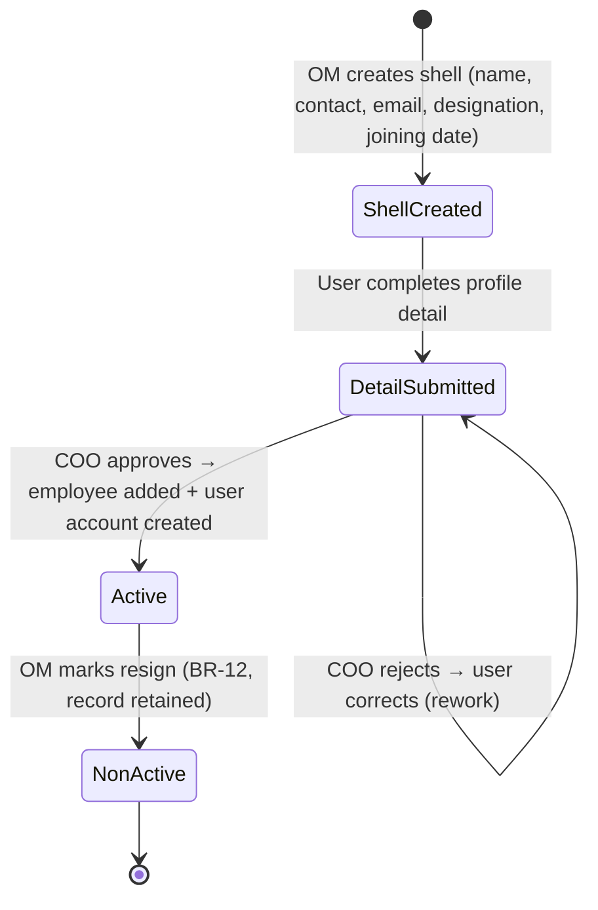
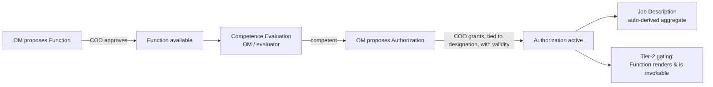
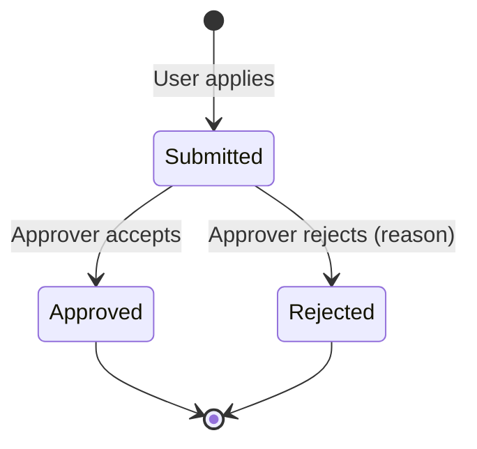

# Module 01 — Personnel

> **Status:** Draft v1 · **Module owner:** BECS Analytics
> **Authoritative cross-cutting reference:** [SSOT](../SSOT.md). This spec **references** the SSOT and must not duplicate or contradict it. Original raw requirements: [BECS Analytics LIMS.md](../../BECS%20Analytics%20LIMS.md).

---

## 1. Overview & Purpose

The **Personnel** module is the system of record for people working in the two BECS Analytics facilities (Lahore Parent Lab and RYK Sub-Lab) across the three sections — **Lahore Lab, RYK Lab, Management**. It governs the full employee lifecycle: from a profile **shell** created by the Operations Manager, through self-service detail entry, COO approval and account creation, the definition of **Functions**, **Competence** evaluation, COO-granted **Authorizations**, derived **Job Descriptions**, day-to-day **attendance** and **leave**, e-signed **Impartiality & Confidentiality** undertakings, and finally **resignation** (non-active tagging, never deletion).

Personnel is the **authorization backbone** of the LIMS: the `Function → Competence → Authorization → Job Description` chain defined in [SSOT §6](../SSOT.md#6-authorization-model) is owned here, and every other module's Tier-2 capability gating reads from the Authorizations granted in this module.

**Outcome:** every person in the system is traceably linked to the Functions they are competent and authorized to perform, every controlled personnel action is COO-gated and audited, and no employee record is ever lost — resigned staff are retained as non-active for historical traceability.

## 2. Roles Involved

Roles, the org hierarchy, and the full **initiator → reviewer → approver** matrix are defined once in [SSOT §5](../SSOT.md#5-roles-designations--approval-matrix) and the hierarchy in [SSOT §4](../SSOT.md#4-organization-facilities--sections). This module does **not** restate the matrix. Summary of who touches Personnel:

| Role | Involvement in Personnel |
|---|---|
| **COO** | Approves HR profiles, Functions, and Authorizations; top approver for leave per hierarchy. See [SSOT §5](../SSOT.md#5-roles-designations--approval-matrix). |
| **Operations Manager (OM)** | Creates profile shells; adds/removes/edits Functions (proposes); proposes Authorizations; marks resignations. |
| **User (any employee)** | Completes own profile detail; e-signs daily attendance check-in **and** check-out; applies for leave; e-signs the Impartiality & Confidentiality undertaking. |
| **Designated evaluator** | Performs Competence evaluation (may be OM or a senior technical role). |
| **Leave approver** | Approves/rejects leave per the org hierarchy ([SSOT §4](../SSOT.md#4-organization-facilities--sections)). |

## 3. In-Scope / Out-of-Scope

**In scope**

- Three sections of personnel administration: **Lahore Lab, RYK Lab, Management**.
- HR Profile split-entry (OM shell → user detail → COO approval → account creation).
- Functions management (add/remove/edit, COO-approved).
- Competence Evaluation keyed on Functions.
- Authorization (COO-granted, designation-linked) and Tier-2 visibility gating.
- Job Description derivation from active Authorizations.
- Employee Attendance (daily e-signed check-in & check-out; leave/holiday auto-integrated) ([BR-20](../SSOT.md#12-global-business-rules-catalog)).
- Leave application & acceptance (applications-only; no balance/quota tracking) ([BR-20](../SSOT.md#12-global-business-rules-catalog)).
- Impartiality & Confidentiality Policy + e-signed Undertaking.
- Resignation → non-active tagging with historical retention.
- Per functional area: **Logs** and **Dashboard**.

**Out of scope (handled elsewhere or deferred)**

- Payroll / salary computation → **Module 06 Finance & Payroll**.
- Staff **Training** as a managed workflow → deferred ([SSOT §16](../SSOT.md#16-deferred-scope-extensibility-hooks)); only the `trainings` profile field and a Training hook exist here.
- The Tier-1 role/screen permission model itself → defined in [SSOT §6](../SSOT.md#6-authorization-model) (this module consumes it).
- Cross-cutting audit-log, attachment, signature, approval and numbering engines → [SSOT §9–§12](../SSOT.md#9-global-domain-model-erd).

## 4. Feature List

| # | Feature | Description | Primary role |
|---|---|---|---|
| F-1 | **HR Profile shell** | OM creates a minimal profile (name, contact #, email, designation, joining date). | OM |
| F-2 | **Self-service profile completion** | The created user fills the remaining personal/professional fields. | User |
| F-3 | **Profile approval & account creation** | COO approves; on approval the employee becomes active and a user account is provisioned. | COO |
| F-4 | **Functions management** | Add / remove / edit Functions; each defines a competence unit. COO-approved. | OM (proposes) → COO |
| F-5 | **Competence Evaluation** | Evaluate whether a person can perform a Function; precondition for authorization. | OM / designated evaluator |
| F-6 | **Authorization** | Grant the right to perform a Function, tied to designation, with validity. | COO (OM proposes) |
| F-7 | **Tier-2 capability gating** | Only authorized Functions render and are invokable in the user's UI. | System |
| F-8 | **Job Description** | Auto-derived, read-only view aggregating a person's active Authorizations. | System |
| F-9 | **Daily Attendance** | User e-signs a daily **check-in and check-out**; `hoursWorked` derived. Approved-leave days and holidays are auto-integrated (not marked present). | User |
| F-10 | **Leave application & acceptance** | User applies; approver accepts/rejects per hierarchy. Applications-only — no balances/quotas tracked. | User / approver |
| F-11 | **Impartiality & Confidentiality Undertaking** | Policy display + e-signed, hash-sealed undertaking. | User |
| F-12 | **Resignation** | OM marks resign → user tagged non-active; records retained. | OM |
| F-13 | **Logs** | Per functional area immutable activity logs (reads from AuditLog). | System |
| F-14 | **Dashboard** | Per functional area summary widgets (headcount, pending approvals, attendance, leave, expiring authorizations). | System |

## 5. Workflows & State Transitions

### 5.1 HR Profile lifecycle (split-entry)

1. **OM** creates a profile **shell** entering only `{ title?, name, contactNumber, email, designation, dateOfJoining }` and the target `section` / `facility`. State → **ShellCreated**.
2. The system notifies the intended employee; the **user** logs into a provisional onboarding context and completes the remaining fields (see §6). State → **DetailSubmitted**.
3. **COO** reviews the completed profile. On **approve**: the employee record is marked **Active**, a **user account is created** (credentials issued), and Tier-1 access for the designation is enabled. State → **Approved/Active**. On **reject**: returned for correction. State → **DetailSubmitted** (rework).
4. On **resignation**, **OM** marks resign → state → **NonActive** (record retained, [BR-12](../SSOT.md#12-global-business-rules-catalog)).



> Provisional account context for step 2 (how the user logs in to complete detail before full approval) — see **Open Question OQ-1**.

### 5.2 Function → Competence → Authorization → Job Description chain

Mirrors [SSOT §6](../SSOT.md#6-authorization-model). A Function is the pivot; competence is its precondition; the COO grants authorization; the job description is the aggregate.



**Function management:** OM adds/edits/removes a Function → COO approves → Function becomes available for competence/authorization. Removing or expiring a Function/Authorization closes the gate and retroactively flags affected results ([SSOT §6](../SSOT.md#6-authorization-model), [BR-13](../SSOT.md#12-global-business-rules-catalog)).

### 5.3 Leave application & acceptance

1. **User** submits a leave application `{ type, startDate, endDate, reason }`.
2. Routed to the **approver per hierarchy** ([SSOT §4](../SSOT.md#4-organization-facilities--sections)).
3. Approver **approves** or **rejects** (with reason). State → **Approved** / **Rejected**.



### 5.4 Attendance (daily e-signed check-in & check-out)

Each working day a user records **two** e-signed events on one immutable attendance record ([BR-20](../SSOT.md#12-global-business-rules-catalog)):

1. **Check-in** — user opens the attendance screen → applies **e-signature**; `checkIn` is stamped with a **server-authoritative** timestamp ([BR-14](../SSOT.md#12-global-business-rules-catalog)). State → **CheckedIn**.
2. **Check-out** — at end of day the user applies **e-signature** again; `checkOut` is stamped (server time) and `hoursWorked` is **derived** from check-in/check-out. State → **CheckedOut**.

There is **no single present-mark** and **no approval step**. **Leave and holidays are integrated automatically:** a day covered by an **approved leave** ([§5.3](#53-leave-application--acceptance)) or a configured holiday is set to status `OnLeave` / `Holiday` and requires no check-in/check-out — such days are **not** marked present.

### 5.5 Impartiality & Confidentiality Undertaking

User reads the displayed Policy → confirms → applies **e-signature**. The undertaking is **hash-sealed** (captures signer, meaning, timestamp) and stored; re-issuance creates a new linked version.

## 6. Data Entities & Fields

Entity relationships are defined in the global ERD ([SSOT §9](../SSOT.md#9-global-domain-model-erd)): `USER ||--|| PERSONNEL_PROFILE`, `USER ||--o{ AUTHORIZATION`, `FUNCTION ||--o{ COMPETENCE`, `FUNCTION ||--o{ AUTHORIZATION`, `AUTHORIZATION }o--|| JOB_DESCRIPTION`. Module-specific fields only are listed below; cross-cutting entities (`AuditLog`, `Attachment`, `Approval`, `Signature`, `Sequence`, `Notification`) are reused per [SSOT §9](../SSOT.md#9-global-domain-model-erd) and not redefined.

### 6.1 PersonnelProfile

**Shell fields (entered by OM):**

| Field | Type | Notes |
|---|---|---|
| name | text | Required |
| contactNumber | text | Required |
| email | citext | Required, unique |
| designation | enum | Drives Tier-1 permissions and Authorization linkage |
| dateOfJoining | date | Required |
| sectionId / facilityId | ref | Scoping ([SSOT §7](../SSOT.md#7-section--facility-scoping-rules)) |

**Detail fields (entered by the user):**

| Field | Type | Notes |
|---|---|---|
| title | enum | Mr/Ms/Dr/etc. |
| fathersName | text | |
| dateOfBirth | date | |
| cnic | text | National ID; unique |
| bloodGroup | enum | |
| emergencyContactNumber | text | |
| education | text / list | |
| experience | text / list | |
| publications | text / list | |
| trainings | text / list | Training hook ([SSOT §16](../SSOT.md#16-deferred-scope-extensibility-hooks)) |
| skills | text / list | |
| status | enum | `ShellCreated · DetailSubmitted · Active · NonActive` |

### 6.2 Function

| Field | Type | Notes |
|---|---|---|
| name / code | text | Discrete authorized task (e.g. "run method TM-014") |
| description | text | Defines the competence unit |
| approvalStatus | enum | `Proposed · Approved` (COO) |
| active | bool | Soft-disable; never hard-delete if referenced |

### 6.3 Competence

| Field | Type | Notes |
|---|---|---|
| userId | ref | Person assessed |
| functionId | ref | Function evaluated |
| evaluatorId | ref | OM / designated evaluator |
| result | enum | `Competent · NotYetCompetent` |
| evaluatedOn | date | Precondition for Authorization |

### 6.4 Authorization

| Field | Type | Notes |
|---|---|---|
| userId | ref | Authorized person |
| functionId | ref | Authorized Function |
| designation | enum | Linked to user's designation |
| grantedBy | ref | **COO** |
| effectiveFrom / expiresOn | date | Validity evaluated at action time and as of test date ([SSOT §6](../SSOT.md#6-authorization-model), [BR-2](../SSOT.md#12-global-business-rules-catalog)) |
| status | enum | `Active · Lapsed · Revoked` |

### 6.5 JobDescription (derived)

Read-only aggregate of a user's **active** Authorizations; not independently editable.

### 6.6 AttendanceRecord

| Field | Type | Notes |
|---|---|---|
| userId | ref | |
| date | date | One record per user per day |
| checkIn | timestamp | Server-authoritative check-in time ([BR-14](../SSOT.md#12-global-business-rules-catalog)); null on leave/holiday |
| checkOut | timestamp | Server-authoritative check-out time; null until checked out / on leave/holiday |
| hoursWorked | interval | **Derived** from `checkOut − checkIn`; null until checked out |
| checkInSignatureId | ref | E-signature for check-in |
| checkOutSignatureId | ref | E-signature for check-out |
| status | enum | `CheckedIn · CheckedOut · OnLeave · Holiday` — `OnLeave`/`Holiday` auto-set, never present ([BR-20](../SSOT.md#12-global-business-rules-catalog)) |

### 6.7 LeaveApplication

Leave is **applications-only**: the system tracks individual applications and their decisions but does **not** maintain leave balances, quotas, or entitlements ([BR-20](../SSOT.md#12-global-business-rules-catalog)).

| Field | Type | Notes |
|---|---|---|
| userId | ref | Applicant |
| type | enum | Annual / Sick / Casual / etc. |
| startDate / endDate | date | |
| reason | text | |
| approverId | ref | Per hierarchy |
| status | enum | `Submitted · Approved · Rejected` |
| decisionReason | text | On reject |

### 6.8 Undertaking

| Field | Type | Notes |
|---|---|---|
| userId | ref | |
| policyVersion | text | Impartiality & Confidentiality Policy version |
| signatureId | ref | E-signature |
| sealHash | text | Hash-sealed snapshot; new version links to superseded |

## 7. Screens / Views

**Part 1 — HR Profile / Functions / Competence / Authorization / Job Description**

- **HR Profile list** — by section (Lahore Lab, RYK Lab, Management); filter by status/designation.
- **Profile shell create** (OM) and **profile detail complete** (user) forms.
- **Profile approval queue** (COO).
- **Functions register** — add/remove/edit (OM), approval state (COO).
- **Competence Evaluation** screen.
- **Authorization** grant screen (COO) + per-user authorization list.
- **Job Description** (read-only, derived).
- **Logs** and **Dashboard**.

**Part 3 — Attendance & Leave**

- **Daily attendance** (e-signed check-in & check-out; leave/holiday days shown auto-integrated).
- **Leave application** form + **leave acceptance** queue (approver).
- **Logs** and **Dashboard**.

**Part 4 — Impartiality & Confidentiality**

- **Policy** display + **Undertaking** (e-sign).
- **Logs**.

All list/log screens use server-side pagination/filtering ([SSOT §13](../SSOT.md#13-non-functional-requirements)); all views are section/facility-scoped ([SSOT §7](../SSOT.md#7-section--facility-scoping-rules)).

## 8. User Stories with Gherkin Acceptance Criteria

### US-1 — OM creates a profile shell
*As an OM, I want to create a minimal employee profile so the person can complete their own details.*

```gherkin
Given I am authenticated as the OM
When I create a profile shell with name, contact number, email, designation and date of joining
Then a PersonnelProfile is created with status "ShellCreated"
And I cannot enter any of the user-owned detail fields
And the action is written to the AuditLog
```

### US-2 — User completes their profile
*As a created user, I want to fill in my personal and professional details.*

```gherkin
Given a profile shell exists for me with status "ShellCreated"
When I submit title, father's name, date of birth, CNIC, blood group, emergency contact, education, experience, publications, trainings and skills
Then the profile status becomes "DetailSubmitted"
And the profile is routed to the COO for approval
```

### US-3 — COO approves a profile and account is created
*As the COO, I want to approve completed profiles so the employee becomes active.*

```gherkin
Given a profile has status "DetailSubmitted"
When I approve it
Then the employee is marked "Active"
And a user account is created for that person
And Tier-1 access for their designation is enabled
When instead I reject it
Then the profile returns to the user for correction with my reason recorded
```

### US-4 — OM manages Functions
*As an OM, I want to add, edit and remove Functions, subject to COO approval.*

```gherkin
Given I am the OM
When I add a new Function with a name and description
Then it is created with approval status "Proposed"
And it becomes available for competence and authorization only after the COO approves it
```

### US-5 — COO authorizes a competent user
*As the COO, I want to authorize personnel for Functions they are competent in.*

```gherkin
Given a user has a Competence result of "Competent" for a Function
When I grant an Authorization tied to the user's designation with an effective and expiry date
Then the Authorization status becomes "Active"
And the user's Job Description is updated to include that Function
And the user cannot be authorized for a Function without an existing "Competent" record (BR-2)
```

### US-6 — Tier-2 gating hides unauthorized Functions
*As a user, I should only see and perform Functions I am authorized for.*

```gherkin
Given I am an authenticated user
When I open any module screen
Then only Functions for which I hold a valid, non-expired Authorization render and are invokable
And a Function whose Authorization has expired is neither visible nor invokable (BR-2)
```

### US-7 — Daily attendance via e-signed check-in & check-out
*As a user, I want to e-sign a check-in and a check-out each working day so my hours are recorded.*

```gherkin
Given I am an authenticated active user
When I check in for today and apply my e-signature
Then an AttendanceRecord is created for me dated today with a server-authoritative checkIn timestamp (BR-14, BR-20)
And its status becomes "CheckedIn"
And I cannot create a second attendance record for the same day
When I later check out and apply my e-signature
Then the record's checkOut timestamp is stamped server-authoritatively
And hoursWorked is derived from checkIn and checkOut
And its status becomes "CheckedOut"

Given today is covered by an approved leave application or a configured holiday
When the attendance for that day is computed
Then the record's status is set to "OnLeave" or "Holiday" automatically
And no check-in or check-out is required and the day is not marked present
```

### US-8 — Leave application and acceptance
*As a user, I want to apply for leave and have it accepted or rejected.*

```gherkin
Given I am an authenticated active user
When I submit a leave application with type, start date, end date and reason
Then it is created with status "Submitted" and routed to my approver per the hierarchy
When my approver approves it the status becomes "Approved"
When my approver rejects it the status becomes "Rejected" with a reason recorded
```

### US-9 — Impartiality & Confidentiality undertaking
*As a user, I want to read the policy and sign the undertaking.*

```gherkin
Given I am viewing the Impartiality and Confidentiality Policy
When I confirm and apply my e-signature
Then an Undertaking is stored, hash-sealed, capturing my identity, meaning and server timestamp
And a re-issued undertaking creates a new version linked to the superseded one
```

### US-10 — Resignation tags non-active, retains history
*As an OM, I want to mark a resignation without deleting any records.*

```gherkin
Given an active employee resigns
When I mark them as resigned
Then their status becomes "NonActive"
And no historical record (attendance, authorizations, signatures, audit) is deleted (BR-12)
And their active Authorizations no longer gate any actions
```

## 9. Module Business Rules

References to the global **BR-n** catalog ([SSOT §12](../SSOT.md#12-global-business-rules-catalog)):

| Rule | Statement | Global ref |
|---|---|---|
| **MR-P1** | HR profile creation, Function add/remove/edit, and Authorization grants require **COO** approval. | [BR-1](../SSOT.md#12-global-business-rules-catalog) |
| **MR-P2** | A profile is split-entry: OM enters only the 5 shell fields; the user enters all detail fields; neither can edit the other's set. | Raw spec |
| **MR-P3** | A user may perform a Function only with a valid, non-expired Authorization; only authorized Functions render (Tier-2). | [BR-2](../SSOT.md#12-global-business-rules-catalog), [SSOT §6](../SSOT.md#6-authorization-model) |
| **MR-P4** | Competence is a **precondition** for Authorization; no authorization without a "Competent" record. | [SSOT §6](../SSOT.md#6-authorization-model) |
| **MR-P5** | Authorizations are **tied to the user's designation** and carry effective/expiry validity, evaluated at action time and as of the test date. | [BR-13](../SSOT.md#12-global-business-rules-catalog), [SSOT §6](../SSOT.md#6-authorization-model) |
| **MR-P6** | Job Description is **derived**, never directly edited. | [SSOT §6](../SSOT.md#6-authorization-model) |
| **MR-P7** | A resigned employee is tagged **non-active** and never hard-deleted; history is retained. | [BR-12](../SSOT.md#12-global-business-rules-catalog) |
| **MR-P8** | Attendance, undertaking, and approval timestamps are **server-authoritative**; e-signatures capture signer, meaning, timestamp. | [BR-14](../SSOT.md#12-global-business-rules-catalog), [SSOT §13](../SSOT.md#13-non-functional-requirements) |
| **MR-P12** | Attendance is an e-signed **check-in and check-out** per day with `hoursWorked` derived; approved-leave days and holidays are auto-integrated and never marked present. Leave is **applications-only** — no balances/quotas are tracked. | [BR-20](../SSOT.md#12-global-business-rules-catalog) |
| **MR-P9** | Every create/update/delete on a personnel record writes an immutable **AuditLog** entry. | [BR-5](../SSOT.md#12-global-business-rules-catalog) |
| **MR-P10** | Every personnel record is scoped to a facility and section; cross-scope access is an explicit COO/OM capability. | [BR-6](../SSOT.md#12-global-business-rules-catalog), [SSOT §7](../SSOT.md#7-section--facility-scoping-rules) |
| **MR-P11** | The Undertaking is an immutable hash-sealed snapshot; amendments create a new linked version. | [BR-8](../SSOT.md#12-global-business-rules-catalog) |

## 10. Dependencies & Integrations

| Depends on / integrates with | Purpose |
|---|---|
| [SSOT §5 Approval matrix](../SSOT.md#5-roles-designations--approval-matrix) | Who initiates vs. approves each personnel action. |
| [SSOT §6 Authorization model](../SSOT.md#6-authorization-model) | The Function → Competence → Authorization → Job Description chain; Tier-1/Tier-2 enforcement. |
| [SSOT §7 Scoping](../SSOT.md#7-section--facility-scoping-rules) | Section/facility stamping and visibility. |
| [SSOT §9 ERD](../SSOT.md#9-global-domain-model-erd) | Entity relationships and shared cross-cutting entities. |
| **Auth subsystem** ([SSOT §14](../SSOT.md#14-technology-stack--architecture-summary)) | Account creation on approval; credential/password handling. |
| **Module 04 — Testing & Reporting** ([04-testing-and-reporting](04-testing-and-reporting.md)) | Consumes Authorizations to gate analyst/report-signatory Functions; lapsed authorization retroactively flags results ([BR-13](../SSOT.md#12-global-business-rules-catalog)). |
| **Module 05 — Equipment** | Equipment-operation Functions link to Authorizations. |
| **Module 06 — Finance & Payroll** | Consumes personnel records (active/non-active, attendance, leave) for payroll. |
| **Training (deferred)** ([SSOT §16](../SSOT.md#16-deferred-scope-extensibility-hooks)) | Will reuse Competence/Authorization and the `trainings` field + Attachment for certificates. |

All authorization checks consumed by other modules are enforced **server-side** in the data-access layer ([SSOT §6–§7](../SSOT.md#6-authorization-model)).

## 11. Open Questions / Assumptions

| # | Type | Item |
|---|---|---|
| **OQ-1** | Open | How does a user authenticate to complete their own profile **before** COO approval creates the full account? (Assumption: a provisional onboarding token/limited session scoped only to the profile-detail form.) |
| **OQ-2** | Open / **partly RESOLVED** | Leave **approver routing** — confirm exact approver per designation/section beyond "per hierarchy" ([SSOT §4](../SSOT.md#4-organization-facilities--sections)). **RESOLVED (D9, [BR-20](../SSOT.md#12-global-business-rules-catalog)):** leave is applications-only — **no** balances/quotas/entitlements are tracked. |
| **OQ-3** | Open | Is **Competence** approved by anyone (the matrix shows no approver) or is the evaluator's record final? Assumed final, with COO approval occurring at the Authorization step. |
| **OQ-4** | **RESOLVED** | Attendance semantics (D8, [BR-20](../SSOT.md#12-global-business-rules-catalog)): attendance is an e-signed **check-in and check-out** per day (not a single present mark), with `hoursWorked` derived. Approved-leave days and holidays are **auto-integrated** (`OnLeave`/`Holiday` status) and never marked present. *(RYK on-site vs. Lahore handling, if any, remains a minor open item.)* |
| **OQ-5** | Open | Designation enumeration and which designations may be created per section; whether one user can hold multiple designations. |
| **OQ-6** | Assumption | Profile **edits after activation** (e.g. updated contact, new publication) follow the same split ownership and are audited; material changes may require re-approval — to confirm. |
| **OQ-7** | Assumption | Removing/expiring a Function or Authorization soft-disables it (never hard-deletes) to preserve traceability of past results ([BR-13](../SSOT.md#12-global-business-rules-catalog)). |
