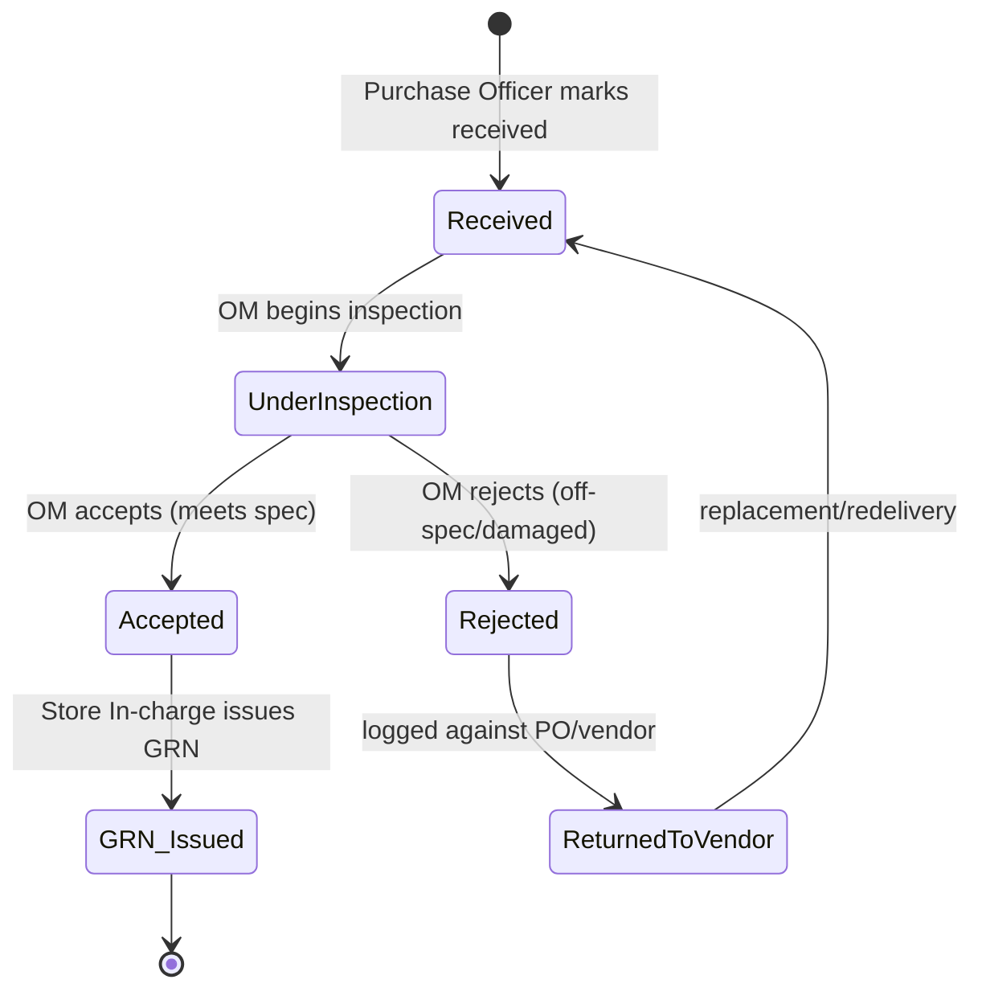
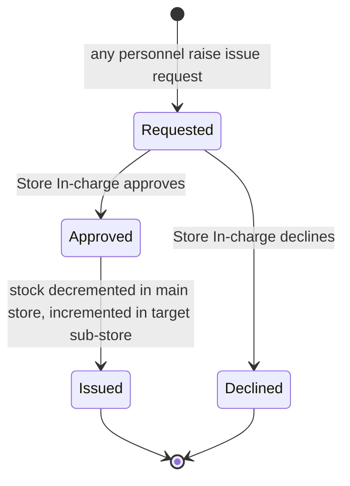

# Module 02 — Inventory & Procurement

> **Status:** Draft v1 · **Module owner:** Procurement & Stores · **Audience:** product, engineering, QA, procurement, stores
>
> This spec is **subordinate to** the [SSOT](../SSOT.md). It references — and must not duplicate or contradict — the cross-cutting rules defined there. When a cross-cutting rule changes, change it in the SSOT first.

---

## 1. Overview & Purpose

The Inventory & Procurement module manages the full lifecycle of consumables, assets, and services across BECS Analytics — from raising a Purchase Request through vendor selection, goods receipt, inspection, stocking in the Lahore main store, and onward issue to sub-stores. It also manages **vendor master data** and **utility** procurement.

The module enforces a controlled, auditable procurement chain (most steps terminating in COO approval — see [SSOT §5](../SSOT.md#5-roles-designations--approval-matrix)) and a strict **store → sub-store** custody model: every newly purchased item enters the **Lahore main store** first and reaches a sub-store only via an approved **issue request** ([BR-10](../SSOT.md#12-global-business-rules-catalog)).

Two procurement paths exist:

- **Full path** — Purchase Request → quotations → comparative statement → PO → receive → inspect → GRN → stock.
- **Simplified path** ([BR-9](../SSOT.md#12-global-business-rules-catalog)) — for stationery, sanitary supplies, furniture, PPE, and utilities: COO-approved Request → PO directly (no quotations/comparative).

> **Reuse note:** Calibration and Equipment-repair procurement **reuse the full procurement workflow** defined here. See module [05-equipment-and-traceability](05-equipment-and-traceability.md).

## 2. Roles Involved

Roles and the initiate-vs-approve split are governed by the **[SSOT Approval Matrix §5](../SSOT.md#5-roles-designations--approval-matrix)**. This module touches the following roles:

| Role | Responsibility in this module |
|---|---|
| **Any employee** | Raises Purchase Requests; raises issue requests (main → sub-store) |
| **COO** | Approves Purchase Requests; selects a quote from the Comparative Statement; approves simplified-path requests |
| **Purchase Officer** | Requests/records quotations against the PR; generates the Comparative Statement; generates & sends PO; marks goods received |
| **Operations Manager (OM)** | Inspects received goods (accept/reject) |
| **Store In-charge** | Issues GRN; approves issue requests to sub-stores |
| **Accountant** | Registers vendors; records invoices and payment status (with Purchase Officer) |

## 3. In-Scope / Out-of-Scope

**In scope**

- Store inventory master data across the categories listed in §6, plus utilities.
- One main store (Lahore) + three sub-stores (Lahore Lab, RYK Lab, Lahore Management) and stock movement between them.
- Procurement: full path and simplified path, including issue requests and the inspection accept/reject loop.
- Vendor registration and vendor master data.
- Invoice recording and payment-status tracking (the *procurement-facing* view).
- Logs and a Dashboard per area (store inventory, procurement, vendors).

**Out of scope** (owned elsewhere)

- General-ledger accounting, expense recognition, and payroll → module [06-finance-and-payroll](06-finance-and-payroll.md).
- Equipment calibration/qualification lifecycle and chemicals/glassware lab inventory (CoA, MSDS, cal certs) → module [05-equipment-and-traceability](05-equipment-and-traceability.md). *(Calibration/equipment-repair procurement reuses this module's full workflow but the technical lifecycle lives in module 05.)*
- Identifier generation rules, blinding, scoping, and the generic approval engine → [SSOT §6–§11](../SSOT.md#6-authorization-model).

## 4. Feature List

| # | Feature | Description | Primary role |
|---|---|---|---|
| F-1 | Store inventory master | Catalog of stockable items grouped by category (§6); per-store stock levels | Store In-charge |
| F-2 | Utilities register | Track recurring services (Electricity, Gas, Telephone, Internet) procured via the simplified path | Purchase Officer |
| F-3 | Purchase Request (PR) | Any employee raises a PR with a unique identifier; routed to COO | Any employee |
| F-4 | Quotations | Purchase Officer requests/records vendor quotations against an approved PR | Purchase Officer |
| F-5 | Comparative Statement | Side-by-side quote comparison generated and sent to COO for quote selection | Purchase Officer |
| F-6 | Purchase Order (PO) | Generated after quote selection (full) or COO approval (simplified); sent to vendor | Purchase Officer |
| F-7 | Goods receiving | Purchase Officer marks goods received against the PO | Purchase Officer |
| F-8 | Goods inspection | OM inspects received goods and accepts or rejects (accept/reject loop) | OM |
| F-9 | GRN issuance | Store In-charge issues GRN for accepted goods; items enter main store | Store In-charge |
| F-10 | Issue request | Any personnel request items main → sub-store; Store In-charge approves the transfer | Any personnel / Store In-charge |
| F-11 | Invoice recording | Invoice recorded after receipt; payment status tracked | Accountant / Purchase Officer |
| F-12 | Vendor registration | Accountant registers vendors with full master data and category fields (§6) | Accountant |
| F-13 | Logs & Dashboard | Each area (inventory, procurement, vendors) has Logs and a Dashboard | All (read, scoped) |

## 5. Workflows & State Transitions

> The **procurement state machines are defined authoritatively in the SSOT** — [§10 Cross-Cutting Workflows & State Machines](../SSOT.md#10-cross-cutting-workflows--state-machines). This section references them and adds the **module-specific detail** for issue requests and the inspection accept/reject loop. Do not re-derive the SSOT machines; the diagrams below extend them.

### 5.1 Procurement — full path (step-by-step)

Reference: SSOT §10 "Procurement (full path)".

1. **Any employee** raises a **Purchase Request** (PR with a unique identifier — see [SSOT §11](../SSOT.md#11-numbering--identifier-standards), format `PR-LHR-2026-00045`).
2. **COO** approves the PR ([BR-1](../SSOT.md#12-global-business-rules-catalog)). On approval, quotations may be requested.
3. **Purchase Officer** requests **Quotations** from vendors; each quotation is recorded against the PR.
4. **Purchase Officer** generates a **Comparative Statement** and sends it to the COO.
5. **COO** approves/selects one quote.
6. **Purchase Officer** generates the **Purchase Order** (`PO-LHR-2026-00045`) and sends it to the vendor.
7. Goods arrive; **Purchase Officer** marks them **received**.
8. **OM inspects** the goods → **accept** or **reject** (see §5.3 loop).
9. On acceptance, **Store In-charge** issues the **GRN** (`GRN-LHR-2026-00045`); items enter the **Lahore main store** ([BR-11](../SSOT.md#12-global-business-rules-catalog)).
10. **Invoice** is recorded after receipt; payment status is tracked.
11. Items move to a sub-store only via an approved **issue request** (§5.4, [BR-10](../SSOT.md#12-global-business-rules-catalog)).

### 5.2 Procurement — simplified path (step-by-step)

Reference: SSOT §10 "Procurement (simplified path)" · [BR-9](../SSOT.md#12-global-business-rules-catalog).

Applies to **Stationery, Sanitary supplies, Furniture, PPE, and all Utilities**.

1. Any employee / Purchase Officer raises a **Request**.
2. **COO** approves.
3. **Purchase Officer** generates the **PO** directly — **no quotations, no Comparative Statement**.
4. Received → Inspected (OM) → GRN (Store In-charge) → Stocked, identical to the full path from step 7 onward.

### 5.3 Goods inspection accept/reject loop (module-specific)

After the Purchase Officer marks goods received, the OM inspects:



- A **rejection** is recorded against the **PO and the vendor** (feeds the vendor dashboard/logs) and blocks GRN issuance — goods are usable only after accepted inspection **and** GRN ([BR-11](../SSOT.md#12-global-business-rules-catalog)).
- On redelivery the item re-enters the **Received** state for re-inspection.

### 5.4 Issue request — main store → sub-store (module-specific)



- Stocked items live in the **Lahore main store** until issued ([BR-10](../SSOT.md#12-global-business-rules-catalog)).
- **Any personnel** may raise an issue request, naming a target sub-store: **Lahore Lab**, **RYK Lab**, or **Lahore Management**.
- The **Store In-charge** approves; approval creates a **stock transaction** (decrement main store, increment target sub-store).

## 6. Data Entities & Fields

Module-specific entities. Cross-cutting entities (`AuditLog`, `Attachment`, `Approval`/`ApprovalStep`, `Signature`, `Sequence`, `Notification`) attach polymorphically — see [SSOT §9 ERD](../SSOT.md#9-global-domain-model-erd). Identifiers follow [SSOT §11](../SSOT.md#11-numbering--identifier-standards).

### 6.1 Reference data

**Inventory categories** (item classification):

| Category | Simplified path? |
|---|---|
| Chemicals | No (full) |
| Equipment | No (full) |
| Equipment Supplies | No (full) |
| Glassware | No (full) |
| Lab supplies | No (full) |
| Stationery | **Yes** ([BR-9](../SSOT.md#12-global-business-rules-catalog)) |
| Sanitary supplies | **Yes** ([BR-9](../SSOT.md#12-global-business-rules-catalog)) |
| Furniture | **Yes** ([BR-9](../SSOT.md#12-global-business-rules-catalog)) |
| Personal Protective Equipment (PPE) | **Yes** ([BR-9](../SSOT.md#12-global-business-rules-catalog)) |

**Utilities** (always simplified path): Electricity · Gas · Telephone · Internet.

**Stores:** one main store — **Lahore (main)** — and three sub-stores — **Lahore Lab**, **RYK Lab**, **Lahore Management**.

**Vendor category/field values** (one or more): Equipment · Chemicals · Glassware · Equipment Supplies · Office Supplies · Lab Supplies · PPEs · CRM · Calibration · Equipment Repair.

### 6.2 Entities

**`InventoryItem`**

| Field | Type | Notes |
|---|---|---|
| `id` | uuid/cuid | internal PK |
| `name` | text | item name |
| `category` | enum | one of §6.1 inventory categories |
| `unitOfMeasure` | text | UOM |
| `reorderLevel` | number? | optional low-stock threshold (dashboard alerts) |

**`Store`**

| Field | Type | Notes |
|---|---|---|
| `id` | uuid/cuid | |
| `name` | text | Lahore (main), Lahore Lab, RYK Lab, Lahore Management |
| `type` | enum | `MAIN` \| `SUB` |
| `facilityId`, `sectionId` | fk | scoping per [SSOT §7](../SSOT.md#7-section--facility-scoping-rules) |

**`StockTransaction`** (ledger of every stock movement)

| Field | Type | Notes |
|---|---|---|
| `id` | uuid/cuid | |
| `inventoryItemId` | fk | |
| `storeId` | fk | affected store |
| `type` | enum | `GRN_IN` \| `ISSUE_OUT` \| `ISSUE_IN` \| `ADJUSTMENT` |
| `quantity` | number | signed by `type` |
| `sourceRef` | fk? | GRN or IssueRequest id |
| `createdAt` | timestamp | server-authoritative ([BR-14](../SSOT.md#12-global-business-rules-catalog)) |

**`PurchaseRequest`** — id `PR-LHR-2026-00045`

| Field | Type | Notes |
|---|---|---|
| `prNo` | text | unique identifier ([SSOT §11](../SSOT.md#11-numbering--identifier-standards)) |
| `requestedBy` | fk(User) | any employee |
| `path` | enum | `FULL` \| `SIMPLIFIED` (derived from category, [BR-9](../SSOT.md#12-global-business-rules-catalog)) |
| `lines` | `PRLine[]` | item, category, quantity, UOM, justification |
| `status` | enum | per SSOT §10 procurement states |

**`Quotation`** — recorded against a PR (full path only)

| Field | Type | Notes |
|---|---|---|
| `purchaseRequestId` | fk | |
| `vendorId` | fk | |
| `linePrices` | json | per-line quoted price |
| `validUntil` | date? | |
| `attachmentId` | fk? | scanned quote (MinIO) |

**`ComparativeStatement`** (full path only) — aggregates quotations for a PR; `selectedQuotationId` set on COO approval.

**`PurchaseOrder`** — id `PO-LHR-2026-00045`; references PR; references `selectedQuotation` (full) or none (simplified); `status` includes `Received`.

**`GoodsReceiving`** + **`GRN`** — id `GRN-LHR-2026-00045`; `inspectionResult` = `ACCEPTED` \| `REJECTED` (OM); GRN issued by Store In-charge on accept.

**`IssueRequest`**

| Field | Type | Notes |
|---|---|---|
| `requestedBy` | fk(User) | any personnel |
| `targetStoreId` | fk(Store) | a sub-store |
| `lines` | json | item + quantity |
| `status` | enum | `Requested` \| `Approved` \| `Declined` \| `Issued` |
| `approvedBy` | fk(User)? | Store In-charge |

**`Vendor`** — id `VEN-00123` (company-wide)

| Field | Type | Notes |
|---|---|---|
| `vendorNo` | text | `VEN-00123` |
| `company` | text | |
| `address` | text | |
| `contactNumber` | text | |
| `ntn` | text | National Tax Number |
| `stn` | text | Sales Tax Number |
| `employeeCount` | number | number of employees |
| `categories` | enum[] | one or more §6.1 vendor category values |
| `accountNumber` | text | |
| `registeredBy` | fk(User) | Accountant |

**`VendorInvoice`** — recorded after goods receipt; links PO; `paymentStatus` = `Unpaid` \| `Partial` \| `Paid` (procurement view; finance owns settlement — module 06).

## 7. Screens / Views

| Screen | Purpose | Primary role |
|---|---|---|
| Store inventory list | Items by category with per-store stock levels; low-stock flags | Store In-charge |
| Item detail | Stock transactions ledger for one item across stores | Store In-charge |
| Utilities register | Recurring utility services & their POs/invoices | Purchase Officer |
| Purchase Request form & list | Raise/track PRs; shows path (full/simplified) and status | Any employee |
| PR approval queue | COO approves PRs and selects quote on the comparative | COO |
| Quotations | Record quotations against a PR | Purchase Officer |
| Comparative Statement | Side-by-side quote comparison; submit to COO | Purchase Officer |
| Purchase Order | Generate/send PO; mark received | Purchase Officer |
| Goods inspection | Accept/reject received goods (accept/reject loop) | OM |
| GRN issuance | Issue GRN for accepted goods | Store In-charge |
| Issue request form & approval | Raise main→sub-store transfers; approve/decline | Any personnel / Store In-charge |
| Vendor registration & list | Register/maintain vendors | Accountant |
| Invoice recording | Record vendor invoice; update payment status | Accountant / Purchase Officer |
| **Logs** (per area) | Audit/activity log for inventory, procurement, vendors | All (scoped) |
| **Dashboard** (per area) | KPIs: stock levels, pending approvals, open POs, vendor performance, payment status | All (scoped) |

## 8. User Stories with Gherkin Acceptance Criteria

**US-1 — Raise a Purchase Request (any employee)**

```gherkin
Scenario: Employee raises a PR for a full-path category
  Given I am an authenticated employee
  When I submit a Purchase Request for a "Chemicals" item with quantity and UOM
  Then the PR is saved with a unique identifier "PR-LHR-2026-NNNNN"
  And the PR path is "FULL"
  And the PR status is "PR_Submitted"
  And it is routed to the COO for approval
```

**US-2 — COO approval gates quotations**

```gherkin
Scenario: Quotations cannot be requested before COO approval
  Given a Purchase Request in status "PR_Submitted"
  When the Purchase Officer attempts to record a quotation against it
  Then the action is rejected
  When the COO approves the PR
  Then the PR status becomes "PR_Approved"
  And the Purchase Officer can record quotations against it
```

**US-3 — Comparative statement and quote selection**

```gherkin
Scenario: COO selects a quote from the comparative statement
  Given a PR with two or more recorded quotations
  When the Purchase Officer generates the Comparative Statement and sends it to the COO
  Then the COO can select exactly one quotation
  And on selection the PR status becomes "QuoteSelected"
  And a Purchase Order can be generated referencing the selected quotation
```

**US-4 — Simplified path skips quotations (BR-9)**

```gherkin
Scenario: PPE request uses the simplified path
  Given I raise a request for a "Personal Protective Equipment (PPE)" item
  Then the request path is "SIMPLIFIED"
  When the COO approves the request
  Then a Purchase Order can be generated directly
  And no Quotation or Comparative Statement is required
```

**US-5 — Inspection accept/reject loop**

```gherkin
Scenario: OM rejects off-spec goods
  Given a Purchase Order marked "Received"
  When the OM inspects and rejects the goods
  Then no GRN can be issued
  And the rejection is recorded against the PO and the vendor
  When replacement goods are redelivered and marked "Received"
  And the OM accepts them
  Then the Store In-charge can issue a GRN
```

**US-6 — GRN places stock in the main store (BR-10, BR-11)**

```gherkin
Scenario: Accepted goods enter the Lahore main store
  Given goods accepted by the OM
  When the Store In-charge issues the GRN "GRN-LHR-2026-NNNNN"
  Then the stock is added to the "Lahore (main)" store only
  And the item is not present in any sub-store until an issue request is approved
```

**US-7 — Issue request to a sub-store (BR-10)**

```gherkin
Scenario: Personnel move stock to RYK Lab
  Given an item in stock at the Lahore main store
  When any personnel raise an issue request targeting "RYK Lab"
  And the Store In-charge approves it
  Then the main-store quantity is decremented
  And the RYK Lab sub-store quantity is incremented
  And a stock transaction is recorded for the movement
```

**US-8 — Vendor registration (Accountant)**

```gherkin
Scenario: Accountant registers a vendor
  Given I am the Accountant
  When I register a vendor with Company, Address, Contact Number, NTN, STN, employee count, Account Number
  And I select one or more category fields including "Calibration"
  Then the vendor is saved with a unique "VEN-NNNNN" number
  And the vendor is available for selection during procurement
```

**US-9 — Invoice recording and payment status**

```gherkin
Scenario: Invoice recorded after receipt
  Given a Purchase Order with received goods
  When the invoice is recorded against the PO
  Then the invoice is linked to the PO
  And its payment status is set to "Unpaid"
  And the payment status can later be updated to "Partial" or "Paid"
```

## 9. Module Business Rules

This module **enforces** the following global rules (defined in [SSOT §12](../SSOT.md#12-global-business-rules-catalog)); it does not redefine them.

| Rule | Application in this module |
|---|---|
| [BR-1](../SSOT.md#12-global-business-rules-catalog) | PRs and simplified-path requests require **COO approval** before procurement proceeds; COO selects the quote on the comparative. |
| [BR-5](../SSOT.md#12-global-business-rules-catalog) | Every PR/quotation/PO/GRN/issue-request/vendor create/update writes an immutable **audit-log** entry. |
| [BR-6](../SSOT.md#12-global-business-rules-catalog) | Stores, stock, and procurement records are **facility/section-scoped**; cross-scope read needs an explicit capability. |
| [BR-7](../SSOT.md#12-global-business-rules-catalog) | PR, PO, GRN, Vendor, Invoice numbers are **gap-free, unique, non-reusable** ([SSOT §11](../SSOT.md#11-numbering--identifier-standards)). |
| **[BR-9](../SSOT.md#12-global-business-rules-catalog)** | **Stationery, sanitary supplies, furniture, PPE, and utilities** use the **simplified path** (no quotations/comparative). |
| **[BR-10](../SSOT.md#12-global-business-rules-catalog)** | New stock enters the **Lahore main store**; it reaches a sub-store only via a Store In-charge-approved **issue request**. |
| **[BR-11](../SSOT.md#12-global-business-rules-catalog)** | Goods are usable only after **OM inspection (accepted)** and **GRN** issuance. |
| [BR-14](../SSOT.md#12-global-business-rules-catalog) | Stock-transaction and approval timestamps are **server-authoritative**. |

## 10. Dependencies & Integrations

| Dependency | Direction | Detail |
|---|---|---|
| **Approval engine** ([SSOT §10](../SSOT.md#10-cross-cutting-workflows--state-machines)) | consumes | PR/comparative/simplified-request approvals route via the generic approval engine to the COO. |
| **Personnel** (module 01) | consumes | Roles/designations (Purchase Officer, Store In-charge, OM, Accountant, COO) and the requesting user identity. |
| **Numbering** ([SSOT §11](../SSOT.md#11-numbering--identifier-standards)) | consumes | PR/PO/GRN/Vendor/Invoice identifiers from the `Sequence` service. |
| **Attachment / file storage** (MinIO) | consumes | Scanned quotations, POs, GRNs, invoices stored as `Attachment`. |
| **Equipment & Traceability** (module 05) | provides | Calibration and equipment-repair procurement **reuse this module's full workflow** and vendor master (categories Calibration, Equipment Repair). |
| **Finance & Payroll** (module 06) | provides | Vendor invoices and POs feed expense recognition/settlement; this module tracks the procurement-side payment status only. |
| **Audit & scoping** ([SSOT §7, §12](../SSOT.md#7-section--facility-scoping-rules)) | consumes | `AuditLog`, facility/section scoping, RLS. |

## 11. Open Questions / Assumptions

**Assumptions**

- A1. Path selection (`FULL` vs `SIMPLIFIED`) is **derived from the item category** per [BR-9](../SSOT.md#12-global-business-rules-catalog); a PR is assumed to contain items of a single path. *(If mixed-path PRs are needed, this requires resolution — see Q1.)*
- A2. `paymentStatus` here is a lightweight procurement-side flag; authoritative settlement/expense accounting lives in module 06.
- A3. Utilities are modeled as recurring simplified-path procurements rather than stocked inventory (no GRN-driven stock balance).
- A4. Issue requests target exactly one sub-store per request; quantities cannot exceed available main-store stock.

**Open questions**

- Q1. Can a single Purchase Request mix full-path and simplified-path items, or must they be split into separate PRs?
- Q2. Are partial goods receipts / partial GRNs against a single PO supported, or is receipt all-or-nothing?
- Q3. On OM rejection, does the same PO/PR remain open for redelivery (assumed), or is a new PR required?
- Q4. Exact identifier prefixes and per-year/per-facility counter reset to be finalized with BECS ([SSOT §11](../SSOT.md#11-numbering--identifier-standards)).
- Q5. Should reorder-level alerts trigger an automatic draft PR, or only a dashboard notification (assumed: notification only)?
- Q6. Do utilities require their own approval cadence (e.g., monthly bill approval) distinct from one-off simplified-path POs?
