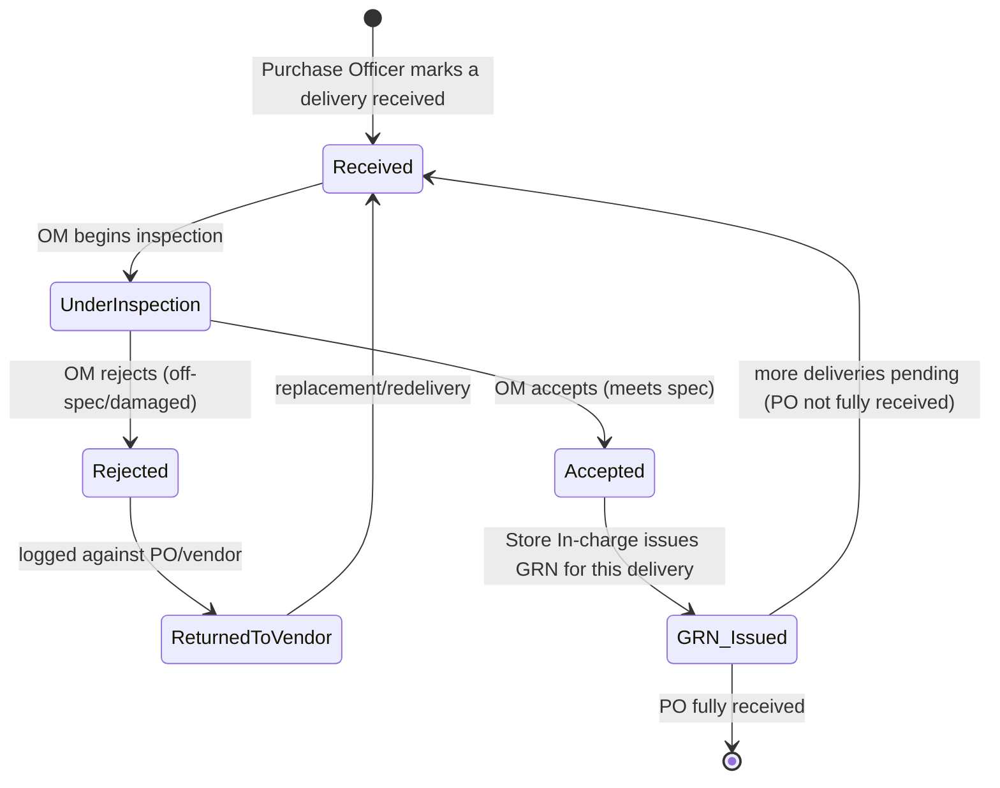
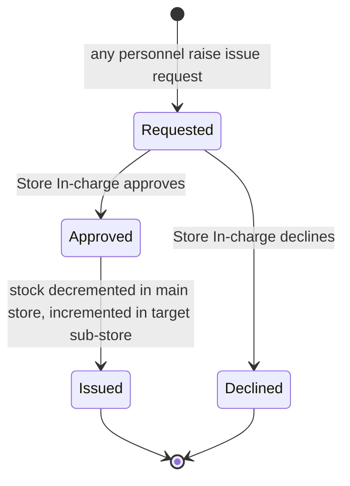

# Module 02 — Inventory & Procurement

> **Status:** Draft v1 · **Module owner:** Procurement & Stores · **Audience:** product, engineering, QA, procurement, stores
>
> This spec is **subordinate to** the [SSOT](../SSOT.md). It references — and must not duplicate or contradict — the cross-cutting rules defined there. When a cross-cutting rule changes, change it in the SSOT first.

---

## 1. Overview & Purpose

The Inventory & Procurement module manages the full lifecycle of consumables, assets, and services across BECS Analytics — from raising a Purchase Request through vendor selection, goods receipt, inspection, stocking in the Lahore main store, and onward issue to sub-stores. It also manages **vendor master data** and **utility** procurement.

The module enforces a controlled, auditable procurement chain (most steps terminating in COO approval — see [SSOT §5](../SSOT.md#5-roles-designations--approval-matrix)) and a strict **store → sub-store** custody model: every newly purchased item enters the **Lahore main store** first and reaches a sub-store only via an approved **issue request** ([BR-10](../SSOT.md#12-global-business-rules-catalog)).

Two procurement paths exist, chosen **per line item** ([BR-18](../SSOT.md#12-global-business-rules-catalog)) — a single Purchase Request may carry both:

- **Full path** — line item → quotations → comparative statement → PO line → receive → inspect → GRN → stock.
- **Simplified path** ([BR-9](../SSOT.md#12-global-business-rules-catalog)) — for stationery, sanitary supplies, furniture, PPE, and utilities: COO-approved line → PO directly (no quotations/comparative).

Every Purchase Request is **verified** before COO approval ([BR-1](../SSOT.md#12-global-business-rules-catalog), [SSOT §5](../SSOT.md#5-roles-designations--approval-matrix)): the **OM** verifies at **Lahore**, the **Lab Manager (RYK)** verifies at **RYK**. The chain is initiator → verifier → COO.

> **Reuse note:** Calibration and Equipment-repair procurement **reuse the full procurement workflow** defined here. See module [05-equipment-and-traceability](05-equipment-and-traceability.md).

## 2. Roles Involved

Roles and the initiate-vs-approve split are governed by the **[SSOT Approval Matrix §5](../SSOT.md#5-roles-designations--approval-matrix)**. This module touches the following roles:

| Role | Responsibility in this module |
|---|---|
| **Any employee** | Raises Purchase Requests; raises issue requests (main → sub-store) |
| **COO** | Approves **verified** Purchase Requests; selects a quote from the Comparative Statement; approves simplified-path requests |
| **Operations Manager (OM)** | **Verifies Purchase Requests at Lahore** before COO approval; inspects received goods (accept/reject), per partial delivery |
| **Lab Manager (RYK)** | **Verifies Purchase Requests at RYK** before COO approval |
| **Purchase Officer** | Requests/records quotations against full-path PR line items; generates the Comparative Statement; generates & sends PO; marks goods received per delivery |
| **Store In-charge** | Issues GRN; approves issue requests to sub-stores |
| **Accountant** | Registers vendors; records invoices and payment status (with Purchase Officer) |

## 3. In-Scope / Out-of-Scope

**In scope**

- Store inventory master data across the categories listed in §6, plus utilities.
- One main store (Lahore) + three sub-stores (Lahore Lab, RYK Lab, Lahore Management) and stock movement between them.
- Procurement: full path and simplified path, including issue requests and the inspection accept/reject loop.
- Vendor registration and vendor master data.
- Invoice recording and payment-status tracking (the *procurement-facing* view).
- Logs and a Dashboard per area (store inventory, procurement, vendors).

**Out of scope** (owned elsewhere)

- General-ledger accounting, expense recognition, and payroll → module [06-finance-and-payroll](06-finance-and-payroll.md).
- Equipment calibration/qualification lifecycle and chemicals/glassware lab inventory (CoA, MSDS, cal certs) → module [05-equipment-and-traceability](05-equipment-and-traceability.md). *(Calibration/equipment-repair procurement reuses this module's full workflow but the technical lifecycle lives in module 05.)*
- Identifier generation rules, blinding, scoping, and the generic approval engine → [SSOT §6–§11](../SSOT.md#6-authorization-model).

## 4. Feature List

| # | Feature | Description | Primary role |
|---|---|---|---|
| F-1 | Store inventory master | Catalog of stockable items grouped by category (§6); per-store stock levels | Store In-charge |
| F-2 | Utilities register | Track recurring services (Electricity, Gas, Telephone, Internet) procured via the simplified path | Purchase Officer |
| F-3 | Purchase Request (PR) | Any employee raises a PR with a unique identifier and one or more line items, each carrying its own path (full/simplified, [BR-18](../SSOT.md#12-global-business-rules-catalog)) | Any employee |
| F-3a | PR verification | Verifier (OM @ Lahore / Lab Manager @ RYK) verifies the PR before it is routed to the COO | OM / Lab Manager (RYK) |
| F-4 | Quotations | Purchase Officer requests/records vendor quotations against the **full-path line items** of an approved PR | Purchase Officer |
| F-5 | Comparative Statement | Side-by-side quote comparison (full-path items) generated and sent to COO for quote selection | Purchase Officer |
| F-6 | Purchase Order (PO) | Generated after quote selection (full-path items) or COO approval (simplified-path items); sent to vendor | Purchase Officer |
| F-7 | Goods receiving | Purchase Officer marks goods received against the PO, in one or more **partial deliveries** ([BR-19](../SSOT.md#12-global-business-rules-catalog)) | Purchase Officer |
| F-8 | Goods inspection | OM inspects each received delivery and accepts or rejects (accept/reject loop) | OM |
| F-9 | GRN issuance | Store In-charge issues a GRN per accepted delivery; items enter main store (multiple GRNs per PO possible) | Store In-charge |
| F-10 | Issue request | Any personnel request items main → sub-store; Store In-charge approves the transfer | Any personnel / Store In-charge |
| F-11 | Invoice recording | Invoice recorded after receipt; payment status tracked | Accountant / Purchase Officer |
| F-12 | Vendor registration | Accountant registers vendors with full master data and category fields (§6) | Accountant |
| F-13 | Logs & Dashboard | Each area (inventory, procurement, vendors) has Logs and a Dashboard | All (read, scoped) |

## 5. Workflows & State Transitions

> The **procurement state machines are defined authoritatively in the SSOT** — [§10 Cross-Cutting Workflows & State Machines](../SSOT.md#10-cross-cutting-workflows--state-machines). This section references them and adds the **module-specific detail** for issue requests and the inspection accept/reject loop. Do not re-derive the SSOT machines; the diagrams below extend them.

### 5.1 Procurement — full path (step-by-step)

Reference: SSOT §10 "Procurement (full path)". The steps below describe the **full-path line items** of a PR; any simplified-path line items on the same PR follow §5.2 from step 3 onward (their own PO, no quotations/comparative).

1. **Any employee** raises a **Purchase Request** (PR with a unique identifier — see [SSOT §11](../SSOT.md#11-numbering--identifier-standards), format `PR-LHR-2026-00045`) with one or more **line items**, each carrying its own `path` (full/simplified, [BR-18](../SSOT.md#12-global-business-rules-catalog)).
2. **Verifier** verifies the PR — **OM** at Lahore, **Lab Manager (RYK)** at RYK ([SSOT §5](../SSOT.md#5-roles-designations--approval-matrix)). The verified PR is routed to the COO.
3. **COO** approves the PR ([BR-1](../SSOT.md#12-global-business-rules-catalog)). On approval, quotations may be requested for the **full-path line items**.
4. **Purchase Officer** requests **Quotations** from vendors for the full-path items; each quotation is recorded against the PR.
5. **Purchase Officer** generates a **Comparative Statement** (full-path items) and sends it to the COO.
6. **COO** approves/selects one quote.
7. **Purchase Officer** generates the **Purchase Order** (`PO-LHR-2026-00045`) and sends it to the vendor.
8. Goods arrive in one or more **partial deliveries** ([BR-19](../SSOT.md#12-global-business-rules-catalog)); **Purchase Officer** marks each delivery **received**.
9. **OM inspects** each delivery → **accept** or **reject** (see §5.3 loop).
10. On acceptance of a delivery, **Store In-charge** issues a **GRN** (`GRN-LHR-2026-00045`) for that delivery; items enter the **Lahore main store** ([BR-11](../SSOT.md#12-global-business-rules-catalog)). Steps 8–10 repeat until the PO is **fully received**.
11. **Invoice** is recorded after receipt; payment status is tracked.
12. Items move to a sub-store only via an approved **issue request** (§5.4, [BR-10](../SSOT.md#12-global-business-rules-catalog)).

### 5.2 Procurement — simplified path (step-by-step)

Reference: SSOT §10 "Procurement (simplified path)" · [BR-9](../SSOT.md#12-global-business-rules-catalog).

Applies to line items in **Stationery, Sanitary supplies, Furniture, PPE, and all Utilities** ([BR-18](../SSOT.md#12-global-business-rules-catalog) — these may be simplified-path line items on an otherwise full-path PR).

1. Any employee / Purchase Officer raises a **Request** (or a simplified-path line item on a PR).
2. **Verifier** (OM @ Lahore / Lab Manager @ RYK) verifies; **COO** approves.
3. **Purchase Officer** generates the **PO** directly for the simplified-path items — **no quotations, no Comparative Statement**.
4. Received (in one or more partial deliveries, [BR-19](../SSOT.md#12-global-business-rules-catalog)) → Inspected (OM) → GRN (Store In-charge) → Stocked, identical to the full path from step 8 onward.

### 5.3 Goods inspection accept/reject loop (module-specific)

After the Purchase Officer marks a **delivery** received, the OM inspects it. A PO may be received in **multiple partial deliveries** ([BR-19](../SSOT.md#12-global-business-rules-catalog)); each delivery has its own inspection and its own GRN:



- A **rejection** is recorded against the **PO and the vendor** (feeds the vendor dashboard/logs) and blocks GRN issuance for that delivery — goods are usable only after accepted inspection **and** GRN ([BR-11](../SSOT.md#12-global-business-rules-catalog)).
- On redelivery the item re-enters the **Received** state for re-inspection.
- The PO tracks **ordered vs received** quantity per line; it is **fully received** only when every line's received quantity meets its ordered quantity ([BR-19](../SSOT.md#12-global-business-rules-catalog)).

### 5.4 Issue request — main store → sub-store (module-specific)



- Stocked items live in the **Lahore main store** until issued ([BR-10](../SSOT.md#12-global-business-rules-catalog)).
- **Any personnel** may raise an issue request, naming a target sub-store: **Lahore Lab**, **RYK Lab**, or **Lahore Management**.
- The **Store In-charge** approves; approval creates a **stock transaction** (decrement main store, increment target sub-store).

## 6. Data Entities & Fields

Module-specific entities. Cross-cutting entities (`AuditLog`, `Attachment`, `Approval`/`ApprovalStep`, `Signature`, `Sequence`, `Notification`) attach polymorphically — see [SSOT §9 ERD](../SSOT.md#9-global-domain-model-erd). Identifiers follow [SSOT §11](../SSOT.md#11-numbering--identifier-standards).

### 6.1 Reference data

**Inventory categories** (item classification):

| Category | Simplified path? |
|---|---|
| Chemicals | No (full) |
| Certified Reference Material (CRM) | No (full) — also tracked in module 05 |
| Equipment | No (full) |
| Equipment Supplies | No (full) |
| Glassware | No (full) |
| Lab supplies | No (full) |
| Stationery | **Yes** ([BR-9](../SSOT.md#12-global-business-rules-catalog)) |
| Sanitary supplies | **Yes** ([BR-9](../SSOT.md#12-global-business-rules-catalog)) |
| Furniture | **Yes** ([BR-9](../SSOT.md#12-global-business-rules-catalog)) |
| Personal Protective Equipment (PPE) | **Yes** ([BR-9](../SSOT.md#12-global-business-rules-catalog)) |

**Utilities** (always simplified path): Electricity · Gas · Telephone · Internet.

**Stores:** one main store — **Lahore (main)** — and three sub-stores — **Lahore Lab**, **RYK Lab**, **Lahore Management**.

**Vendor category/field values** (one or more): Equipment · Chemicals · Glassware · Equipment Supplies · Office Supplies · Lab Supplies · PPEs · CRM · Calibration · Equipment Repair.

### 6.2 Entities

**`InventoryItem`**

| Field | Type | Notes |
|---|---|---|
| `id` | uuid/cuid | internal PK |
| `name` | text | item name |
| `category` | enum | one of §6.1 inventory categories |
| `unitOfMeasure` | text | UOM |
| `reorderLevel` | number? | optional low-stock threshold (dashboard alerts) |

**`Store`**

| Field | Type | Notes |
|---|---|---|
| `id` | uuid/cuid | |
| `name` | text | Lahore (main), Lahore Lab, RYK Lab, Lahore Management |
| `type` | enum | `MAIN` \| `SUB` |
| `facilityId`, `sectionId` | fk | scoping per [SSOT §7](../SSOT.md#7-section--facility-scoping-rules) |

**`StockTransaction`** (ledger of every stock movement)

| Field | Type | Notes |
|---|---|---|
| `id` | uuid/cuid | |
| `inventoryItemId` | fk | |
| `storeId` | fk | affected store |
| `type` | enum | `GRN_IN` \| `ISSUE_OUT` \| `ISSUE_IN` \| `ADJUSTMENT` |
| `quantity` | number | signed by `type` |
| `sourceRef` | fk? | GRN or IssueRequest id |
| `createdAt` | timestamp | server-authoritative ([BR-14](../SSOT.md#12-global-business-rules-catalog)) |

**`PurchaseRequest`** — id `PR-LHR-2026-00045`

| Field | Type | Notes |
|---|---|---|
| `prNo` | text | unique identifier ([SSOT §11](../SSOT.md#11-numbering--identifier-standards)) |
| `requestedBy` | fk(User) | any employee |
| `lines` | `PRLine[]` | one or more line items (see below); a PR may mix paths ([BR-18](../SSOT.md#12-global-business-rules-catalog)) |
| `verifiedBy` | fk(User)? | OM (Lahore) / Lab Manager (RYK) — verification before COO approval ([SSOT §5](../SSOT.md#5-roles-designations--approval-matrix)) |
| `status` | enum | per SSOT §10 procurement states (incl. `PR_Submitted`, `PR_Verified`, `PR_Approved`) |

**`PRLine`** — a line item of a PurchaseRequest; **path is decided per line** ([BR-18](../SSOT.md#12-global-business-rules-catalog))

| Field | Type | Notes |
|---|---|---|
| `purchaseRequestId` | fk | parent PR |
| `inventoryItemId` | fk? | catalog item (or free-text for utilities) |
| `category` | enum | one of §6.1 inventory categories / utility |
| `path` | enum | `FULL` \| `SIMPLIFIED` (derived from `category`, [BR-9](../SSOT.md#12-global-business-rules-catalog)/[BR-18](../SSOT.md#12-global-business-rules-catalog)) |
| `quantity` | number | requested quantity |
| `unitOfMeasure` | text | UOM |
| `justification` | text? | |

**`Quotation`** — recorded against a PR; covers **full-path line items only**

| Field | Type | Notes |
|---|---|---|
| `purchaseRequestId` | fk | |
| `vendorId` | fk | |
| `linePrices` | json | quoted price per **full-path** `PRLine` |
| `validUntil` | date? | |
| `attachmentId` | fk? | scanned quote (MinIO) |

**`ComparativeStatement`** — aggregates quotations over the **full-path lines** of a PR; `selectedQuotationId` set on COO approval. (Simplified-path lines never appear on a comparative.)

**`PurchaseOrder`** — id `PO-LHR-2026-00045`; references PR; PO **lines** reference the originating `PRLine` and carry `orderedQuantity` and a running `receivedQuantity`; references `selectedQuotation` for full-path lines or none for simplified-path lines; `status` includes `PartiallyReceived` and `FullyReceived` ([BR-19](../SSOT.md#12-global-business-rules-catalog)).

**`GoodsReceiving`** + **`GRN`** — id `GRN-LHR-2026-00045`; **one record per partial delivery** ([BR-19](../SSOT.md#12-global-business-rules-catalog)), so a PO may have **multiple** GoodsReceiving/GRN records. Each carries the **quantity received per PO line** and `inspectionResult` = `ACCEPTED` \| `REJECTED` (OM); GRN issued by Store In-charge on accept. The PO is `FullyReceived` once every line's `receivedQuantity` reaches its `orderedQuantity`.

**`IssueRequest`**

| Field | Type | Notes |
|---|---|---|
| `requestedBy` | fk(User) | any personnel |
| `targetStoreId` | fk(Store) | a sub-store |
| `lines` | json | item + quantity |
| `status` | enum | `Requested` \| `Approved` \| `Declined` \| `Issued` |
| `approvedBy` | fk(User)? | Store In-charge |

**`Vendor`** — id `VEN-00123` (company-wide)

| Field | Type | Notes |
|---|---|---|
| `vendorNo` | text | `VEN-00123` |
| `company` | text | |
| `address` | text | |
| `contactNumber` | text | |
| `ntn` | text | National Tax Number |
| `stn` | text | Sales Tax Number |
| `employeeCount` | number | number of employees |
| `categories` | enum[] | one or more §6.1 vendor category values |
| `accountNumber` | text | |
| `registeredBy` | fk(User) | Accountant |

**`VendorInvoice`** — recorded after goods receipt; links PO; `paymentStatus` = `Unpaid` \| `Partial` \| `Paid` (procurement view; finance owns settlement — module 06).

## 7. Screens / Views

| Screen | Purpose | Primary role |
|---|---|---|
| Store inventory list | Items by category with per-store stock levels; low-stock flags | Store In-charge |
| Item detail | Stock transactions ledger for one item across stores | Store In-charge |
| Utilities register | Recurring utility services & their POs/invoices | Purchase Officer |
| Purchase Request form & list | Raise/track PRs with line items; shows per-line path (full/simplified) and status | Any employee |
| PR verification queue | Verify PRs before COO approval | OM / Lab Manager (RYK) |
| PR approval queue | COO approves **verified** PRs and selects quote on the comparative | COO |
| Quotations | Record quotations against the full-path lines of a PR | Purchase Officer |
| Comparative Statement | Side-by-side quote comparison (full-path lines); submit to COO | Purchase Officer |
| Purchase Order | Generate/send PO; mark deliveries received (ordered vs received per line) | Purchase Officer |
| Goods inspection | Accept/reject each received delivery (accept/reject loop) | OM |
| GRN issuance | Issue a GRN per accepted delivery | Store In-charge |
| Issue request form & approval | Raise main→sub-store transfers; approve/decline | Any personnel / Store In-charge |
| Vendor registration & list | Register/maintain vendors | Accountant |
| Invoice recording | Record vendor invoice; update payment status | Accountant / Purchase Officer |
| **Logs** (per area) | Audit/activity log for inventory, procurement, vendors | All (scoped) |
| **Dashboard** (per area) | KPIs: stock levels, pending approvals, open POs, vendor performance, payment status | All (scoped) |

## 8. User Stories with Gherkin Acceptance Criteria

**US-1 — Raise a Purchase Request with mixed-path line items (any employee, BR-18)**

```gherkin
Scenario: Employee raises a PR mixing full-path and simplified-path line items
  Given I am an authenticated employee
  When I submit a Purchase Request with a "Chemicals" line item and a "Stationery" line item
  Then the PR is saved with a unique identifier "PR-LHR-2026-NNNNN"
  And the "Chemicals" line item path is "FULL"
  And the "Stationery" line item path is "SIMPLIFIED"
  And the PR status is "PR_Submitted"
  And it is routed for verification
```

**US-2 — PR is verified before COO approval, which gates quotations (D18, BR-1)**

```gherkin
Scenario: A PR must be verified, then COO-approved, before quotations
  Given a Purchase Request in status "PR_Submitted" at the Lahore facility
  When the Purchase Officer attempts to record a quotation against it
  Then the action is rejected
  When the OM verifies the PR
  Then the PR status becomes "PR_Verified"
  And it is routed to the COO for approval
  When the COO approves the PR
  Then the PR status becomes "PR_Approved"
  And the Purchase Officer can record quotations against its full-path line items

Scenario: At RYK the Lab Manager verifies the PR
  Given a Purchase Request in status "PR_Submitted" at the RYK facility
  When the Lab Manager (RYK) verifies the PR
  Then the PR status becomes "PR_Verified"
  And it is routed to the COO for approval
```

**US-3 — Comparative statement and quote selection**

```gherkin
Scenario: COO selects a quote from the comparative statement
  Given a PR with two or more recorded quotations
  When the Purchase Officer generates the Comparative Statement and sends it to the COO
  Then the COO can select exactly one quotation
  And on selection the PR status becomes "QuoteSelected"
  And a Purchase Order can be generated referencing the selected quotation
```

**US-4 — Simplified-path line items skip quotations (BR-9, BR-18)**

```gherkin
Scenario: A PPE line item uses the simplified path while a Chemicals line uses the full path
  Given a verified, COO-approved Purchase Request containing a "Personal Protective Equipment (PPE)" line and a "Chemicals" line
  Then the "PPE" line path is "SIMPLIFIED"
  And a Purchase Order can be generated directly for the "PPE" line
  And no Quotation or Comparative Statement is required for the "PPE" line
  And the "Chemicals" line still requires quotations and a Comparative Statement before its PO
```

**US-5 — Inspection accept/reject loop**

```gherkin
Scenario: OM rejects off-spec goods
  Given a delivery against a Purchase Order marked "Received"
  When the OM inspects and rejects the goods
  Then no GRN can be issued for that delivery
  And the rejection is recorded against the PO and the vendor
  When replacement goods are redelivered and marked "Received"
  And the OM accepts them
  Then the Store In-charge can issue a GRN
```

**US-5a — Partial receipts and per-delivery GRNs (D11, BR-19)**

```gherkin
Scenario: A PO is received in two partial deliveries
  Given a Purchase Order with a line ordered for quantity 100
  When a first delivery of quantity 60 is marked "Received"
  And the OM accepts it
  And the Store In-charge issues a GRN for the first delivery
  Then the PO line received quantity is 60
  And the PO status is "PartiallyReceived"
  When a second delivery of quantity 40 is marked "Received"
  And the OM accepts it
  And the Store In-charge issues a GRN for the second delivery
  Then the PO line received quantity is 100
  And the PO status is "FullyReceived"
  And two GRN records exist against the PO
```

**US-6 — GRN places stock in the main store (BR-10, BR-11)**

```gherkin
Scenario: Accepted goods enter the Lahore main store
  Given goods accepted by the OM
  When the Store In-charge issues the GRN "GRN-LHR-2026-NNNNN"
  Then the stock is added to the "Lahore (main)" store only
  And the item is not present in any sub-store until an issue request is approved
```

**US-7 — Issue request to a sub-store (BR-10)**

```gherkin
Scenario: Personnel move stock to RYK Lab
  Given an item in stock at the Lahore main store
  When any personnel raise an issue request targeting "RYK Lab"
  And the Store In-charge approves it
  Then the main-store quantity is decremented
  And the RYK Lab sub-store quantity is incremented
  And a stock transaction is recorded for the movement
```

**US-8 — Vendor registration (Accountant)**

```gherkin
Scenario: Accountant registers a vendor
  Given I am the Accountant
  When I register a vendor with Company, Address, Contact Number, NTN, STN, employee count, Account Number
  And I select one or more category fields including "Calibration"
  Then the vendor is saved with a unique "VEN-NNNNN" number
  And the vendor is available for selection during procurement
```

**US-9 — Invoice recording and payment status**

```gherkin
Scenario: Invoice recorded after receipt
  Given a Purchase Order with received goods
  When the invoice is recorded against the PO
  Then the invoice is linked to the PO
  And its payment status is set to "Unpaid"
  And the payment status can later be updated to "Partial" or "Paid"
```

## 9. Module Business Rules

This module **enforces** the following global rules (defined in [SSOT §12](../SSOT.md#12-global-business-rules-catalog)); it does not redefine them.

| Rule | Application in this module |
|---|---|
| [BR-1](../SSOT.md#12-global-business-rules-catalog) | PRs are **verified** (OM @ Lahore / Lab Manager @ RYK) then require **COO approval** before procurement proceeds; COO selects the quote on the comparative. |
| [BR-5](../SSOT.md#12-global-business-rules-catalog) | Every PR/quotation/PO/GRN/issue-request/vendor create/update writes an immutable **audit-log** entry. |
| [BR-6](../SSOT.md#12-global-business-rules-catalog) | Stores, stock, and procurement records are **facility/section-scoped**; cross-scope read needs an explicit capability. |
| [BR-7](../SSOT.md#12-global-business-rules-catalog) | PR, PO, GRN, Vendor, Invoice numbers are **gap-free, unique, non-reusable** ([SSOT §11](../SSOT.md#11-numbering--identifier-standards)). |
| **[BR-9](../SSOT.md#12-global-business-rules-catalog)** | **Stationery, sanitary supplies, furniture, PPE, and utilities** line items use the **simplified path** (no quotations/comparative). |
| **[BR-18](../SSOT.md#12-global-business-rules-catalog)** | A PR's procurement path is decided **per line item**; full-path and simplified-path line items may coexist in one PR. Quotations/comparative apply only to the full-path lines. |
| **[BR-19](../SSOT.md#12-global-business-rules-catalog)** | A PO may be received via **multiple partial deliveries**, each independently inspected (OM accept/reject) and GRN'd, until every line is fully received. |
| **[BR-10](../SSOT.md#12-global-business-rules-catalog)** | New stock enters the **Lahore main store**; it reaches a sub-store only via a Store In-charge-approved **issue request**. |
| **[BR-11](../SSOT.md#12-global-business-rules-catalog)** | Goods are usable only after **OM inspection (accepted)** and **GRN** issuance. |
| [BR-14](../SSOT.md#12-global-business-rules-catalog) | Stock-transaction and approval timestamps are **server-authoritative**. |

## 10. Dependencies & Integrations

| Dependency | Direction | Detail |
|---|---|---|
| **Approval engine** ([SSOT §10](../SSOT.md#10-cross-cutting-workflows--state-machines)) | consumes | PR verification (OM @ Lahore / Lab Manager @ RYK) then PR/comparative/simplified-request approvals route via the generic approval engine to the COO. |
| **Personnel** (module 01) | consumes | Roles/designations (Purchase Officer, Store In-charge, OM, Accountant, COO) and the requesting user identity. |
| **Numbering** ([SSOT §11](../SSOT.md#11-numbering--identifier-standards)) | consumes | PR/PO/GRN/Vendor/Invoice identifiers from the `Sequence` service. |
| **Attachment / file storage** (MinIO) | consumes | Scanned quotations, POs, GRNs, invoices stored as `Attachment`. |
| **Equipment & Traceability** (module 05) | provides | Calibration and equipment-repair procurement **reuse this module's full workflow** and vendor master (categories Calibration, Equipment Repair). |
| **Finance & Payroll** (module 06) | provides | Vendor invoices and POs feed expense recognition/settlement; this module tracks the procurement-side payment status only. |
| **Audit & scoping** ([SSOT §7, §12](../SSOT.md#7-section--facility-scoping-rules)) | consumes | `AuditLog`, facility/section scoping, RLS. |

## 11. Open Questions / Assumptions

**Assumptions**

- A1. **RESOLVED (D10 / [BR-18](../SSOT.md#12-global-business-rules-catalog)):** Path selection (`FULL` vs `SIMPLIFIED`) is **derived from the item category** per [BR-9](../SSOT.md#12-global-business-rules-catalog) and is decided **per line item**. A single PR **may** mix full-path and simplified-path line items; quotations/comparative apply only to the full-path lines.
- A2. `paymentStatus` here is a lightweight procurement-side flag; authoritative settlement/expense accounting lives in module 06.
- A3. Utilities are modeled as recurring simplified-path procurements rather than stocked inventory (no GRN-driven stock balance).
- A4. Issue requests target exactly one sub-store per request; quantities cannot exceed available main-store stock.

**Open questions**

- ~~Q1. Can a single Purchase Request mix full-path and simplified-path items, or must they be split into separate PRs?~~ **RESOLVED (D10 / [BR-18](../SSOT.md#12-global-business-rules-catalog)):** mixed-path PRs are **allowed**; path is decided per line item.
- ~~Q2. Are partial goods receipts / partial GRNs against a single PO supported, or is receipt all-or-nothing?~~ **RESOLVED (D11 / [BR-19](../SSOT.md#12-global-business-rules-catalog)):** partial receipts are **supported** — a PO may be received in multiple deliveries, each with its own inspection and GRN, until fully received.
- Q3. On OM rejection, does the same PO/PR remain open for redelivery (assumed), or is a new PR required?
- Q4. Exact identifier prefixes and per-year/per-facility counter reset to be finalized with BECS ([SSOT §11](../SSOT.md#11-numbering--identifier-standards)).
- Q5. Should reorder-level alerts trigger an automatic draft PR, or only a dashboard notification (assumed: notification only)?
- Q6. Do utilities require their own approval cadence (e.g., monthly bill approval) distinct from one-off simplified-path POs?
