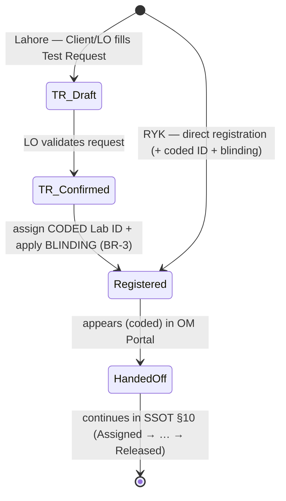

# Module 03 — Samples & Client

> **Status:** Draft v1 · **Module owner:** Liaison Officer (LO) function area · **Section relevance:** Lahore Lab, RYK Lab, Management
>
> This spec **references** the [SSOT](../SSOT.md) for everything cross-cutting (roles, blinding, numbering, business rules) and must not duplicate or contradict it. Where this document and the SSOT disagree, the SSOT wins.

---

## 1. Overview & Purpose

The Samples & Client module is the **front door** of the BECS Analytics LIMS. It is where a client relationship begins (client registration), where work is requested (test request / sample registration), and where the **coded, blinded** sample is created that flows into the [Testing & Reporting module (04)](04-testing-and-reporting.md).

Its purpose is to:

- Register clients and maintain client master data, logs, and a client dashboard.
- Accept **test requests** (Lahore) and **direct sample registrations** (RYK), assigning each sample a **coded Lab ID** ([SSOT §11](../SSOT.md#11-numbering--identifier-standards)).
- Apply **blinding** from the moment of registration so analysts and the OM never see client identity ([SSOT §8](../SSOT.md#8-blinding--decoding-rules), [BR-3](../SSOT.md#12-global-business-rules-catalog)).
- Surface the **accredited parameters** and the **parameters-and-prices** catalogue (master data fetched from module 04).
- Prepare client-facing **quotations** and **invoices**, and handle **complaints**.

This module establishes identity and blinding; module 04 performs testing and releases the **decoded** final report back to the LO.

## 2. Roles Involved

Authority follows the approval matrix in [SSOT §5](../SSOT.md#5-roles-designations--approval-matrix). This module does **not** redefine who approves what; it references that matrix.

| Role | Involvement in this module |
|---|---|
| **Liaison Officer (LO)** | Registers clients; fills/submits Lahore test requests; prepares client quotations; **generates client invoices**; receives the **decoded** final report for client release ([SSOT §8](../SSOT.md#8-blinding--decoding-rules)). |
| **Sales & Marketing Officer** | Prepares client **quotations** (shared with LO per [§5](../SSOT.md#5-roles-designations--approval-matrix)). |
| **Client** | May fill the Lahore **Test Request** form first (self-service), later confirmed/registered by the LO. |
| **RYK Lab Manager / RYK personnel** | Registers QC samples **directly** at RYK (no client test-request flow). |
| **Operations Manager (OM)** | Consumes registered samples in the OM Portal (module 04: assignment/verification). Operates on **blinded** samples only ([BR-3](../SSOT.md#12-global-business-rules-catalog)). |
| **Analyst** | Downstream (module 04); sees coded Lab ID + sample type + parameters only — **never** client identity ([SSOT §8](../SSOT.md#8-blinding--decoding-rules)). |
| **COO** | Approves the report (module 04), which unlocks **decoding** ([BR-1](../SSOT.md#12-global-business-rules-catalog), [BR-3](../SSOT.md#12-global-business-rules-catalog)). No client-registration approval is required ([§5](../SSOT.md#5-roles-designations--approval-matrix)). |

## 3. In-Scope / Out-of-Scope

**In scope**

- Client Registration, List of Clients, Client Logs, Client Dashboard.
- Sample Registration (Lahore via Test Request; RYK direct), Samples Log, Samples Dashboard.
- Test Request form (Lahore Lab).
- List of Accredited Parameters and List of Parameters & Prices (display/consumption of master data owned by module 04).
- Complaints handling.
- Client-facing Quotations and Invoices.
- Assignment of the **coded Lab ID** and application of **blinding** at registration.

**Out of scope** (owned elsewhere)

- Parameter ↔ test-method definitions, the **canonical parameter list**, raw-data capture, verification, approval, and final-report generation → [Testing & Reporting (04)](04-testing-and-reporting.md).
- Sample → analyst assignment, OM verification, COO approval, and **decoding** mechanics → [SSOT §8](../SSOT.md#8-blinding--decoding-rules) / module 04.
- Revenue recognition, payments, and ledger postings driven by client invoices → [Finance & Payroll (06)](06-finance-and-payroll.md). This module **issues** the invoice; Finance recognizes the revenue.
- Vendor-side quotations/invoices → [Inventory & Procurement (02)](02-inventory-and-procurement.md).

## 4. Feature List

Each area below has its own **Log** and **Dashboard** per the raw spec.

| # | Feature | Description | Primary role |
|---|---|---|---|
| 1 | **Client Registration** | Create/maintain a client record (fields in §6); assigns a `Client No` (`CLI-00123`, [SSOT §11](../SSOT.md#11-numbering--identifier-standards)). | LO |
| 2 | **List of Clients** | Filterable, server-paged roster of all clients. | LO |
| 3 | **Client Logs** | Audit trail of client create/update/registration events ([BR-5](../SSOT.md#12-global-business-rules-catalog)). | LO |
| 4 | **Client Dashboard** | KPIs: active clients, by sector, requests-per-client, outstanding invoices. | LO |
| 5 | **Sample Registration** | Register a sample → assign **coded Lab ID** + apply **blinding** ([SSOT §8](../SSOT.md#8-blinding--decoding-rules), [§11](../SSOT.md#11-numbering--identifier-standards), [BR-3](../SSOT.md#12-global-business-rules-catalog)). Lahore via Test Request; RYK direct. | LO (Lahore) / RYK personnel (RYK) |
| 6 | **Samples Log** | Audit/lifecycle log of registered samples (coded view). | LO / OM |
| 7 | **Samples Dashboard** | KPIs: samples by status ([SSOT §10](../SSOT.md#10-cross-cutting-workflows--state-machines)), by facility, TAT, priority backlog. | LO / OM |
| 8 | **List of Accredited Parameters** | Read-only view of parameters the lab is **accredited** to report; **fetched from module 04**. | LO / Client |
| 9 | **List of Parameters & Prices** | Read-only catalogue of parameters, methods, and unit prices; **fetched from module 04**. | LO / Sales & Marketing |
| 10 | **Complaints** | Log, triage, and track client complaints (CAPA hook, [SSOT §16](../SSOT.md#16-deferred-scope-extensibility-hooks)). | LO |
| 11 | **Quotations** | Prepare a client-facing quotation from priced parameters. | LO / Sales & Marketing Officer |
| 12 | **Invoices** | Generate a client invoice (`INV-…`); revenue recorded by Finance. | LO |
| 13 | **Test Request** | Lahore intake form (fields in §6); first filled by **Client or LO**; feeds Sample Registration. | Client / LO |

## 5. Workflows & State Transitions

The sample-to-report lifecycle is owned by [SSOT §10](../SSOT.md#10-cross-cutting-workflows--state-machines). This module **adds the registration detail** that precedes `Registered → Assigned`. The two intake paths converge on the same `Registered` state.

### 5.1 Lahore intake (Test Request path)

1. **Draft test request.** The **Client** (self-service) or **LO** fills the Test Request form (§6.3): type of sample, sample ID, parameter(s) from the parameters/methods list (with an **"Others"** free-entry fallback), UOM, optional **third-party report name**, priority, and client instructions.
2. **LO confirmation.** The LO validates the request against the client record and the [parameters & prices catalogue (module 04)](04-testing-and-reporting.md).
3. **Sample Registration.** On registration the system assigns a **coded Lab ID** (`LHR-S-2026-000123`, [SSOT §11](../SSOT.md#11-numbering--identifier-standards)) and **blinds** the `Client ↔ Sample` link in the data-access layer ([SSOT §8](../SSOT.md#8-blinding--decoding-rules), [BR-3](../SSOT.md#12-global-business-rules-catalog)). **Blinding and the coded ID begin here.**
4. **Handoff.** The sample enters state **`Registered`** and appears (coded) in the **OM Portal** → [module 04](04-testing-and-reporting.md) takes over (`Registered → Assigned → … → Approved → Decoded → Released`).

### 5.2 RYK intake (direct path)

1. **Direct Sample Registration.** RYK is an on-site QC lab — **no client test-request flow**. RYK personnel register the sample directly, mainly for the named parameter/sample combinations (§6.4).
2. **Coded Lab ID + blinding.** A coded ID (`RYK-S-2026-000045`) is assigned and blinding applied identically ([SSOT §8](../SSOT.md#8-blinding--decoding-rules), [BR-3](../SSOT.md#12-global-business-rules-catalog)).
3. **Handoff.** Sample enters **`Registered`** and proceeds per [SSOT §10](../SSOT.md#10-cross-cutting-workflows--state-machines).

> **Emphasis:** the **coded Lab ID** and **blinding** are not a later step — they are applied **atomically at registration** (both paths). From `Registered` onward, no analyst or OM action exposes client identity until **COO approval unlocks decoding** ([SSOT §8](../SSOT.md#8-blinding--decoding-rules)).

### 5.3 Registration state diagram



The remainder (`Registered → Assigned → ResultsEntered → Verified → Approved → Decoded → Released`) is defined once in [SSOT §10](../SSOT.md#10-cross-cutting-workflows--state-machines) and **not** restated here.

## 6. Data Entities & Fields

Module-specific fields only. Cross-module relationships and the canonical ERD live in [SSOT §9](../SSOT.md#9-global-domain-model-erd). `PARAMETER`, `PRICE`, and `TEST_METHOD` are **owned by module 04** and referenced here, not redefined.

### 6.1 Client (`CLIENT`)

Registered by the LO ([SSOT §5](../SSOT.md#5-roles-designations--approval-matrix)). `Client No` format `CLI-00123` ([SSOT §11](../SSOT.md#11-numbering--identifier-standards)).

| Field | Type | Required | Notes |
|---|---|---|---|
| Client No | string (gen.) | yes | `CLI-00123`, company-wide ([SSOT §11](../SSOT.md#11-numbering--identifier-standards)) |
| Company | string | yes | |
| Company Address | string | yes | |
| Contact Person | string | yes | |
| Contact # | string | yes | |
| Email | string (citext) | yes | |
| Sector | enum/string | yes | Drives Client Dashboard segmentation |
| facilityId / sectionId | scope | yes | Stamped per [SSOT §7](../SSOT.md#7-section--facility-scoping-rules) ([BR-6](../SSOT.md#12-global-business-rules-catalog)) |

### 6.2 Sample (`SAMPLE`) — module-specific fields

| Field | Type | Required | Notes |
|---|---|---|---|
| Lab ID (coded) | string (gen.) | yes | `LHR-S-2026-000123` / `RYK-S-2026-000045` — the **only** ID analysts/OM see ([SSOT §8](../SSOT.md#8-blinding--decoding-rules), [§11](../SSOT.md#11-numbering--identifier-standards)) |
| clientId | FK → CLIENT | yes (Lahore) | **Access-gated / blinded link** ([BR-3](../SSOT.md#12-global-business-rules-catalog)); absent for some RYK QC |
| Sample Type | string | yes | e.g. Zabardast Urea, Raw Zinc, AOM, MPF (RYK) |
| Origin path | enum | yes | `TEST_REQUEST` (Lahore) \| `DIRECT` (RYK) |
| thirdPartyReportName | string | no | Report issued in a third party's name ([SSOT §8](../SSOT.md#8-blinding--decoding-rules)) |
| Priority | enum | yes | e.g. Normal / Urgent |
| Client Instructions | text | no | |
| status | enum | yes | Lifecycle state per [SSOT §10](../SSOT.md#10-cross-cutting-workflows--state-machines) |
| facilityId / sectionId | scope | yes | [SSOT §7](../SSOT.md#7-section--facility-scoping-rules) |

`SAMPLE ||--o{ SAMPLE_PARAMETER` and `SAMPLE_PARAMETER }o--|| PARAMETER` per [SSOT §9](../SSOT.md#9-global-domain-model-erd).

### 6.3 Test Request (`TEST_REQUEST`, Lahore only)

First filled by **Client or LO**.

| Field | Type | Required | Notes |
|---|---|---|---|
| Type of Sample | string | yes | |
| Sample ID | string | yes | Client-supplied sample identifier (distinct from the **coded Lab ID** assigned at registration) |
| Parameter(s) | FK → PARAMETER[] | yes | Picked from the parameters/methods list **fetched from module 04** |
| Others (free entry) | string | conditional | Used when the parameter is **absent** from the list |
| UOM | string | yes | Unit of measure |
| Third-party report name | string | no | Option for the report to be issued in another party's name |
| Priority | enum | yes | |
| Client Instructions | text | no | |

### 6.4 RYK QC parameter/sample master data (named values)

Direct-registration QC focuses mainly on:

| Parameter | Sample type |
|---|---|
| BAZ | Zabardast Urea |
| Total Zinc | Raw Zinc |
| BAZ | AOM |
| Citrate-Soluble P₂O₅ | MPF |

> Per [SSOT §3](../SSOT.md#3-glossary--domain-terminology), **BAZ / AOM / MPF / Zabardast Urea / Raw Zinc** are treated as **named master-data values**; their exact technical definitions are an **open item** to confirm with BECS lab management (see §11).

### 6.5 Quotation / Invoice / Complaint (module-specific)

- **Quotation** — line items from the priced-parameter catalogue (module 04); prepared by LO or Sales & Marketing Officer ([§5](../SSOT.md#5-roles-designations--approval-matrix)).
- **Invoice** — `INV-LHR-2026-00045` ([SSOT §11](../SSOT.md#11-numbering--identifier-standards)); generated by LO; `INVOICE }o--|| REVENUE` recognized by Finance ([SSOT §9](../SSOT.md#9-global-domain-model-erd)).
- **Complaint** — client, subject, description, status; CAPA-source hook ([SSOT §16](../SSOT.md#16-deferred-scope-extensibility-hooks)).

## 7. Screens / Views

| Screen | Audience | Purpose |
|---|---|---|
| Client Registration form | LO | Capture client fields (§6.1) |
| List of Clients | LO | Server-paged, filterable roster |
| Client Logs | LO | Audit events per client ([BR-5](../SSOT.md#12-global-business-rules-catalog)) |
| Client Dashboard | LO | Sector/active/outstanding KPIs |
| Test Request form | Client / LO | Lahore intake (§6.3) |
| Sample Registration | LO / RYK | Assign coded Lab ID + blinding |
| Samples Log | LO / OM | Coded sample lifecycle list |
| Samples Dashboard | LO / OM | Status/TAT/priority KPIs |
| List of Accredited Parameters | LO / Client | Read-only (from module 04) |
| List of Parameters & Prices | LO / Sales & Marketing | Read-only (from module 04) |
| Complaints | LO | Log + track complaints |
| Quotations | LO / Sales & Marketing | Prepare client quotation |
| Invoices | LO | Generate client invoice |

> All list/log screens use **server-side pagination/filtering** ([SSOT §13](../SSOT.md#13-non-functional-requirements)). Every screen is **scope-filtered** by facility/section ([SSOT §7](../SSOT.md#7-section--facility-scoping-rules)).

## 8. User Stories with Gherkin Acceptance Criteria

### US-1 — Register a client
> As the **Liaison Officer**, I want to register a client so that samples can be linked to a client identity.

```gherkin
Scenario: LO registers a new client
  Given I am authenticated as the Liaison Officer
  And I provide Company, Company Address, Contact Person, Contact #, Email and Sector
  When I submit the client registration form
  Then a Client record is created with a unique Client No (CLI-#####)
  And the record is stamped with my facility and section
  And a client log entry is written to the audit trail
```

### US-2 — Submit a Lahore test request (self-service then LO)
> As a **Client**, I want to fill a test request so the LO can register my sample.

```gherkin
Scenario: Client requests a parameter that exists in the catalogue
  Given a Test Request form for Lahore Lab
  When I select a parameter from the parameters-and-methods list fetched from module 04
  And I enter type of sample, sample ID, UOM, priority and instructions
  Then the request is saved as Draft for LO confirmation

Scenario: Requested parameter is not in the catalogue
  Given a Test Request form
  When the parameter I need is not in the list
  Then an "Others" option lets me enter the parameter as free text
  And the request is flagged for LO review before registration
```

### US-3 — Register a sample with coded Lab ID and blinding
> As the **Liaison Officer**, I want sample registration to code and blind the sample so analysts never see the client.

```gherkin
Scenario: Registration assigns a coded Lab ID and blinds the link
  Given a confirmed Lahore test request
  When I register the sample
  Then a unique coded Lab ID (LHR-S-YYYY-######) is assigned in the same transaction
  And the Client-to-Sample link is blinded in the data-access layer (BR-3)
  And the sample enters the Registered state
  And it appears in the OM Portal showing only the coded ID, sample type and parameters
```

### US-4 — RYK direct registration
> As **RYK personnel**, I want to register QC samples directly without a client test request.

```gherkin
Scenario: Direct QC registration at RYK
  Given I am at the RYK facility
  When I register a sample for "BAZ in AOM"
  Then no client test-request flow is required
  And a coded Lab ID (RYK-S-YYYY-######) is assigned and blinding applied
  And the sample enters the Registered state
```

### US-5 — Third-party report name
> As a **Client**, I want my report issued in the name of a third party.

```gherkin
Scenario: Report requested in a third party's name
  Given I am filling the test request
  When I choose to have the report issued in the name of a third party
  And I provide that third party's name
  Then the third-party identity is stored with the sample
  And it is applied at decode time on the final report (SSOT §8)
```

### US-6 — Prepare a client quotation
> As the **Sales & Marketing Officer** (or **LO**), I want to prepare a quotation from priced parameters.

```gherkin
Scenario: Build a quotation from the priced catalogue
  Given I am authenticated as LO or Sales & Marketing Officer
  When I add parameters from the parameters-and-prices list fetched from module 04
  Then a client quotation is generated with line prices
```

### US-7 — Generate a client invoice
> As the **Liaison Officer**, I want to generate a client invoice.

```gherkin
Scenario: LO generates an invoice
  Given a client and completed/quoted work
  When I generate an invoice
  Then a unique Invoice No (INV-LHR-YYYY-#####) is assigned
  And the invoice is available to Finance for revenue recognition
```

### US-8 — Log a complaint
> As the **Liaison Officer**, I want to log a client complaint so it can be tracked.

```gherkin
Scenario: Log and track a complaint
  Given I am authenticated as the Liaison Officer
  When I record a complaint with client, subject and description
  Then a complaint record is created with an open status
  And it is available as a CAPA source per SSOT §16
```

## 9. Module Business Rules

These reference the global catalogue ([SSOT §12](../SSOT.md#12-global-business-rules-catalog)); they are **not** new rules.

- **[BR-3](../SSOT.md#12-global-business-rules-catalog) (primary)** — Samples are **blinded** at registration; analysts and the OM see only the coded Lab ID, sample type, and parameters. Client identity is revealed only after **COO approval** (decode) ([SSOT §8](../SSOT.md#8-blinding--decoding-rules)). **Blinding and the coded ID begin at registration in this module.**
- **[BR-7](../SSOT.md#12-global-business-rules-catalog)** — The coded **Lab ID** (and `Client No`, `Invoice No`) are gap-free, unique, non-reusable, generated concurrency-safely ([SSOT §11](../SSOT.md#11-numbering--identifier-standards)).
- **[BR-5](../SSOT.md#12-global-business-rules-catalog)** — Every client/sample/quotation/invoice create/update writes an immutable audit-log entry (the per-area Logs).
- **[BR-6](../SSOT.md#12-global-business-rules-catalog)** — Every record is scoped to facility + section; the RYK direct path and Lahore path are scoped accordingly ([SSOT §7](../SSOT.md#7-section--facility-scoping-rules)).
- **[BR-1](../SSOT.md#12-global-business-rules-catalog)** — Client registration and sample registration **do not** require COO approval per [§5](../SSOT.md#5-roles-designations--approval-matrix); the COO approval gate sits on the **report** (module 04), which unlocks decoding.
- **Module rule (parameters):** the parameter/method/price list is **read-only** here and **sourced from module 04**; the only local extension is the test-request **"Others"** free-entry fallback for absent parameters.

## 10. Dependencies & Integrations

| Depends on / integrates with | What this module consumes or produces |
|---|---|
| **[Testing & Reporting (04)](04-testing-and-reporting.md)** | **Fetches** the parameters & test-methods list, the **accredited-parameters** list, and **prices**. Produces the **coded, blinded** `SAMPLE` that module 04 assigns/tests. Receives the **decoded** final report (ID + QR + seal) back at the LO on COO approval ([SSOT §8](../SSOT.md#8-blinding--decoding-rules), [§10](../SSOT.md#10-cross-cutting-workflows--state-machines)). |
| **[Finance & Payroll (06)](06-finance-and-payroll.md)** | Client **Invoices** generated here flow to Finance for **revenue recognition** (`INVOICE }o--|| REVENUE`, [SSOT §9](../SSOT.md#9-global-domain-model-erd)). |
| **[Personnel (01)](01-personnel.md)** | Role/Function gating — LO/Sales & Marketing capabilities resolve via the two-tier authorization model ([SSOT §6](../SSOT.md#6-authorization-model)). |
| **Cross-cutting** | `AuditLog`, `Attachment`, `Sequence` (numbering), `Notification` ([SSOT §9](../SSOT.md#9-global-domain-model-erd)); blinding/decoding enforced in the data-access layer ([SSOT §8](../SSOT.md#8-blinding--decoding-rules)). |

## 11. Open Questions / Assumptions

**Open questions**

1. **RYK master-data definitions** — confirm exact technical definitions of **BAZ, AOM, MPF, Zabardast Urea, Raw Zinc** so parameter master data is seeded correctly (per [SSOT §3](../SSOT.md#3-glossary--domain-terminology) open item).
2. **Client-side decode visibility** — confirmed that only the **LO** receives the decoded report; do quotations/invoices ever require the coded↔client link to be visible to Sales & Marketing? (Assumed **no** — Sales & Marketing only prepares quotations from priced parameters.)
3. **Sample ID vs Lab ID** — the client-supplied **Sample ID** on the test request is distinct from the system **coded Lab ID**; confirm both must be retained and that the client Sample ID is **not** itself blinded (assumed retained, not identity-revealing).
4. **"Others" parameter governance** — when a client picks "Others", does the new parameter require module-04 onboarding (method/price) before the report can be released? (Assumed **yes** — it cannot be reported until module 04 has a method.)
5. **RYK clients** — RYK direct registration may have **no external client** (internal QC); confirm whether a synthetic internal "client" is recorded for traceability.

**Assumptions**

- Client and sample registration require **no COO approval** ([§5](../SSOT.md#5-roles-designations--approval-matrix)); the approval gate is on the report (module 04).
- The **Test Request** form applies to **Lahore Lab only**; RYK never uses it.
- Quotations are **draft commercial documents** here; any approval workflow, if needed, is out of scope for this build.
- All list/log/dashboard screens are server-paged and facility/section-scoped ([SSOT §7](../SSOT.md#7-section--facility-scoping-rules), [§13](../SSOT.md#13-non-functional-requirements)).
