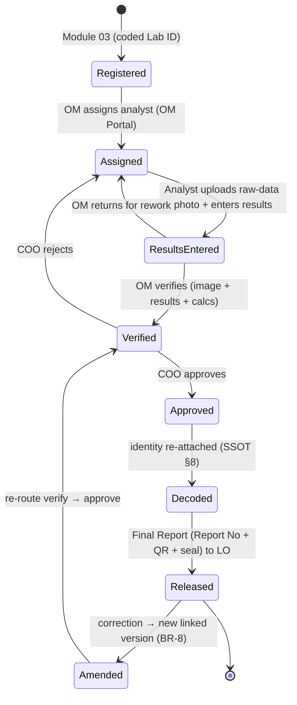

# Module 04 — Testing & Reporting

> **Status:** Draft v1 · **Module owner:** BECS Analytics · **Depends on:** [SSOT](../SSOT.md)
>
> This spec references the [SSOT](../SSOT.md) and must not duplicate or contradict it. Cross-cutting rules (approval matrix, blinding, numbering, business rules) live in the SSOT; this document covers only what is module-specific.

---

## 1. Overview & Purpose

The Testing & Reporting module is the technical core of the LIMS. It owns the laboratory's **master catalogue of test parameters and test methods**, captures **analysis raw data** (as an uploaded photo of the analyst's raw-data sheet plus entered result values), and drives the **test → verify → approve → decode → release** chain that turns a registered, blinded sample into a sealed, QR-stamped **Final Report**.

The module exists to guarantee that every reported result is:

- produced under **blinding** — analysts and the OM see only a coded Lab ID, never the client identity (SSOT [§8](../SSOT.md#8-blinding--decoding-rules), [BR-3](../SSOT.md#12-global-business-rules-catalog));
- subject to **segregation of duty** — the person who performs, the person who verifies, and the person who approves are three distinct people (SSOT [§6](../SSOT.md#6-authorization-model), [BR-4](../SSOT.md#12-global-business-rules-catalog));
- **traceable** to the method version, the instrument's calibration validity, and the analyst's authorization as of the test date (SSOT [BR-13](../SSOT.md#12-global-business-rules-catalog));
- captured in an **immutable, hash-sealed snapshot** with a unique Report No and QR code (SSOT [§11](../SSOT.md#11-numbering--identifier-standards), [BR-8](../SSOT.md#12-global-business-rules-catalog)).

This module **owns** the parameter and test-method master data that the Samples & Client module (03) reads from when registering test requests.

## 2. Roles Involved

Roles, initiators, and approvers are authoritative in the SSOT **Approval Matrix** ([§5](../SSOT.md#5-roles-designations--approval-matrix)). This module touches the following rows of that matrix; consult the SSOT for the canonical definitions.

| Role | Responsibility in this module | SSOT §5 row |
|---|---|---|
| **OM** (Operations Manager) | Assigns registered samples to analysts on the OM Portal; **verifies** uploaded raw data + results before approval; owns parameter / test-method master data add/edit (with COO authorization) | "Sample → analyst assignment", "Raw data + results" |
| **Analyst** | Performs the test on a **blinded** sample; **uploads a photo of the raw-data sheet** and enters result values | "Raw data + results" |
| **COO** | **Approves** verified results; approval unlocks Final Report generation + decode | "Raw data + results", "Final report release" |
| **Liaison Officer (LO)** | Receives the **decoded** Final Report for client-facing release | "Final report release" |
| **Lab Manager (RYK)** | Acts in the OM coordination role for direct-registered RYK on-site QC samples (per hierarchy, SSOT [§4](../SSOT.md#4-organization-facilities--sections)) | — |

> **Function gating (SSOT [§6](../SSOT.md#6-authorization-model)):** running a given test method and signing/approving reports are gated **Functions**. Only users holding a valid, non-expired Authorization for the relevant Function may act ([BR-2](../SSOT.md#12-global-business-rules-catalog)). Each Parameter↔TestMethod association may require an authorizing Function.

## 3. In-Scope / Out-of-Scope

| In scope | Out of scope (owned elsewhere) |
|---|---|
| Master list of Parameters and Test Methods (this module is the owner) | Sample registration, test-request form, coded Lab ID assignment → Module 03 |
| Parameter ↔ Test Method mapping (M:N), with required authorizing Function per association | Client registration, client identity, quotations, invoices → Module 03 |
| Analysis Raw Data capture (photo upload + result entry) | Authorization / Competence / Function definitions → Module 01 (Personnel) |
| Internal Reports (pre-approval, internal) | Calibration records, instrument qualification (IQ/OQ/PQ) → Module 05 (Equipment & Traceability) — *referenced for traceability only* |
| Final Reports (post-approval, decoded, sealed, QR) | Decode UI for client release downstream of LO → Module 03 (consumes decoded report) |
| Verification (OM) and Approval (COO) steps of the testing chain | Revenue recognition from reporting → Module 06 (Finance) |
| Individual Logs (audit trail for this module's actions) | Blinding/decoding *engine* (data-access layer) → cross-cutting (SSOT [§8](../SSOT.md#8-blinding--decoding-rules)) |
| Traceability linkage at result time (method version, calibration validity, analyst authorization) | — |

## 4. Feature List

| Feature | Description | Primary role |
|---|---|---|
| **List of Parameters and Test Methods** | Browsable/searchable master catalogue of all test parameters and all test methods (with method versions). This module is the **system of record**; Module 03 reads from it when building test requests. | OM |
| **Parameters and Test Methods (mapping)** | The **M:N association** between Parameter and TestMethod — which methods can measure which parameters. Each association may carry a required **authorizing Function** (SSOT [§6](../SSOT.md#6-authorization-model)), so only authorized analysts can run that method for that parameter. | OM (COO authorizes) |
| **Analysis Raw Data** | Per `SampleParameter`, the analyst **uploads a photo/image of the raw-data sheet** (stored as an `Attachment`) and **enters the result value(s) + calculations**. The analyst does **not** transcribe a structured raw-data sheet — the image is the primary raw record. | Analyst |
| **Internal Reports** | Pre-approval, internal-only compilation of a sample's results for OM verification and COO review. Not client-facing; still **blinded** (coded Lab ID). | OM / COO |
| **Final Reports** | Post-approval, client-facing report. Generated on COO approval, **decoded**, carries a unique Report No + **QR code**, and is a **hash-sealed immutable snapshot** ([BR-8](../SSOT.md#12-global-business-rules-catalog)). | System → LO |
| **Individual Logs** | Per-entity audit trail (assignment, upload, verify, approve, decode, release, amend) writing immutable audit-log entries ([BR-5](../SSOT.md#12-global-business-rules-catalog)). | All (read), system (write) |

## 5. Workflows & State Transitions

This module realizes the SSOT **Sample → Report lifecycle** ([§10](../SSOT.md#10-cross-cutting-workflows--state-machines)). The states below map 1:1 to that state machine; this section details the testing, verification, approval, and decode steps.

### 5.1 Step-by-step

1. **Registered → Assigned.** A sample registered in Module 03 (coded Lab ID assigned) appears on the **OM Portal**. The **OM assigns** the sample (and its parameters) to an **Analyst**. The analyst sees only the coded Lab ID, sample type, and parameters to test ([BR-3](../SSOT.md#12-global-business-rules-catalog)). Assignment is gated by the analyst's Authorization for the relevant test-method Function ([BR-2](../SSOT.md#12-global-business-rules-catalog)).
2. **Assigned → ResultsEntered.** The **Analyst performs the test**, then for each `SampleParameter`:
   - **uploads a photo/image of the raw-data sheet** → stored as `Attachment` (raw-data photo);
   - **enters the result value(s) and calculations**.
   At save, the system **stamps traceability** ([BR-13](../SSOT.md#12-global-business-rules-catalog)): the **method version** used, the **instrument's calibration validity** as of the test date, and the **analyst's authorization** as of the test date. Server-authoritative timestamp ([BR-14](../SSOT.md#12-global-business-rules-catalog)).
3. **ResultsEntered → Verified.** The **OM verifies** by reviewing the **uploaded raw-data image + entered results + calculations** against the parameters. The OM must be a **different person** from the analyst ([BR-4](../SSOT.md#12-global-business-rules-catalog)). The OM may **return for rework** (→ Assigned). On accept, an **Internal Report** is available.
4. **Verified → Approved.** The verified results route to the **COO** for **approval**. The COO must be **distinct** from both analyst and OM ([BR-4](../SSOT.md#12-global-business-rules-catalog)). COO may **reject** (→ Assigned for rework).
5. **Approved → Decoded.** COO approval **unlocks decoding** (SSOT [§8](../SSOT.md#8-blinding--decoding-rules)): client identity (or the requested third-party identity) is re-attached. The decode event is **audited** (who, when, which report).
6. **Decoded → Released.** The **Final Report** is generated as a **hash-sealed snapshot** with a unique **Report No + QR code** (SSOT [§11](../SSOT.md#11-numbering--identifier-standards), [BR-8](../SSOT.md#12-global-business-rules-catalog)) and shown to the **Liaison Officer** for client-facing release.
7. **Amendment (any time after Released).** A correction never edits a sealed report; it **creates a new linked version** that supersedes the prior one ([BR-8](../SSOT.md#12-global-business-rules-catalog)), itself re-routed through verify → approve.

> **RYK note:** RYK on-site QC samples are **direct-registered** (Module 03) and follow the same chain; the Lab Manager (RYK) acts in the OM coordination role per SSOT [§4](../SSOT.md#4-organization-facilities--sections).

### 5.2 State diagram



## 6. Data Entities & Fields

Module-specific entities and fields. These attach to the global ERD (SSOT [§9](../SSOT.md#9-global-domain-model-erd)) — see `PARAMETER`, `TEST_METHOD`, `ANALYSIS_RAW_DATA`, `SAMPLE_PARAMETER`, `ATTACHMENT`, `FINAL_REPORT`. Internal PKs are UUID/cuid (SSOT [§15](../SSOT.md#15-conventions)).

### 6.1 `Parameter` (master data — owned here)

| Field | Type | Notes |
|---|---|---|
| `id` | uuid | PK |
| `name` | string | e.g. "Total Zinc", "Citrate-Soluble P₂O₅" |
| `code` | string | short code |
| `uom` | string | unit of measure |
| `isAccredited` | bool | drives "accredited parameter" lists (SSOT [§3](../SSOT.md#3-glossary--domain-terminology)) |
| `facilityScope` | enum | facility/section scoping ([BR-6](../SSOT.md#12-global-business-rules-catalog)) |
| `status` | enum | active / retired |

### 6.2 `TestMethod` (master data — owned here)

| Field | Type | Notes |
|---|---|---|
| `id` | uuid | PK |
| `code` | string | e.g. `TM-014` |
| `name` | string | method title |
| `version` | string | **versioned**; result stamps the version used ([BR-13](../SSOT.md#12-global-business-rules-catalog)) |
| `effectiveFrom` / `effectiveTo` | datetime | version validity window |
| `requiredFunctionId` | uuid (FK → Function) | authorizing Function to run this method (SSOT [§6](../SSOT.md#6-authorization-model)) |
| `status` | enum | active / superseded / retired |

### 6.3 `ParameterTestMethod` (M:N association)

| Field | Type | Notes |
|---|---|---|
| `id` | uuid | PK |
| `parameterId` | uuid (FK) | |
| `testMethodId` | uuid (FK) | |
| `requiredFunctionId` | uuid (FK → Function), nullable | per-association authorizing Function override (SSOT [§6](../SSOT.md#6-authorization-model)) |
| `isDefault` | bool | preferred method for the parameter |

### 6.4 `AnalysisRawData`

| Field | Type | Notes |
|---|---|---|
| `id` | uuid | PK |
| `sampleParameterId` | uuid (FK, 1:1) | the blinded sample's parameter under test |
| `rawDataPhotoId` | uuid (FK → Attachment) | **photo/image of the raw-data sheet** (MinIO-stored, SSOT [§14](../SSOT.md#14-technology-stack--architecture-summary)) |
| `resultValue` | string/decimal | analyst-entered result |
| `calculations` | text | analyst-entered calculations |
| `analystId` | uuid (FK → User) | performer (segregation, [BR-4](../SSOT.md#12-global-business-rules-catalog)) |
| `testDate` | datetime | server-authoritative ([BR-14](../SSOT.md#12-global-business-rules-catalog)) |
| `methodVersionRef` | string | TestMethod version as of `testDate` ([BR-13](../SSOT.md#12-global-business-rules-catalog)) |
| `calibrationValidityRef` | uuid/snapshot | instrument calibration validity at `testDate` (Module 05) ([BR-13](../SSOT.md#12-global-business-rules-catalog)) |
| `authorizationRef` | uuid/snapshot | analyst authorization at `testDate` ([BR-13](../SSOT.md#12-global-business-rules-catalog)) |
| `verifiedById` | uuid (FK → User), nullable | OM verifier ([BR-4](../SSOT.md#12-global-business-rules-catalog)) |
| `verifiedAt` | datetime, nullable | |
| `status` | enum | Assigned / ResultsEntered / Verified / Rework |

### 6.5 `InternalReport`

| Field | Type | Notes |
|---|---|---|
| `id` | uuid | PK |
| `sampleId` | uuid (FK) | blinded — coded Lab ID only |
| `compiledResults` | json | aggregate of verified `AnalysisRawData` |
| `status` | enum | Draft / Verified / SubmittedToCOO |
| `isBlinded` | bool (const true) | pre-approval, internal-only |

### 6.6 `FinalReport`

| Field | Type | Notes |
|---|---|---|
| `id` | uuid | PK |
| `reportNo` | string | unique, e.g. `LHR-R-2026-000123` (SSOT [§11](../SSOT.md#11-numbering--identifier-standards), [BR-7](../SSOT.md#12-global-business-rules-catalog)) |
| `qrCode` | string/blob | encodes verification URL/hash (SSOT [§11](../SSOT.md#11-numbering--identifier-standards)) |
| `contentHash` | string | hash seal of the immutable snapshot ([BR-8](../SSOT.md#12-global-business-rules-catalog)) |
| `sealedPdfId` | uuid (FK → Attachment) | rendered sealed PDF (MinIO) |
| `sampleId` | uuid (FK) | |
| `decodedIdentity` | json | client or requested third-party identity (re-attached at decode, SSOT [§8](../SSOT.md#8-blinding--decoding-rules)) |
| `approvedById` | uuid (FK → COO) | ([BR-4](../SSOT.md#12-global-business-rules-catalog)) |
| `approvedAt` | datetime | |
| `decodedAt` | datetime | decode event (audited) |
| `version` | int | amendments increment |
| `supersedesReportId` | uuid (FK → FinalReport), nullable | links amended → superseded ([BR-8](../SSOT.md#12-global-business-rules-catalog)) |
| `status` | enum | Approved / Decoded / Released / Superseded |

## 7. Screens / Views

| Screen | Audience | Purpose |
|---|---|---|
| **List of Parameters & Test Methods** | OM | Browse/search/manage parameter and method master data + versions |
| **Parameter ↔ Test Method mapping** | OM (COO authorizes) | Manage M:N associations and required authorizing Function |
| **OM Portal** | OM | Inbox of registered samples; **assign** sample → analyst |
| **My Assigned Tests** | Analyst | Blinded worklist (coded Lab ID, sample type, parameters) |
| **Raw Data Entry** | Analyst | Upload raw-data sheet photo + enter results/calculations |
| **Verification Queue** | OM | Review uploaded image + results; verify or return for rework |
| **Approval Queue** | COO | Review Internal Report; approve or reject |
| **Internal Report view** | OM / COO | Pre-approval, blinded compiled results |
| **Final Report view** | LO | Decoded, sealed report with Report No + QR; release to client |
| **Individual Logs** | All (scoped) | Per-entity audit trail (paginated server-side) |

## 8. User Stories with Gherkin Acceptance Criteria

### US-1 — OM assigns a registered sample to an analyst
```gherkin
Feature: Sample assignment on the OM Portal
  Scenario: OM assigns a blinded sample to an authorized analyst
    Given a sample with a coded Lab ID is Registered and visible on the OM Portal
    And the chosen analyst holds a valid Authorization for the method's Function
    When the OM assigns the sample and its parameters to the analyst
    Then the sample state becomes "Assigned"
    And the analyst sees only the coded Lab ID, sample type, and parameters (BR-3)
    And the assignment is written to the audit log (BR-5)

  Scenario: Assignment blocked for an unauthorized analyst
    Given the chosen analyst lacks a valid Authorization for the method's Function
    When the OM attempts to assign the sample
    Then the system rejects the assignment (BR-2)
```

### US-2 — Analyst uploads raw data and enters results
```gherkin
Feature: Analysis raw data capture
  Scenario: Analyst records a result with a raw-data photo
    Given an analyst has an Assigned, blinded sample
    When the analyst uploads a photo of the raw-data sheet and enters the result and calculations
    Then an AnalysisRawData record is created linked to the Attachment image
    And the record stamps method version, instrument calibration validity, and analyst authorization as of the test date (BR-13)
    And the test date uses the server-authoritative timestamp (BR-14)
    And the sample state becomes "ResultsEntered"
```

### US-3 — OM verifies results (segregation of duty)
```gherkin
Feature: OM verification
  Scenario: OM verifies a result they did not perform
    Given results are ResultsEntered for a blinded sample
    And the verifying OM is a different person from the analyst (BR-4)
    When the OM reviews the uploaded image, results, and calculations and accepts
    Then the sample state becomes "Verified"
    And an Internal Report is available

  Scenario: OM returns results for rework
    When the OM rejects the results during verification
    Then the sample state returns to "Assigned"
    And the rework reason is logged (BR-5)
```

### US-4 — COO approves and Final Report is decoded and released
```gherkin
Feature: COO approval, decode, and release
  Scenario: COO approves verified results
    Given a sample is Verified
    And the approving COO is distinct from the analyst and the OM (BR-4)
    When the COO approves
    Then the sample state becomes "Approved"
    And decoding is unlocked (SSOT §8)

  Scenario: Final Report generated, sealed, decoded, released
    Given the COO has approved
    When the system generates the Final Report
    Then the report has a unique Report No and a QR code (SSOT §11, BR-7)
    And the report is a hash-sealed immutable snapshot (BR-8)
    And client identity is re-attached and the decode event is audited (SSOT §8)
    And the decoded report is shown to the Liaison Officer (state "Released")
```

### US-5 — Amending a released report
```gherkin
Feature: Report amendment
  Scenario: Correction creates a new linked version
    Given a Final Report has been Released
    When an amendment is required
    Then a new Final Report version is created linked to the superseded report (BR-8)
    And the prior report is marked "Superseded" and remains immutable
    And the new version is re-routed through verification and approval
```

## 9. Module Business Rules

This module enforces the following SSOT rules (canonical text in SSOT [§12](../SSOT.md#12-global-business-rules-catalog)):

| Rule | Application in this module |
|---|---|
| [**BR-2**](../SSOT.md#12-global-business-rules-catalog) | An analyst may run a method only with a valid, non-expired Authorization for the method's Function; assignment and result entry are gated. |
| [**BR-3**](../SSOT.md#12-global-business-rules-catalog) | Analysts and the OM operate on **blinded** samples (coded Lab ID only) throughout testing and verification. |
| [**BR-4**](../SSOT.md#12-global-business-rules-catalog) | **Segregation of duty:** Analyst (performs) ≠ OM (verifies) ≠ COO (approves) — enforced server-side at each transition. |
| [**BR-5**](../SSOT.md#12-global-business-rules-catalog) | Every assignment, upload, verify, approve, decode, release, and amend writes an immutable audit-log entry (Individual Logs). |
| [**BR-7**](../SSOT.md#12-global-business-rules-catalog) | The Final Report No is gap-free, unique, non-reusable, facility-prefixed (SSOT [§11](../SSOT.md#11-numbering--identifier-standards)). |
| [**BR-8**](../SSOT.md#12-global-business-rules-catalog) | A Final Report is an immutable, hash-sealed snapshot with QR; amendments create a new linked version superseding the old. |
| [**BR-13**](../SSOT.md#12-global-business-rules-catalog) | Each result links to method version, instrument calibration validity, and analyst authorization **as of the test date**. |
| [**BR-14**](../SSOT.md#12-global-business-rules-catalog) | Test dates and signature/approval timestamps are server-authoritative; client times are not trusted. |
| [**BR-6**](../SSOT.md#12-global-business-rules-catalog) | Parameters, methods, raw data, and reports are scoped to facility/section; cross-scope read requires an explicit capability. |

Module-specific clarifications:

- **MR-04-1** — The raw-data **photo/image is the primary raw record**; the analyst does not transcribe a structured digital raw-data sheet. Result values and calculations are entered alongside the image.
- **MR-04-2** — **Internal Reports are blinded and pre-approval**; **Final Reports are decoded and post-approval**. Only Final Reports carry a Report No + QR + seal and are client-facing.
- **MR-04-3** — Each `ParameterTestMethod` association may require an **authorizing Function**; if present, only analysts authorized for that Function may be assigned that parameter-method combination.

## 10. Dependencies & Integrations

| Direction | Module / system | Interface |
|---|---|---|
| **Provides → 03 (Samples & Client)** | Parameter + Test Method master list (this module owns it); Module 03's test-request form reads `Parameter`, `TestMethod`, and `ParameterTestMethod` | Read API over master data |
| **Consumes ← 03 (Samples & Client)** | Registered samples with coded Lab IDs appear on the OM Portal; decoded Final Report consumed by LO for client release | Sample lifecycle handoff (Registered → ...) |
| **Consumes ← 01 (Personnel)** | Functions, Competence, Authorizations (validity at action time and test date) for gating and traceability | Authorization check (SSOT [§6](../SSOT.md#6-authorization-model)) |
| **Consumes ← 05 (Equipment & Traceability)** | Instrument **calibration validity** as of the test date for [BR-13](../SSOT.md#12-global-business-rules-catalog) stamping | Calibration validity lookup |
| **Consumes → 06 (Finance)** | Released reports may trigger downstream revenue recognition | Event/handoff |
| **Cross-cutting** | `Attachment` (raw-data photos, sealed PDFs → MinIO), `AuditLog`, `Approval`/`ApprovalStep`, `Signature`, `Sequence` (Report No), `Notification`; blinding/decoding enforced in the data-access layer | SSOT [§9](../SSOT.md#9-global-domain-model-erd), [§14](../SSOT.md#14-technology-stack--architecture-summary) |
| **Tooling** | PDF + QR generation (`@react-pdf/renderer` + QR lib); background jobs via pg-boss for report rendering/sealing | SSOT [§14](../SSOT.md#14-technology-stack--architecture-summary) |

## 11. Open Questions / Assumptions

**Open questions**

1. **Multi-result parameters:** can a single `SampleParameter` carry multiple result values (replicates/sub-results), or strictly one? (Schema currently models one primary result with calculations text.)
2. **Method-version pinning at assignment vs. test:** is the method version pinned at **assignment** or at **result entry / test date**? SSOT [BR-13](../SSOT.md#12-global-business-rules-catalog) anchors traceability to the test date — assumed authoritative.
3. **Calibration-invalid behavior:** if an instrument's calibration is **expired at the test date**, should result entry be **blocked** or **flagged**? SSOT [§6](../SSOT.md#6-authorization-model) implies lapsed authorization closes the gate and retroactively flags — confirm the same posture for calibration.
4. **RYK coordination role:** confirm whether the **Lab Manager (RYK)** performs verification for RYK samples, or whether verification always routes to the OM at Lahore.
5. **Approver of amendments:** does an amended report require COO re-approval in all cases, or a lighter path for clerical corrections? (Assumed full re-route.)
6. **Master-data seeding:** confirm precise definitions of **BAZ, AOM, MPF, Zabardast Urea, Raw Zinc** so parameter/method master data is seeded correctly (SSOT [§3](../SSOT.md#3-glossary--domain-terminology) open item).

**Assumptions**

- A1 — The uploaded raw-data **image is the legal raw record**; structured digital raw-data sheets are out of scope for this build (MR-04-1).
- A2 — One `AnalysisRawData` per `SampleParameter` (1:1, per SSOT [§9](../SSOT.md#9-global-domain-model-erd) ERD).
- A3 — Decode for client release is **unlocked here** (on COO approval) but the **client-facing decode UI** lives in Module 03 (LO).
- A4 — Final Report rendering/sealing runs as a background job; the Report No is reserved concurrency-safely within the generating transaction (SSOT [§11](../SSOT.md#11-numbering--identifier-standards)).
- A5 — Internal Reports are never client-facing and are purged/retained per the same retention policy as their sample.
