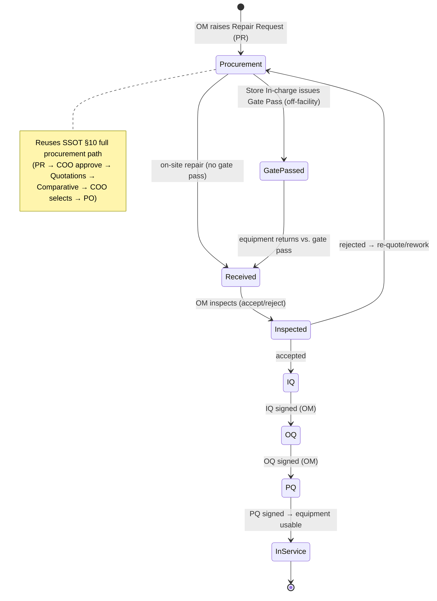

# Module 05 — Equipment & Traceability

> **Status:** Draft v1 · **Owner:** BECS Analytics · **Audience:** product, engineering, QA, lab management
>
> This spec **references** the [SSOT](../SSOT.md) and must not duplicate or contradict it. Cross-cutting rules (approval matrix, procurement, numbering, business rules, the Attachment subsystem) live there; this document covers only what is specific to Equipment & Traceability. When a cross-cutting rule changes, change it in the SSOT first.

---

## 1. Overview & Purpose

The Equipment & Traceability module is the lab's authority on the **physical and consumable assets that make a test result valid**: calibrated instruments, qualified equipment, chemicals (with their CoA/MSDS), glassware (with calibration certificates), and lab supplies.

Its core purpose is twofold:

1. **Lifecycle management** — calibrate and re-calibrate instruments, raise repair requests, run installation/operational/performance qualification, and keep per-asset registers and inventories of chemicals, glassware, and lab supplies.
2. **Traceability** — expose each instrument's **calibration validity as of a given date** so the Testing & Reporting module ([04-testing-and-reporting](./04-testing-and-reporting.md)) can satisfy [BR-13](../SSOT.md#12-global-business-rules-catalog): every result is time-anchored to the method version, the **instrument calibration validity**, and the analyst authorization in force on the test date. A test run on an out-of-calibration instrument is **allowed but flagged**, never blocked ([BR-17](../SSOT.md#12-global-business-rules-catalog)).

Calibration and equipment-repair procurement are **not a new workflow** — they reuse the full procurement path defined in [SSOT §10](../SSOT.md#10-cross-cutting-workflows--state-machines). This module documents only the equipment-specific *extensions* on top of that path (gate pass, receiving, IQ/OQ/PQ).

## 2. Roles Involved

Initiator/approver responsibilities are governed by the **approval matrix** in [SSOT §5](../SSOT.md#5-roles-designations--approval-matrix); the rows there are authoritative. The roles this module touches:

| Role | Involvement in this module |
|---|---|
| **COO** | Approves PRs (calibration / repair), selects the winning quote on Comparative Statements; final authority per [BR-1](../SSOT.md#12-global-business-rules-catalog) |
| **Operations Manager (OM)** | Raises calibration & repair requests; inspects returned/received equipment; signs off IQ/OQ/PQ; verifies traceability data |
| **Purchase Officer** | Records quotations, builds Comparative Statements, issues POs, marks goods/equipment received (reused from procurement) |
| **Store In-charge** | Issues GRN on accepted receipts; holds chemicals/glassware/lab-supply inventory; issues gate passes for off-facility repairs |
| **Lab Manager (RYK) / Analyst** | Consume calibration-validity data; record chemical/glassware usage against lab inventory; attach CoA/MSDS/cal certs at intake |
| **Accountant** | Registers calibration & repair vendors (vendor `field` includes *Calibration*, *equipment repair*) — see [SSOT §5](../SSOT.md#5-roles-designations--approval-matrix) |

> Function-level gating ([BR-2](../SSOT.md#12-global-business-rules-catalog)) still applies: e.g. signing an IQ/OQ/PQ requires the relevant authorized Function to render in the user's UI ([SSOT §6](../SSOT.md#6-authorization-model)).

## 3. In-Scope / Out-of-Scope

| In scope | Out of scope (owned elsewhere) |
|---|---|
| Equipment master register; calibration records & schedule | Initial procurement of *new* equipment as stock (Module 02 — Inventory & Procurement) |
| Calibration requests → quotations → comparative → PO (reusing procurement) | Generic store inventory of stationery/PPE/furniture (Module 02) |
| Equipment repair requests → procurement → gate pass → receiving → IQ/OQ/PQ | Vendor registration mechanics (Module 02 / Accountant) |
| Chemicals register + lab inventory; CoA & MSDS as Attachments | Goods inspection/GRN engine internals (Module 02) |
| Glassware register + lab inventory; calibration certificates as Attachments | Finance expense recognition of the PO (Module 06 — Finance) |
| Lab-supplies register + lab inventory | Test execution & result entry (Module 04 — Testing) |
| **Exposing calibration validity to the Testing module** (BR-13; out-of-cal tests flagged, not blocked, per BR-17) | The actual blinding/decoding of samples (Module 04 / [SSOT §8](../SSOT.md#8-blinding--decoding-rules)) |
| Supporting the **accredited RYK parameters** on RYK instruments (Zabardast Urea, Raw Zinc, AOM, MPF, BAZ — named master-data) | RYK parameter technical definitions/units/methods ([SSOT §3](../SSOT.md#3-glossary--domain-terminology), supplied by BECS later) |
| Per-area Logs & Dashboards (Calibrations, Equipment) | — |

## 4. Feature List

Each feature notes its **primary role**. Logs and Dashboards exist per area (Calibrations, Equipment).

### 4.1 Calibrations

| Feature | Description | Primary role |
|---|---|---|
| Calibration Record | Per-instrument calibration history: cal date, next-due date, validity window, performed-by/vendor, result, certificate Attachment | OM |
| Calibration Request | Raises a need to (re)calibrate an instrument; enters the **full procurement path** ([SSOT §10](../SSOT.md#10-cross-cutting-workflows--state-machines)) as a Purchase Request | OM |
| Quotations | Vendor quotes recorded against the calibration request (reused) | Purchase Officer |
| Comparative Statements | Side-by-side quote comparison; COO selects a quote (reused) | Purchase Officer → COO |
| Purchase Order | PO issued to the selected calibration vendor (reused) | Purchase Officer |
| Logs | Audit/activity log of calibration actions ([BR-5](../SSOT.md#12-global-business-rules-catalog)) | All |
| Dashboard | Due/overdue calibrations, validity heat-map, instruments out for calibration | OM |

### 4.2 Equipment

| Feature | Description | Primary role |
|---|---|---|
| Equipment Repair Request | Raises a repair need; enters the **full procurement path** as a Purchase Request | OM |
| Quotations / Comparative / PO | Reused procurement steps for the repair vendor | Purchase Officer → COO |
| Gate Pass | Authorizes equipment to physically leave the facility for off-site repair; tracks out/in movement | Store In-charge |
| Receiving | Records the repaired equipment back at the facility (reuses goods-receiving + OM inspection) | Purchase Officer / OM |
| Installation Qualification (IQ) | Documented evidence the equipment is installed correctly to spec | OM |
| Operational Qualification (OQ) | Documented evidence the equipment operates within specified ranges | OM |
| Performance Qualification (PQ) | Documented evidence the equipment performs for its intended use under real conditions | OM |
| Logs / Dashboard | Repair history, equipment-out tracking, qualification status | OM |

### 4.3 Chemicals

| Feature | Description | Primary role |
|---|---|---|
| List & Lab Inventory of Chemicals | Master list + per-lab stock balance of chemicals | Store In-charge / Analyst |
| Certificate of Analysis (CoA) | Per-lot CoA stored as an **Attachment** ([SSOT §9 cross-cutting](../SSOT.md#9-global-domain-model-erd)) | OM / Store In-charge |
| Material Safety Data Sheet (MSDS) | Per-chemical MSDS stored as an **Attachment** | OM / Store In-charge |

### 4.3.1 Certified Reference Materials (CRM)

| Feature | Description | Primary role |
|---|---|---|
| List & Lab Inventory of CRMs | Master list + per-lab stock of certified reference materials | Store In-charge / Analyst |
| Reference Certificate | Per-lot certificate (certified value, uncertainty, traceability) stored as an **Attachment** | OM / Store In-charge |
| Certified value, lot & expiry | Tracked per CRM; expiry drives due/expired flags on the dashboard | Store In-charge |

CRMs are procured via the **full** procurement path (Module 02, category **CRM**) and, like chemicals, **cannot be stocked without their reference certificate**. They are the reference materials consumed by the deferred Quality Control module (in-house RM work).

### 4.4 Glassware

| Feature | Description | Primary role |
|---|---|---|
| List & Lab Inventory of Glassware | Master list + per-lab stock of glassware | Store In-charge / Analyst |
| Calibration Certificate | Per-item glassware calibration certificate stored as an **Attachment** | OM |

### 4.5 Lab Supplies

| Feature | Description | Primary role |
|---|---|---|
| List & Lab Inventory of Lab Supplies | Master list + per-lab stock of lab supplies | Store In-charge |

## 5. Workflows & State Transitions

### 5.1 Calibration request (reuses full procurement)

A Calibration Request **is** a Purchase Request directed at a calibration vendor. It runs the **full procurement path** verbatim — *do not redraw it*; see the canonical state machine in [SSOT §10 "Procurement (full path)"](../SSOT.md#10-cross-cutting-workflows--state-machines).

Step-by-step (procurement-specific steps cited from [SSOT §5](../SSOT.md#5-roles-designations--approval-matrix)):

1. **OM** raises a Calibration Request (PR) for an instrument → `PR_Submitted`.
2. **COO** approves → `PR_Approved`.
3. **Purchase Officer** records **Quotations** → builds **Comparative Statement** → **COO selects** a quote.
4. **Purchase Officer** issues **PO** to the calibration vendor.
5. On completion, a **Calibration Record** is created/updated with the new validity window and the certificate Attachment; the dashboard's due/overdue state recomputes.

> The instrument's resulting **calibration validity window** is what the Testing module reads under BR-13 (see §10).

### 5.2 Equipment repair (reuses full procurement + repair-specific extensions)

Steps 1–5 of the repair workflow are **identical to the full procurement path** ([SSOT §10](../SSOT.md#10-cross-cutting-workflows--state-machines)) — a Repair Request is a PR. The **module-specific extensions** begin once the PO is issued and the equipment must physically move and be re-qualified:

| Extension step | Actor | Notes |
|---|---|---|
| **Gate Pass** (off-facility only) | Store In-charge | Issued when the repair is off-site; equipment leaves with an out-movement record and returns against the same gate pass |
| **Receiving** | Purchase Officer marks received; **OM** inspects | Reuses goods-receiving + inspection ([BR-11](../SSOT.md#12-global-business-rules-catalog)); GRN-equivalent acceptance |
| **IQ** | OM | Installed correctly to spec — sign-off |
| **OQ** | OM | Operates within specified ranges — sign-off |
| **PQ** | OM | Performs for intended use — sign-off |

Equipment is returned to service **only after IQ, OQ and PQ are all signed off**; until then it is flagged unusable, mirroring the "goods usable only after acceptance" principle ([BR-11](../SSOT.md#12-global-business-rules-catalog)).



### 5.3 Chemicals / Glassware / Lab supplies ("same as inventory")

These registers behave **like Module 02 inventory** — intake follows the procurement → receiving → GRN → stocking path, then per-lab issue. The traceability-specific addition is **mandatory Attachments at intake**: a chemical lot cannot be stocked without its **CoA**, and glassware cannot be marked calibrated without its **calibration certificate** (MSDS is attached per chemical). See §9 (BR-EQ-3/4).

## 6. Data Entities & Fields

Module-specific entities only; relationships into the global model are shown in the [SSOT §9 ERD](../SSOT.md#9-global-domain-model-erd) (`EQUIPMENT ||--o{ CALIBRATION_RECORD`, `EQUIPMENT ||--o{ QUALIFICATION`). Cross-cutting entities (`AuditLog`, `Attachment`, `Approval`, `Signature`, `Sequence`, `Notification`) and procurement entities (`PurchaseRequest`, `Quotation`, `ComparativeStatement`, `PurchaseOrder`) are reused as-is.

### `Equipment`
| Field | Type | Notes |
|---|---|---|
| `id` | uuid/cuid | internal PK |
| `assetTag` | string | human-facing, section/facility-prefixed ([SSOT §11](../SSOT.md#11-numbering--identifier-standards)) |
| `name` / `model` / `manufacturer` / `serialNo` | string | |
| `facilityId` / `sectionId` | fk | scoping ([BR-6](../SSOT.md#12-global-business-rules-catalog)) |
| `status` | enum | `InService`, `OutForRepair`, `OutForCalibration`, `Quarantined`, `Retired` |
| `requiresCalibration` | bool | drives BR-13 traceability requirement |
| `currentCalibrationValidUntil` | date | derived from the latest passing `CalibrationRecord.validUntil`; the value the Testing module evaluates for validity as of a test date (BR-13/BR-17) |
| `calibrationStatusAsOf(date)` | derived | exposes `Valid` / `Expired` for a given date so Testing can **flag** (not block) out-of-cal tests (BR-17) |

### `CalibrationRecord`
| Field | Type | Notes |
|---|---|---|
| `id` | uuid | |
| `equipmentId` | fk → Equipment | |
| `calibrationDate` | date | server-authoritative ([BR-14](../SSOT.md#12-global-business-rules-catalog)) |
| `validFrom` / `validUntil` | date | **the validity window read by Testing (BR-13)**; `validUntil` is the expiry the Testing module compares against the test date — a test past `validUntil` is **flagged, not blocked** (BR-17) |
| `performedBy` | string / vendorId | internal or external (`Vendor.field = Calibration`) |
| `result` | enum | `Pass`, `PassWithAdjustment`, `Fail` |
| `certificateAttachmentId` | fk → Attachment | the calibration certificate |
| `purchaseRequestId` | fk → PurchaseRequest | links to the reused procurement chain (nullable for internal cals) |

### `Qualification` (IQ / OQ / PQ)
| Field | Type | Notes |
|---|---|---|
| `id` | uuid | |
| `equipmentId` | fk → Equipment | |
| `type` | enum | `IQ`, `OQ`, `PQ` |
| `performedDate` | date | |
| `outcome` | enum | `Pass`, `Fail` |
| `signedByUserId` | fk → User | OM sign-off ([Signature](../SSOT.md#9-global-domain-model-erd)) |
| `repairRequestId` | fk → PurchaseRequest | the repair that triggered re-qualification (nullable) |

### `GatePass`
| Field | Type | Notes |
|---|---|---|
| `id` / `gatePassNo` | uuid / string | numbered per [SSOT §11](../SSOT.md#11-numbering--identifier-standards) |
| `equipmentId` | fk → Equipment | |
| `repairRequestId` | fk → PurchaseRequest | |
| `vendorId` | fk → Vendor | destination |
| `outDate` / `expectedReturnDate` / `actualReturnDate` | date | |
| `issuedByUserId` | fk → User | Store In-charge |
| `status` | enum | `Out`, `Returned` |

### `ChemicalItem`, `GlasswareItem`, `LabSupplyItem` (master + inventory)
| Field | Type | Notes |
|---|---|---|
| `id` / `code` | uuid / string | |
| `name` / `category` | string | |
| `facilityId` / `sectionId` | fk | per-lab inventory scoping |
| `quantityOnHand` / `uom` | number / string | lab inventory balance |
| `lotNo` | string | chemicals (per-lot CoA) |
| `coaAttachmentId` | fk → Attachment | **chemicals — required at stocking** |
| `msdsAttachmentId` | fk → Attachment | **chemicals** |
| `calCertAttachmentId` | fk → Attachment | **glassware — required to mark calibrated** |

## 7. Screens / Views

| # | Screen | Purpose | Primary role |
|---|---|---|---|
| S-1 | Calibration Dashboard | Due / overdue / out-for-calibration tiles; validity heat-map | OM |
| S-2 | Calibration Record (detail) | Per-instrument history + certificate Attachment viewer | OM |
| S-3 | Calibration Request form | Raises PR (drops into procurement) | OM |
| S-4 | Calibration Logs | Filterable audit/activity list ([BR-5](../SSOT.md#12-global-business-rules-catalog)) | All |
| S-5 | Equipment Dashboard | In-service / out-for-repair / qualification-pending tiles | OM |
| S-6 | Equipment register & detail | Asset master, status, linked cals & qualifications | OM |
| S-7 | Repair Request form | Raises PR (drops into procurement) | OM |
| S-8 | Gate Pass issue / return | Out/in movement for off-facility repair | Store In-charge |
| S-9 | IQ / OQ / PQ sign-off | Sequential qualification checklists + e-signature | OM |
| S-10 | Chemicals list & lab inventory | Master + balances; CoA/MSDS viewers | Store In-charge / Analyst |
| S-11 | Glassware list & lab inventory | Master + balances; cal-cert viewer | Store In-charge / Analyst |
| S-12 | Lab supplies list & lab inventory | Master + balances | Store In-charge |

All list/log screens use server-side pagination/filtering ([SSOT §13](../SSOT.md#13-non-functional-requirements)).

## 8. User Stories with Gherkin Acceptance Criteria

**US-1 — Raise a calibration request**
> As an **OM**, I want to raise a calibration request for an instrument so it is recalibrated through the standard procurement chain.
```gherkin
Scenario: OM raises a calibration request
  Given I am an OM viewing an instrument with status InService
  When I submit a Calibration Request for that instrument
  Then a Purchase Request is created in state PR_Submitted
  And it is routed to the COO for approval per SSOT §5
  And an audit-log entry is written (BR-5)
```

**US-2 — Off-facility repair gate pass**
> As a **Store In-charge**, I want to issue a gate pass so equipment can leave the facility for repair and be tracked back in.
```gherkin
Scenario: Equipment leaves and returns under a gate pass
  Given a repair PO has been issued for an off-site vendor
  When I issue a Gate Pass for the equipment
  Then the equipment status becomes OutForRepair
  And the gate pass status is Out with an outDate
  When the equipment returns and I close the gate pass
  Then the gate pass status becomes Returned with an actualReturnDate
```

**US-3 — Re-qualification before return to service**
> As an **OM**, I want IQ, OQ and PQ enforced in order so repaired equipment is only used once fully qualified.
```gherkin
Scenario: Equipment cannot return to service without all qualifications
  Given repaired equipment has been received and inspected as accepted
  When IQ is not yet signed
  Then the equipment status is not InService
  And attempting to sign OQ before IQ is rejected
  When IQ, then OQ, then PQ are each signed with outcome Pass
  Then the equipment status becomes InService
```

**US-4 — Chemical intake requires CoA & MSDS**
> As a **Store In-charge**, I want CoA and MSDS required so chemicals are traceable and safe.
```gherkin
Scenario: A chemical lot cannot be stocked without CoA
  Given I am stocking a received chemical lot
  When the CoA Attachment is missing
  Then stocking is blocked with a validation error (BR-EQ-3)
  And once both CoA and MSDS Attachments are present, stocking succeeds
```

**US-5 — Calibration validity is traceable to a test**
> As the **Testing module**, I want to read an instrument's calibration validity as of the test date so each result is traceable (BR-13).
```gherkin
Scenario: A test references calibration validity as of the test date
  Given an instrument has a CalibrationRecord valid 2026-01-01..2026-06-30
  When a test dated 2026-04-15 references that instrument
  Then the test record stores the calibration validity in force on 2026-04-15
  When a test dated 2026-07-10 references that instrument
  Then the instrument is flagged out-of-calibration for that test (BR-13)
  And the test is still allowed to proceed and record results (BR-17)
```

## 9. Module Business Rules

Global rules are authoritative in [SSOT §12](../SSOT.md#12-global-business-rules-catalog); referenced here, not restated. Module-local rules are numbered `BR-EQ-n` and must not contradict the global catalog.

| Rule | Statement |
|---|---|
| [BR-13](../SSOT.md#12-global-business-rules-catalog) (global) | **Traceability:** a test result links to method version, **instrument calibration validity**, and analyst authorization **as of the test date**. This module is the system of record for the calibration-validity half. |
| [BR-17](../SSOT.md#12-global-business-rules-catalog) (global) | **Calibration is a flag, not a block:** a result on an instrument whose calibration is expired as of the test date is **allowed but flagged** (refines BR-13). This module exposes the validity status; the Testing module renders the flag. |
| [BR-1](../SSOT.md#12-global-business-rules-catalog) (global) | Calibration & repair PRs and Comparative Statements require **COO approval/selection**. |
| [BR-5](../SSOT.md#12-global-business-rules-catalog) (global) | Every create/update/delete on calibration, qualification, gate pass, and inventory records writes an immutable audit-log entry. |
| [BR-6](../SSOT.md#12-global-business-rules-catalog) (global) | All equipment/inventory records are facility/section scoped; cross-scope read is an explicit capability. |
| [BR-11](../SSOT.md#12-global-business-rules-catalog) (global) | Returned/received equipment is usable only after **OM inspection (accepted)**; extended here to require IQ+OQ+PQ before `InService`. |
| [BR-14](../SSOT.md#12-global-business-rules-catalog) (global) | Calibration dates, validity windows and qualification dates are **server-authoritative**. |
| **BR-EQ-1** | Calibration & equipment-repair requests **reuse the full procurement path** ([SSOT §10](../SSOT.md#10-cross-cutting-workflows--state-machines)); they are never a simplified-path procurement ([BR-9](../SSOT.md#12-global-business-rules-catalog) does not apply). |
| **BR-EQ-2** | An instrument with `requiresCalibration = true` and no current valid `CalibrationRecord` (i.e. past `validUntil`) is flagged **out-of-calibration**; tests referencing it on such a date are **allowed but flagged** under [BR-17](../SSOT.md#12-global-business-rules-catalog) (refines BR-13), never blocked. |
| **BR-EQ-3** | A chemical lot cannot be stocked without a **CoA Attachment**, and an **MSDS Attachment** is required per chemical. |
| **BR-EQ-4** | Glassware cannot be marked **calibrated** without its **calibration-certificate Attachment**. |
| **BR-EQ-5** | Off-facility repairs require an issued **Gate Pass** before the equipment leaves; return is closed against the same gate pass. |
| **BR-EQ-6** | IQ → OQ → PQ are enforced **in order**; equipment returns to `InService` only when all three pass. |

## 10. Dependencies & Integrations

| Depends on / integrates with | Direction | What is exchanged |
|---|---|---|
| **Module 02 — Inventory & Procurement** | this module → 02 | Calibration & repair requests are PRs that run the **full procurement workflow** ([SSOT §10](../SSOT.md#10-cross-cutting-workflows--state-machines)); receiving/inspection/GRN engine reused. Vendor registration (incl. `field = Calibration / equipment repair`) owned by 02/Accountant. |
| **Module 04 — Testing & Reporting** ([04-testing-and-reporting](./04-testing-and-reporting.md)) | this module → 04 | **Exposes calibration validity** (`validUntil` / `calibrationStatusAsOf(date)`) so a test references the instrument's validity **as of the test date** ([BR-13](../SSOT.md#12-global-business-rules-catalog)); out-of-calibration instruments **flag** affected results but do **not block** the test ([BR-17](../SSOT.md#12-global-business-rules-catalog)). |
| **Attachment subsystem** ([SSOT §9](../SSOT.md#9-global-domain-model-erd), [§14](../SSOT.md#14-technology-stack--architecture-summary) MinIO) | this module → cross-cutting | Stores CoA, MSDS, glassware calibration certificates, and calibration certificates. |
| **Approval / Signature / AuditLog / Sequence / Notification** ([SSOT §9](../SSOT.md#9-global-domain-model-erd)) | cross-cutting | COO approvals, OM IQ/OQ/PQ e-signatures, audit logs, numbered IDs, due/overdue notifications. |
| **Module 06 — Finance** | 06 ← procurement | Repair/calibration POs incur expenses (`PURCHASE_ORDER }o--|| EXPENSE`, [SSOT §9](../SSOT.md#9-global-domain-model-erd)). |

## 11. Open Questions / Assumptions

| # | Item | Type |
|---|---|---|
| 1 | Calibration intervals/frequency per instrument type are not yet specified — assume per-equipment configurable interval driving `validUntil` and dashboard due/overdue. | Assumption |
| 2 | Whether glassware/lab-supply intake reuses the GRN store flow or a lighter lab-only intake — assumed **"same as inventory"** (full path) per raw spec, pending BECS confirmation. | Open |
| 3 | Internal (in-house) calibrations vs. external vendor calibrations both supported; `purchaseRequestId` nullable for internal cals. Confirm whether internal calibration needs its own approval. | Open |
| 4 | Exact gate-pass numbering prefix and whether gate passes apply to on-site vendor visits — assumed off-facility only. | Open |
| 5 | ~~OQ was listed after PQ in the raw spec.~~ **RESOLVED (D14):** the standard sequence **IQ → OQ → PQ** is enforced throughout this module (workflow, state machine, entity/status fields, Gherkin, BR-EQ-6). | Resolved |
| 6 | Whether a failed IQ/OQ/PQ auto-raises a new repair request (CAPA-style) — deferred; CAPA is out of scope ([SSOT §16](../SSOT.md#16-deferred-scope-extensibility-hooks)). | Open |
| 7 | Section/facility prefixes for `assetTag` and `gatePassNo` to be finalized with BECS ([SSOT §11](../SSOT.md#11-numbering--identifier-standards)). | Open |
