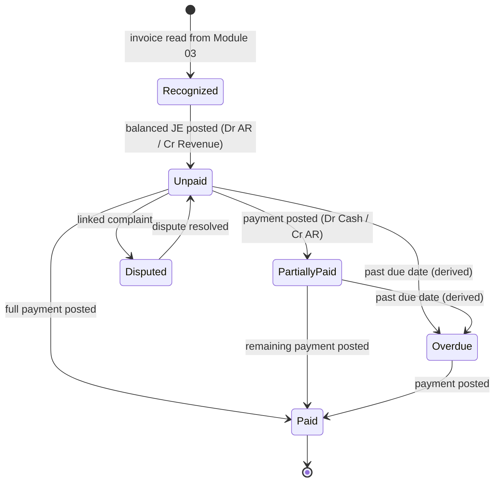
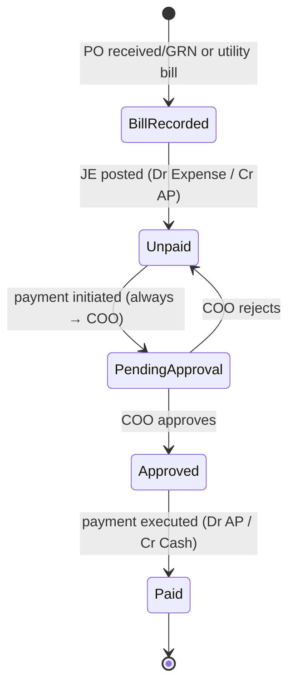
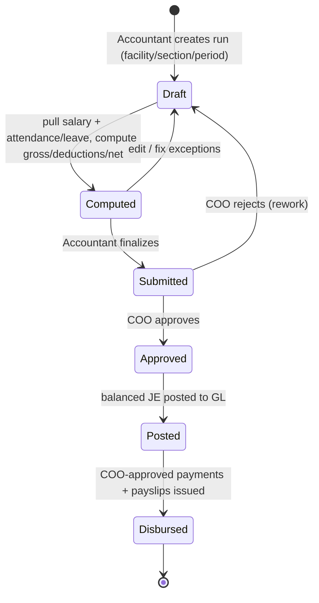
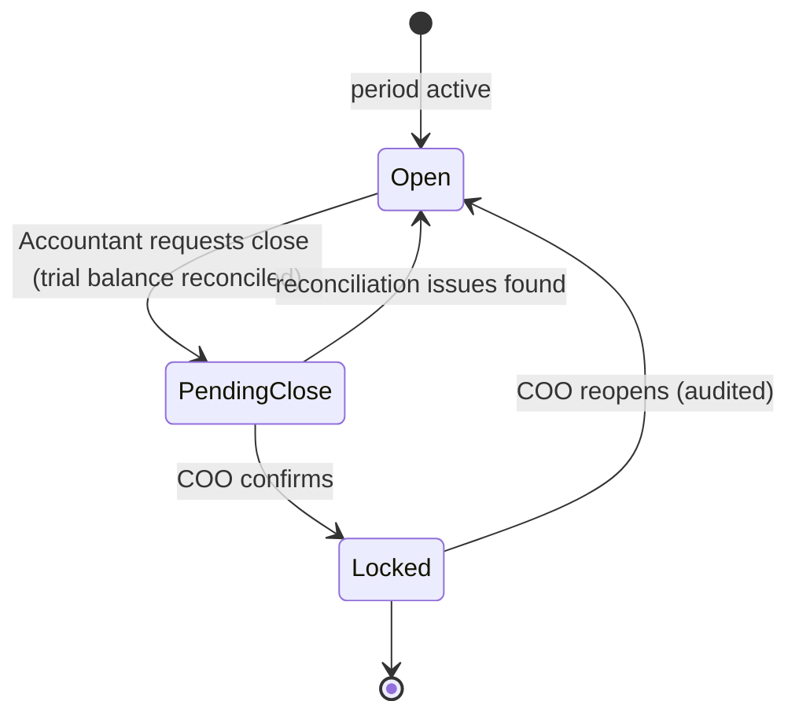

# Module 06 — Finance & Payroll

> **Status:** Draft v2 · **Owner:** BECS Analytics · **Module scope:** General ledger, Accounts Receivable, Accounts Payable, Payments, Payroll, Financial statements
>
> This spec **references** and must not contradict the [SSOT](../SSOT.md). Cross-cutting rules (approval matrix, scoping, numbering, business rules, NFRs) live there. Per [ADR-0004](../adr/0004-finance-accounting-model.md), this module is a **full double-entry general ledger** and the **system of record** — there is no external accounting package. Items still requiring BECS stakeholder confirmation are flagged throughout and consolidated in [§11 Open Questions](#11-open-questions--assumptions).

---

## 1. Overview & Purpose

Finance & Payroll is the LIMS' **general ledger and system of record** ([ADR-0004](../adr/0004-finance-accounting-model.md), [BR-16](../SSOT.md#12-global-business-rules-catalog)). It does not originate most source documents — it **recognizes, posts, settles, and reports** on financial events, but it does so through a **full double-entry ledger**: every financial event posts a **balanced journal entry** (Σ debits = Σ credits) against a **chart of accounts**, from which the system produces a **trial balance**, **balance sheet**, and **P&L**.

- **Revenue / Accounts Receivable** flows in from **client invoices** issued by the Liaison Officer (Module 03 — Samples & Client); recognized as revenue and posted to the GL. Includes the **RYK monthly consolidated invoice** to Bio Tech Fertilizers (Pvt) Ltd ([SSOT §3](../SSOT.md#3-glossary--domain-terminology)).
- **Accounts Payable** flows in from **Purchase Orders** and **Utilities** (Module 02 — Inventory & Procurement) and **calibration / equipment-repair POs** (Module 05 — Equipment & Traceability); recorded as bills and posted to the GL.
- **Payments** record actual cash movement and post settlement entries. **Every outgoing payment requires COO approval** ([D5 / BR-15](../SSOT.md#12-global-business-rules-catalog)) — no threshold; **client (incoming) payments may be recorded by the Accountant or the Liaison Officer** ([D6, SSOT §5](../SSOT.md#5-roles-designations--approval-matrix)).
- **Payroll** computes monthly staff pay from the Personnel salary structure plus Attendance & Leave data, posts each approved run to the GL, and produces **payslips**.

The **ledger is append-only**: posted journal entries are immutable; corrections are made via **reversing entries**, never edits. **Accounting periods are closed and locked** ([BR-16](../SSOT.md#12-global-business-rules-catalog), [SSOT §13](../SSOT.md#13-non-functional-requirements)). All amounts are **PKR**, stored as **integer minor units (paisa)** to avoid floating-point error ([D7, SSOT §15](../SSOT.md#15-conventions)). All financial reporting is **scoped per facility / section** ([SSOT §7](../SSOT.md#7-section--facility-scoping-rules)); COO/OM see consolidated.

**Design intent:** an **audit-grade, double-entry accounting system** — chart of accounts, balanced posting, statutory payroll, period close, and financial statements — that is the authoritative record of BECS Analytics' books, with **no dependency on third-party accounting software**.

---

## 2. Roles Involved

Authoritative role/approval definitions: [SSOT §5](../SSOT.md#5-roles-designations--approval-matrix). This module touches the following:

| Role | Responsibility in this module |
|---|---|
| **Accountant** | Primary operator. Records bills/AP, records incoming & outgoing payments, maintains the Chart of Accounts, posts and reviews journal entries, prepares payroll runs, runs trial balance / statements, drives period close. (Vendor registration & vendor-side invoice already assigned to Accountant in [SSOT §5](../SSOT.md#5-roles-designations--approval-matrix).) |
| **COO** | **Approving authority** for **every** outgoing payment (vendor, utility, payroll — [BR-15](../SSOT.md#12-global-business-rules-catalog)), every payroll run, and period close/reopen. Has cross-scope financial visibility ([SSOT §7](../SSOT.md#7-section--facility-scoping-rules)). |
| **Operations Manager (OM)** | Operational oversight; cross-scope read of finance dashboards and statements; may co-review payroll inputs (attendance exceptions). No disbursement authority. |
| **Liaison Officer (LO)** | **Originates client invoices** in Module 03 ([SSOT §5](../SSOT.md#5-roles-designations--approval-matrix)). Those invoices are the **revenue/AR source**. The LO may **also record incoming client payments** ([D6, SSOT §5](../SSOT.md#5-roles-designations--approval-matrix)). |
| Sales & Marketing Officer | Prepares client quotations (Module 03); quotations are pre-revenue and informational here only. |
| Purchase Officer | Originates POs (Modules 02/05) and may co-record vendor invoices/bills ([SSOT §5](../SSOT.md#5-roles-designations--approval-matrix)). POs are the AP source consumed here. |

> Tier-1 access (who can open the Finance module) and Tier-2 Function gating apply per [SSOT §6](../SSOT.md#6-authorization-model). Specific Finance Functions (e.g. `post-journal`, `record-payment`, `run-payroll`, `close-period`) are proposed in [§9](#9-module-business-rules).

---

## 3. In-Scope / Out-of-Scope

### In scope

- **Chart of Accounts (CoA):** assets, liabilities, equity, revenue, expense accounts; the backbone of all posting.
- **Double-entry general ledger:** every financial event posts a **balanced** `JournalEntry` (Σ debits = Σ credits) of `JournalLine`s; the ledger is **append-only** with **reversing entries** for corrections.
- **Revenue recognition & Accounts Receivable (AR):** client invoices (Module 03) recognized as revenue and posted; receivables ledger, aging buckets **0–30 / 31–60 / 61–90 / 90+**; includes the **RYK monthly consolidated invoice** to Bio Tech Fertilizers (Pvt) Ltd.
- **Accounts Payable (AP):** bills from POs (Module 02), Utilities (Module 02), and calibration/equipment-repair POs (Module 05), posted to the GL.
- **Payments:** record incoming (client) and outgoing (vendor / utility / payroll) payments, allocate to invoices/bills, and post settlement entries. **Every outgoing payment requires COO approval** ([BR-15](../SSOT.md#12-global-business-rules-catalog)).
- **Payroll:** monthly runs; gross = basic + named allowances; deductions = income-tax slabs, EOBI, Provident Fund, advances/loans; each run posts to the GL and requires COO approval; payslips. Salary structure **versioned by effective date**.
- **Financial statements & period close:** trial balance, balance sheet, P&L; **periods are closed and locked** per facility/period.
- **Financial dashboards & reports:** revenue vs expense, P&L, balance sheet, AR/AP, aging, payroll cost — scoped per facility/section; COO/OM consolidated.
- **Tax capture:** NTN/STN and tax-amount fields recorded on invoices/bills.

### Out of scope (this build)

- **Tax computation & filing** (GST/sales-tax, withholding, NTN/STN-based returns) — fields are **captured but not auto-computed** ([D1](../adr/0004-finance-accounting-model.md), [§11](#11-open-questions--assumptions)).
- **Multi-currency** — **PKR only** ([D7](../adr/0004-finance-accounting-model.md), [SSOT §15](../SSOT.md#15-conventions)).
- **Fixed-asset depreciation schedules** and **automated bank-feed reconciliation** (manual reconciliation scope is an open question — [§11](#11-open-questions--assumptions)).
- Origination of client invoices/quotations (owned by Module 03) and PO origination (owned by Modules 02/05).

---

## 4. Feature List

| # | Feature | Description | Primary role |
|---|---|---|---|
| F-1 | **Chart of Accounts** | Maintain the account tree (Asset / Liability / Equity / Revenue / Expense); each account has a code, type, and normal balance. | Accountant |
| F-2 | **Journal posting engine** | Every financial event posts a balanced `JournalEntry` (Σ debits = Σ credits) of `JournalLine`s; posting is rejected if unbalanced. | Accountant / System |
| F-3 | **Reversing entries** | Correct a posted entry by posting a system-generated **reversal** in an open period; the original is never edited or deleted. | Accountant |
| F-4 | **Revenue & AR register** | Read-in client invoices (Module 03), recognize as revenue, post AR/revenue entry; track outstanding, status, aging (0–30 / 31–60 / 61–90 / 90+). | Accountant / LO |
| F-5 | **RYK monthly consolidated invoice** | One invoice per month (`INV-RYK-2026-06`) to Bio Tech Fertilizers (Pvt) Ltd covering all RYK testing for the period; recognized as revenue. | LO / Accountant |
| F-6 | **Incoming payment recording** | Record client payments (full/partial), allocate to invoices, post settlement entry, update AR. **May be recorded by Accountant or LO** ([D6](../SSOT.md#5-roles-designations--approval-matrix)). | Accountant / LO |
| F-7 | **Accounts Payable register** | Record bills against POs (Modules 02/05) and utilities; post AP/expense (or asset) entry; track status and due date. | Accountant / Purchase Officer |
| F-8 | **Outgoing payment recording** | Record vendor / utility / payroll payments; **every** outgoing payment routes to **COO** approval before disbursement ([BR-15](../SSOT.md#12-global-business-rules-catalog)). | Accountant → COO |
| F-9 | **Payroll run** | Monthly run per facility/section; compute gross (basic + allowances) and deductions (income-tax slabs, EOBI, PF, advances/loans) from salary structure + Attendance/Leave. | Accountant |
| F-10 | **Payroll approval, posting & disbursement** | COO approves run; on approval the run **posts to the GL** (salary expense, statutory liabilities, net-pay payable); disbursement recorded as outgoing payment(s). | COO / Accountant |
| F-11 | **Payslip generation** | Per-employee PDF payslips for an approved run; surfaced in Module 01 self-service. | Accountant / System |
| F-12 | **Salary structure (versioned)** | Maintain basic + named allowances + deduction setup per employee, versioned by effective date. | Accountant |
| F-13 | **Trial balance** | List of all accounts with debit/credit balances for a period; total debits = total credits. | Accountant / COO |
| F-14 | **Balance sheet & P&L** | Statement of financial position (Assets = Liabilities + Equity) and profit & loss for a period, scoped per facility/section or consolidated. | Accountant / COO / OM |
| F-15 | **Period close & lock** | Reconcile and lock a fiscal period per facility; locked periods reject postings; corrections go to the next open period. | Accountant → COO |
| F-16 | **Financial dashboards & reports** | Revenue vs expense, P&L, AR/AP aging, payroll cost, payment register; PDF/CSV export — scoped per facility/section. | Accountant / COO / OM |
| F-17 | **Tax field capture** | Record NTN/STN and tax amounts on invoices/bills; **no auto-computation** yet ([D1](../adr/0004-finance-accounting-model.md)). | Accountant |

---

## 5. Workflows & State Transitions

### 5.1 Revenue & Accounts Receivable (client invoice → post → settled)

1. LO issues a **client invoice** in Module 03 (Invoice No per [SSOT §11](../SSOT.md#11-numbering--identifier-standards), e.g. `INV-LHR-2026-00045`; RYK monthly consolidated invoice `INV-RYK-2026-06`).
2. Finance **recognizes** it as **Revenue** and **posts a balanced journal entry**: **Dr Accounts Receivable / Cr Revenue** (and **Cr Tax Payable** if a tax amount is captured). The receivable enters AR as **Unpaid**.
3. Accountant **or LO** records **incoming payment(s)**, posting **Dr Cash/Bank / Cr Accounts Receivable**; allocation reduces the outstanding balance.
4. Status advances **Unpaid → Partially Paid → Paid**; **Overdue** is a derived flag when past due date and not fully paid.
5. Disputed amounts may be flagged **Disputed** (links to a complaint in Module 03) and excluded from aging until resolved.



### 5.2 Accounts Payable & outgoing payment (PO/utility bill → post → COO-approved pay)

1. A **PO** (Module 02 full/simplified path, or Module 05 calibration/repair) reaches **Received → GRN** ([SSOT §10](../SSOT.md#10-cross-cutting-workflows--state-machines)); utilities follow the simplified path.
2. Accountant records the **bill** against the PO/utility (number, amount, attachment) and **posts**: **Dr Expense (or Asset) / Cr Accounts Payable** (and **Dr Input-Tax** if captured). The payable enters AP as **Unpaid**.
3. Accountant initiates an **outgoing payment**. **Every** outgoing payment routes to **COO** for approval ([D5 / BR-15](../SSOT.md#12-global-business-rules-catalog)) — there is **no threshold**.
4. On COO approval + execution, the settlement entry **Dr Accounts Payable / Cr Cash/Bank** is posted and the payable advances **Unpaid → PendingApproval → Approved → Paid**.



### 5.3 Payroll run (compute → approve → post → disburse)

1. Accountant **creates a payroll run** for `{facility, section, period (month)}`.
2. System **computes** each active employee's pay from the **versioned salary structure** and **Attendance/Leave** (Module 01): gross = basic + named allowances; deductions = income-tax slabs, EOBI, Provident Fund, advances/loans; net pay = gross − deductions.
3. Accountant reviews exceptions (missing attendance, unapproved leave) and finalizes the **draft run**.
4. Run is **submitted to COO**; COO **approves** or **rejects** ([BR-15](../SSOT.md#12-global-business-rules-catalog)).
5. On approval the run **posts to the GL** as a balanced entry: **Dr Salary Expense** (gross) / **Cr EOBI Payable, Cr PF Payable, Cr Tax Payable, Cr Advances Recovered** (deductions) / **Cr Net-Pay Payable** (net). **Payslips** are generated. Disbursement is recorded as COO-approved outgoing payment(s), posting **Dr Net-Pay Payable / Cr Cash/Bank**.



### 5.4 Fiscal period close & lock

1. Accountant verifies all entries for the period are posted and reconciled, and reviews the **trial balance** (debits = credits).
2. Accountant requests **close** for `{facility, period}`; COO confirms.
3. Period is **Locked** — postings/edits into it are blocked; corrections require a **reversing entry** in the next open period. Reopen requires COO and is audited.



---

## 6. Data Entities & Fields

Module-specific entities. Cross-cutting entities (`AuditLog`, `Attachment`, `Approval`/`ApprovalStep`, `Signature`, `Sequence`, `Notification`) attach polymorphically per [SSOT §9](../SSOT.md#9-global-domain-model-erd). Every entity carries `facilityId`, `sectionId`, timestamps, and actor refs ([BR-5](../SSOT.md#12-global-business-rules-catalog), [BR-6](../SSOT.md#12-global-business-rules-catalog)). **All monetary fields are PKR stored as `bigint` minor units (paisa)** ([D7, SSOT §15](../SSOT.md#15-conventions)) — never floats/decimals.

The SSOT ERD declares the GL backbone:
`CHART_OF_ACCOUNT ||--o{ JOURNAL_LINE`, `JOURNAL_ENTRY ||--o{ JOURNAL_LINE`, `INVOICE }o--|| JOURNAL_ENTRY`, `PAYMENT }o--|| JOURNAL_ENTRY`, `PURCHASE_ORDER }o--|| JOURNAL_ENTRY`, `PAYROLL_RECORD }o--|| JOURNAL_ENTRY`. The entities below realize that backbone.

### 6.1 `ChartOfAccount`
| Field | Type | Notes |
|---|---|---|
| id | uuid/cuid | PK |
| code | string | e.g. `1100` AR, `1000` Cash, `2000` AP, `2100` Tax Payable, `2200` EOBI Payable, `2210` PF Payable, `2300` Net-Pay Payable, `4000` Revenue, `5000` Salary Expense, `5100` Utilities, `5200` Chemicals, `5300` Calibration |
| name | string | |
| type | enum | `Asset · Liability · Equity · Revenue · Expense` |
| normalBalance | enum | `Debit · Credit` (derived from type) |
| parentId | FK (self) | optional grouping/sub-accounts |
| isActive | bool | accounts may be deactivated, never deleted |

### 6.2 `JournalEntry`
| Field | Type | Notes |
|---|---|---|
| id | uuid/cuid | PK |
| entryNo | string | `JE-2026-000123` ([SSOT §11](../SSOT.md#11-numbering--identifier-standards)) |
| entryDate | date | posting date; **server-authoritative** ([BR-14](../SSOT.md#12-global-business-rules-catalog)) |
| periodId | FK → FiscalPeriod | must be **Open** to post ([FBR-6](#9-module-business-rules)) |
| sourceType | enum | `Invoice · Bill · Payment · PayrollRun · Reversal · Manual` |
| sourceRef | FK | the originating document |
| memo | string | description |
| reversalOfId | FK → JournalEntry | set when this entry reverses another (append-only correction) |
| isReversed | bool | true once a reversal has been posted against it |
| facilityId / sectionId | FK | scope |
| **Invariant** | — | **Σ(debit lines) = Σ(credit lines)**; posting is rejected otherwise ([BR-16](../SSOT.md#12-global-business-rules-catalog), [FBR-1](#9-module-business-rules)). Posted entries are **immutable** ([FBR-2](#9-module-business-rules)). |

### 6.3 `JournalLine`
| Field | Type | Notes |
|---|---|---|
| id | uuid/cuid | PK |
| journalEntryId | FK → JournalEntry | parent |
| accountId | FK → ChartOfAccount | the posted account |
| debit | bigint (paisa) | one of debit/credit is 0 |
| credit | bigint (paisa) | |
| lineMemo | string | optional |

### 6.4 `Invoice` (AR — recognized from Module 03)
| Field | Type | Notes |
|---|---|---|
| id | uuid/cuid | PK |
| invoiceNo | string | from Module 03 (`INV-LHR-2026-00045`); RYK monthly = `INV-RYK-2026-06` |
| clientId | FK → Client | billed client (Bio Tech Fertilizers for RYK monthly) |
| sampleRefs | FK[] → Sample | billed sample(s)/report(s); for RYK monthly, all tests in the period |
| isRykMonthly | bool | true for the RYK consolidated monthly invoice |
| amount | bigint (paisa) | net of tax |
| taxAmount | bigint (paisa) | nullable; **captured, not computed** ([D1](../adr/0004-finance-accounting-model.md)) |
| ntn / stn | string | client tax identifiers (captured) |
| paidAmount | bigint (paisa) | running |
| outstanding | bigint (paisa) | derived |
| dueDate | date | from invoice terms (default credit days — [§11](#11-open-questions--assumptions)) |
| status | enum | `Unpaid · PartiallyPaid · Paid · Overdue · Disputed` |
| agingBucket | enum (derived) | `0-30 · 31-60 · 61-90 · 90+` |
| journalEntryId | FK → JournalEntry | the **Dr AR / Cr Revenue** posting |
| facilityId / sectionId | FK | scope |

### 6.5 `Bill` (AP)
| Field | Type | Notes |
|---|---|---|
| id | uuid/cuid | PK |
| sourceType | enum | `PO · Utility · CalibrationPO · RepairPO` |
| sourceRef | FK | PurchaseOrder (Modules 02/05) / UtilityBill |
| vendorId | FK → Vendor | nullable for utility-by-meter |
| vendorInvoiceNo | string | vendor's own invoice number |
| accountId | FK → ChartOfAccount | expense/asset account to debit |
| amount | bigint (paisa) | net of tax |
| taxAmount | bigint (paisa) | nullable; captured, not computed |
| ntn / stn | string | vendor tax identifiers (captured) |
| dueDate | date | |
| status | enum | `Unpaid · PendingApproval · Approved · Paid · Rejected` |
| agingBucket | enum (derived) | `0-30 · 31-60 · 61-90 · 90+` |
| journalEntryId | FK → JournalEntry | the **Dr Expense / Cr AP** posting |
| attachmentId | FK → Attachment | vendor invoice scan (MinIO) |

### 6.6 `Payment`
| Field | Type | Notes |
|---|---|---|
| id | uuid/cuid | PK |
| direction | enum | `Incoming · Outgoing` |
| method | enum | `Cash · BankTransfer · Cheque · Online` |
| amount | bigint (paisa) | |
| paidOn | date | server-authoritative ([BR-14](../SSOT.md#12-global-business-rules-catalog)) |
| reference | string | cheque/transaction no |
| allocations | json/relation | links to one or more Invoice (AR) or Bill (AP) lines |
| approvalId | FK → Approval | **required for every Outgoing payment** ([BR-15](../SSOT.md#12-global-business-rules-catalog)); null for Incoming |
| recordedBy | FK → User | Accountant or LO for Incoming ([D6](../SSOT.md#5-roles-designations--approval-matrix)); Accountant for Outgoing |
| journalEntryId | FK → JournalEntry | the settlement posting (Dr Cash / Cr AR, or Dr AP / Cr Cash) |

### 6.7 `PayrollRun`
| Field | Type | Notes |
|---|---|---|
| id | uuid/cuid | PK |
| runNo | string | `PAY-LHR-2026-06` ([SSOT §11](../SSOT.md#11-numbering--identifier-standards)) |
| facilityId / sectionId | FK | scope |
| period | year-month | the payroll month |
| status | enum | `Draft · Computed · Submitted · Approved · Posted · Disbursed · Rejected` |
| approvalId | FK → Approval | COO ([BR-15](../SSOT.md#12-global-business-rules-catalog)) |
| journalEntryId | FK → JournalEntry | balanced posting on approval |
| grossTotal / deductionTotal / netTotal | bigint (paisa) | run totals |

### 6.8 `PayrollLine` (per employee, per run)
| Field | Type | Notes |
|---|---|---|
| id | uuid/cuid | PK |
| payrollRunId | FK → PayrollRun | |
| userId | FK → User (Module 01) | |
| salaryStructureId | FK → SalaryStructure | version effective for the period |
| basicSalary | bigint (paisa) | |
| allowances | json | named earning lines (house rent, conveyance, medical, …) |
| daysPresent / daysAbsent / unpaidLeaveDays | int | from Attendance/Leave (Module 01) |
| incomeTax / eobi / providentFund | bigint (paisa) | statutory deductions ([D4](../adr/0004-finance-accounting-model.md)) |
| advancesLoans | bigint (paisa) | advance/loan recovery |
| grossPay / netPay | bigint (paisa) | computed |
| payslipAttachmentId | FK → Attachment | generated PDF |

### 6.9 `SalaryStructure` (versioned by effective date)
| Field | Type | Notes |
|---|---|---|
| id | uuid/cuid | PK |
| userId | FK → User | |
| basicSalary | bigint (paisa) | |
| allowances | json | house rent, conveyance, medical, etc. (exact components TBC — [§11](#11-open-questions--assumptions)) |
| deductionSetup | json | PF rate, EOBI, recurring advances/loans |
| effectiveFrom / effectiveTo | date | **versioned**; payroll uses the version effective in the run period ([FBR-5](#9-module-business-rules)) |

### 6.10 `FiscalPeriod`
| Field | Type | Notes |
|---|---|---|
| id | uuid/cuid | PK |
| facilityId | FK | per-facility close |
| period | year-month | (fiscal-year start month TBC — [§11](#11-open-questions--assumptions)) |
| status | enum | `Open · PendingClose · Locked` |
| closedBy / reopenedBy | FK → User | audited ([BR-5](../SSOT.md#12-global-business-rules-catalog)) |

### 6.11 `UtilityBill` (bridge to Module 02 utilities)
| Field | Type | Notes |
|---|---|---|
| utilityType | enum | `Electricity · Gas · Telephone · Internet` |
| billingPeriod | string | |
| amount | bigint (paisa) | |
| dueDate | date | |
| → creates a `Bill` of `sourceType=Utility`, which posts a JE | | |

---

## 7. Screens / Views

| Screen | Purpose | Primary role |
|---|---|---|
| **Finance Dashboard** | KPIs: revenue MTD/YTD, expense MTD/YTD, net profit, AR outstanding, AP outstanding, cash position, payroll cost — scoped/filterable by facility/section. | Accountant / COO / OM |
| **Chart of Accounts** | Manage the account tree (Asset/Liability/Equity/Revenue/Expense). | Accountant |
| **General Ledger / Journal** | Browse journal entries and lines; post manual entries; post reversals. | Accountant / COO |
| **Revenue / AR Register** | Recognized revenue & receivables; status, aging; drill invoice → client → sample. | Accountant / LO |
| **Aging Report (AR)** | Receivables by aging bucket and client. | Accountant / COO |
| **Accounts Payable Register** | All bills (PO / utility / calibration-repair); status, due date; bill capture. | Accountant |
| **Aging Report (AP)** | Payables by aging bucket and vendor. | Accountant / COO |
| **Record Payment** | Record incoming/outgoing payment, allocate to invoices/bills; outgoing routes to COO. | Accountant / LO (incoming) |
| **Payment Approvals** | Queue of **all** outgoing payments and payroll runs awaiting COO approval. | COO |
| **Payroll Run** | Create run, view computed lines, fix exceptions, submit. | Accountant |
| **Payroll Review/Approval** | COO review of a run with totals, statutory deductions, per-employee breakdown. | COO |
| **Salary Structures** | Maintain versioned per-employee structures. | Accountant |
| **Payslips** | Per-employee payslip list/PDF (also in Module 01 self-service). | Accountant / Employee |
| **Trial Balance** | All accounts with debit/credit balances for a period (must balance). | Accountant / COO |
| **Balance Sheet & P&L** | Financial statements, scoped per facility/section or consolidated. | Accountant / COO / OM |
| **Period Close** | Reconcile & lock fiscal period; reopen (COO, audited). | Accountant / COO |
| **Reports & Export** | Statements, registers, payroll cost; PDF/CSV export. | Accountant |
| **Finance Logs** | Module audit-log view ([BR-5](../SSOT.md#12-global-business-rules-catalog)), server-side paginated. | Accountant / COO |

All list/log screens use server-side pagination/filtering; dashboards/statements backed by indexed queries ([SSOT §13](../SSOT.md#13-non-functional-requirements)). Default visibility is own-section; COO/OM may switch scope or view consolidated where granted ([SSOT §7](../SSOT.md#7-section--facility-scoping-rules)).

---

## 8. User Stories with Gherkin Acceptance Criteria

### US-1 — Recognize client invoice as revenue and post to the GL
*As an Accountant, I want client invoices recognized as revenue and posted as a balanced journal entry so the books reflect what clients owe.*
```gherkin
Scenario: New client invoice posts a balanced AR/Revenue entry
  Given the Liaison Officer issued invoice "INV-LHR-2026-00045" in Module 03 for client "CLI-00123" of 100000 PKR
  When the invoice is recognized in Finance
  Then a JournalEntry is posted with Dr "Accounts Receivable" 10000000 paisa and Cr "Revenue" 10000000 paisa
  And the sum of debit lines equals the sum of credit lines
  And an Invoice (AR) record is created with status "Unpaid" and outstanding 10000000 paisa
  And the entry is stamped with the invoice's facility and section
```

### US-2 — RYK monthly consolidated invoice
*As the Liaison Officer/Accountant, I want one monthly invoice to Bio Tech Fertilizers covering all RYK testing so RYK revenue is recognized correctly.*
```gherkin
Scenario: One consolidated RYK invoice per month
  Given RYK testing was performed across June 2026 for Bio Tech Fertilizers (Pvt) Ltd
  When the RYK monthly invoice is generated for period "2026-06"
  Then exactly one invoice "INV-RYK-2026-06" is created covering all RYK tests for the month
  And it is recognized as revenue with a balanced Dr AR / Cr Revenue journal entry
  And it is scoped to the RYK facility
```

### US-3 — Record a partial client payment (Accountant or LO)
```gherkin
Scenario: Partial payment posts settlement and updates AR
  Given invoice "INV-LHR-2026-00045" has outstanding 100000 PKR and status "Unpaid"
  When the Liaison Officer records an incoming payment of 60000 PKR allocated to that invoice
  Then a JournalEntry is posted with Dr "Cash/Bank" 6000000 paisa and Cr "Accounts Receivable" 6000000 paisa
  And the outstanding becomes 4000000 paisa
  And the status becomes "Partially Paid"
  And no COO approval is required for an incoming payment
```

### US-4 — Every outgoing payment requires COO approval
```gherkin
Scenario: Outgoing vendor payment routes to COO regardless of amount
  Given a bill for PO "PO-LHR-2026-00045" of 5000 PKR with status "Unpaid"
  When the Accountant initiates an outgoing payment
  Then the bill status becomes "Pending Approval"
  And an approval task is routed to the COO
  And the payment cannot be executed or posted until the COO approves
  And on approval a JournalEntry Dr "Accounts Payable" / Cr "Cash/Bank" is posted
```

### US-5 — Compute and post a payroll run
```gherkin
Scenario: Payroll run computes from versioned salary structure and posts on approval
  Given active employees in section "Lahore Lab" each have a salary structure effective for "2026-06"
  And attendance and approved-leave data exist for June 2026
  When the Accountant creates and computes a payroll run for facility "LHR", section "Lahore Lab", period "2026-06"
  Then each employee gets a PayrollLine with basic, allowances, income tax, EOBI, Provident Fund, advances, and net pay
  And unpaid-leave days reduce net pay
  When the COO approves the run
  Then a balanced JournalEntry is posted: Dr "Salary Expense" gross; Cr EOBI/PF/Tax Payable and Cr "Net-Pay Payable"
  And payslips are generated for each employee
```

### US-6 — Append-only correction via reversing entry
```gherkin
Scenario: A posted entry is corrected by reversal, never edited
  Given JournalEntry "JE-2026-000123" is posted in an open period
  When the Accountant corrects it
  Then the original entry is not edited or deleted
  And a new reversing JournalEntry is posted with debit/credit lines swapped
  And the reversal references the original via "reversalOfId"
  And the original is marked "isReversed"
```

### US-7 — Lock a fiscal period
```gherkin
Scenario: Locked period rejects new postings
  Given the fiscal period "2026-05" for facility "LHR" is "Locked"
  When the Accountant attempts to post a journal entry dated in May 2026
  Then the system rejects the posting
  And advises posting a correcting entry in the current open period
```

### US-8 — Trial balance must balance
```gherkin
Scenario: Trial balance totals reconcile
  Given journal entries have been posted for facility "LHR" in period "2026-06"
  When the Accountant runs the trial balance for that period
  Then every account's debit/credit balance is listed
  And total debits equal total credits
```

### US-9 — Scoped financial statements
```gherkin
Scenario: Section-scoped visibility with consolidated for COO
  Given the Accountant's session is scoped to section "Lahore Lab"
  When they open the Balance Sheet and P&L
  Then only Lahore-Lab-scoped accounts and balances are shown
  And RYK-scoped figures are not visible
  But the COO can switch scope to view RYK or consolidated statements
```

---

## 9. Module Business Rules

These **reference** the global catalog ([SSOT §12](../SSOT.md#12-global-business-rules-catalog)) and add module-specific rules (`FBR-n`) consistent with it and [ADR-0004](../adr/0004-finance-accounting-model.md).

| Rule | Statement | Basis |
|---|---|---|
| **BR-15** | **Every** outgoing payment (vendor, utility, payroll) requires **COO approval** — **no threshold**. Incoming client payments do not. | [SSOT BR-15](../SSOT.md#12-global-business-rules-catalog) |
| **BR-16** | Finance is a **full double-entry GL** and **system of record**; every financial event posts **balanced** entries (Σdebits = Σcredits); **PKR** only, stored as paisa. | [SSOT BR-16](../SSOT.md#12-global-business-rules-catalog) |
| **BR-5** | Every create/post on a finance record writes an **immutable audit-log** entry. | [SSOT BR-5](../SSOT.md#12-global-business-rules-catalog) |
| **BR-6** | Every finance record is **scoped** to facility + section; cross-scope read requires explicit capability (COO/OM). | [SSOT BR-6](../SSOT.md#12-global-business-rules-catalog) |
| **BR-7** | Finance identifiers (Journal Entry No, Payroll Run No, payment ref) are **gap-free, unique, non-reusable** ([SSOT §11](../SSOT.md#11-numbering--identifier-standards)). | [SSOT BR-7](../SSOT.md#12-global-business-rules-catalog) |
| **BR-12** | A resigned employee retains historical payroll/ledger records and is never hard-deleted; excluded from future payroll runs once non-active. | [SSOT BR-12](../SSOT.md#12-global-business-rules-catalog) |
| **BR-14** | Posting, payment, recognition and payroll dates are **server-authoritative**. | [SSOT BR-14](../SSOT.md#12-global-business-rules-catalog) |
| **FBR-1** | A `JournalEntry` is rejected unless **Σ debit lines = Σ credit lines**; every financial event posts through the ledger. | module / [BR-16](../SSOT.md#12-global-business-rules-catalog) |
| **FBR-2** | Posted journal entries are **immutable** (append-only). Corrections are made by posting a **reversing entry**, never by editing/deleting. | module / [ADR-0004](../adr/0004-finance-accounting-model.md) |
| **FBR-3** | Revenue is recognized **only** from client invoices originated by the LO in Module 03 (Finance does not create client invoices); the **RYK monthly consolidated invoice** is one invoice per month. | module |
| **FBR-4** | A payment cannot allocate more than the outstanding balance of an invoice/bill; over-allocation is rejected. | module |
| **FBR-5** | A bill's outgoing payment can only target a `Bill` whose **PO is GRN-issued** (goods received) or whose **utility/payroll** source is finalized ([BR-11](../SSOT.md#12-global-business-rules-catalog)). | module |
| **FBR-6** | A **payroll run** is unique per `{facility, section, period}`; payroll uses the **salary structure version and attendance/leave effective for the run period** (in the spirit of [BR-13](../SSOT.md#12-global-business-rules-catalog)). | module |
| **FBR-7** | Postings into a **Locked** fiscal period are blocked; corrections post (via reversal) to the next open period. | module / [ADR-0004](../adr/0004-finance-accounting-model.md) |
| **FBR-8** | Tax fields (NTN/STN, tax amounts) are **captured but not auto-computed** until tax rules are confirmed ([§11](#11-open-questions--assumptions)). | module / open |

**Proposed Finance Functions** (Tier-2 gating, [SSOT §6](../SSOT.md#6-authorization-model)): `manage-coa`, `post-journal`, `post-reversal`, `recognize-revenue`, `record-incoming-payment`, `record-outgoing-payment`, `approve-payment`, `record-bill`, `run-payroll`, `approve-payroll`, `manage-salary-structure`, `close-period`, `view-finance-crossscope`.

---

## 10. Dependencies & Integrations

| Direction | Module / system | Interface |
|---|---|---|
| **Inbound — revenue/AR** | **Module 03 — Samples & Client** | Client invoices (Invoice No, amount, client, sample refs, NTN/STN) → `Invoice` + revenue `JournalEntry`. Complaints can flag invoices `Disputed`. RYK monthly consolidated invoice to Bio Tech Fertilizers. |
| **Inbound — AP** | **Module 02 — Inventory & Procurement** | POs (full & simplified), Utilities, Vendor master, vendor invoices → `Bill` + AP `JournalEntry`. |
| **Inbound — AP** | **Module 05 — Equipment & Traceability** | Calibration & equipment-repair POs (full path) → `Bill` + AP `JournalEntry`. |
| **Inbound — payroll inputs** | **Module 01 — Personnel** | Active employees, designations, **salary structure**, **attendance & leave** → `PayrollRun`/`PayrollLine`. |
| **Outbound — payslips** | **Module 01 — Personnel** | Generated payslips surfaced in employee self-service. |
| **Cross-cutting** | SSOT §9 engines | `Approval` (COO gates — **every** outgoing payment, payroll, period close), `AuditLog`, `Attachment` (MinIO: vendor invoices, payslips, statements), `Sequence` (`JE-…`, `PAY-…` numbering), `Notification` (approval/overdue alerts), `Signature`. |
| **Platform** | [SSOT §14](../SSOT.md#14-technology-stack--architecture-summary) | PostgreSQL+Prisma (RLS scoping; `bigint` paisa amounts), pg-boss (aging/overdue jobs, payroll compute, statement rollups), Recharts (dashboards), @react-pdf/renderer (payslips, statements). |

> There is **no external accounting software** integration — this module is the **system of record** ([ADR-0004](../adr/0004-finance-accounting-model.md), [BR-16](../SSOT.md#12-global-business-rules-catalog)).

---

## 11. Open Questions / Assumptions

> The major scope decisions (full double-entry GL, system of record, PKR-only/paisa, RYK revenue, every-payment COO approval, dual incoming-payment role, payroll structure) are **resolved** in [ADR-0004](../adr/0004-finance-accounting-model.md) and the SSOT. Only the items below remain genuinely TBD.

### Open questions (require BECS confirmation)
| # | Question |
|---|---|
| OQ-1 | **Exact tax rates/rules:** Which taxes apply to client invoices and vendor bills (GST/sales tax, withholding), at what rates, and how should NTN/STN-based returns/challans work? Tax fields are captured now; **computation is deferred** until BECS confirms ([D1](../adr/0004-finance-accounting-model.md), [FBR-8](#9-module-business-rules)). |
| OQ-2 | **Exact salary components & values:** Precise allowance lines (house rent, conveyance, medical, …), income-tax slab brackets/rates, EOBI and Provident Fund rates, and advance/loan recovery rules. The structure (basic + named allowances + deductions, versioned) is fixed; the values are TBC ([D4](../adr/0004-finance-accounting-model.md)). |
| OQ-3 | **Fiscal-year start month:** Which month starts the fiscal year (e.g. July for Pakistan FY, or January) for YTD reporting and period numbering? |
| OQ-4 | **Bank reconciliation scope:** Is manual bank reconciliation (matching ledger cash entries to bank statements) in scope for this build, and to what depth? (Automated bank feeds are out of scope.) |

### Working assumptions (unless BECS states otherwise)
| # | Assumption |
|---|---|
| A-1 | **Default client credit terms** net-30 from invoice date, with optional per-client override (drives AR `dueDate`/aging). |
| A-2 | Initial **Chart of Accounts** seeded with standard Asset/Liability/Equity/Revenue/Expense accounts (see [§6.1](#61-chartofaccount)); BECS may extend/rename. |
| A-3 | **Per-facility** fiscal periods and statements, with COO/OM able to view **consolidated** ([SSOT §7](../SSOT.md#7-section--facility-scoping-rules)). |
| A-4 | Cash/bank accounts modelled as CoA Asset accounts; one default Bank and one Cash account per facility unless BECS specifies more. |
