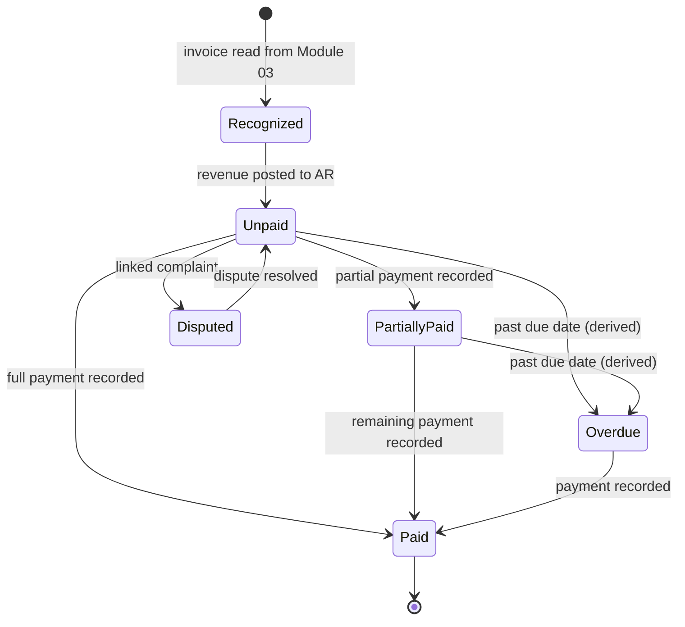
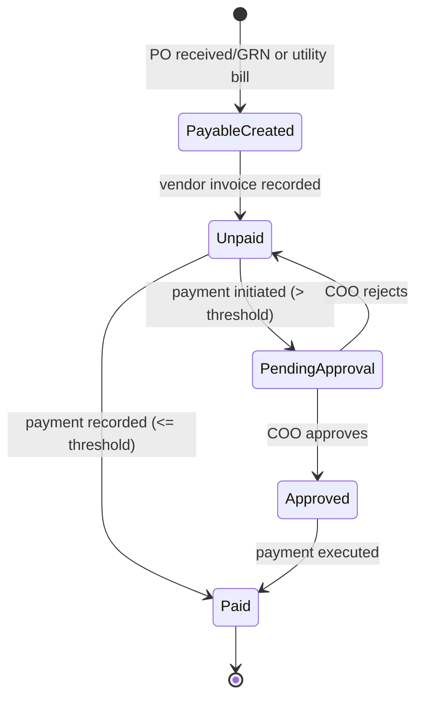
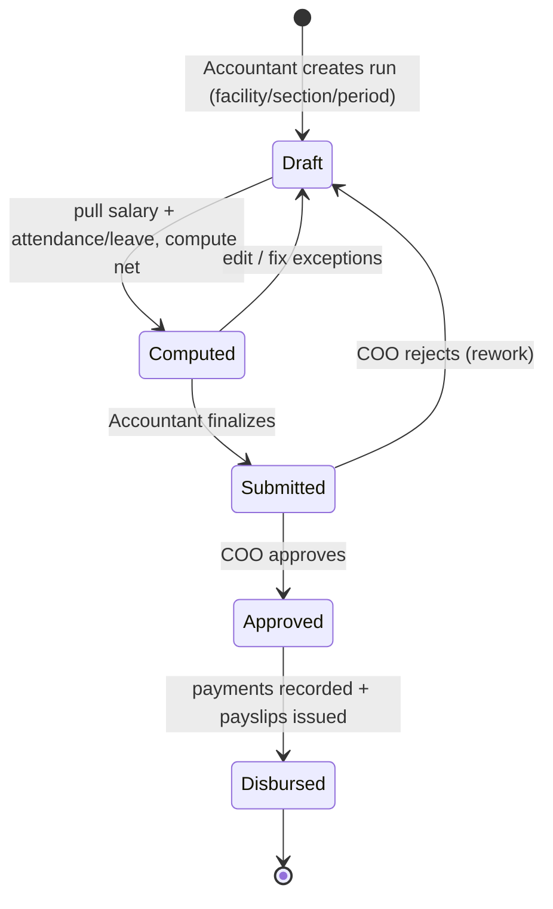
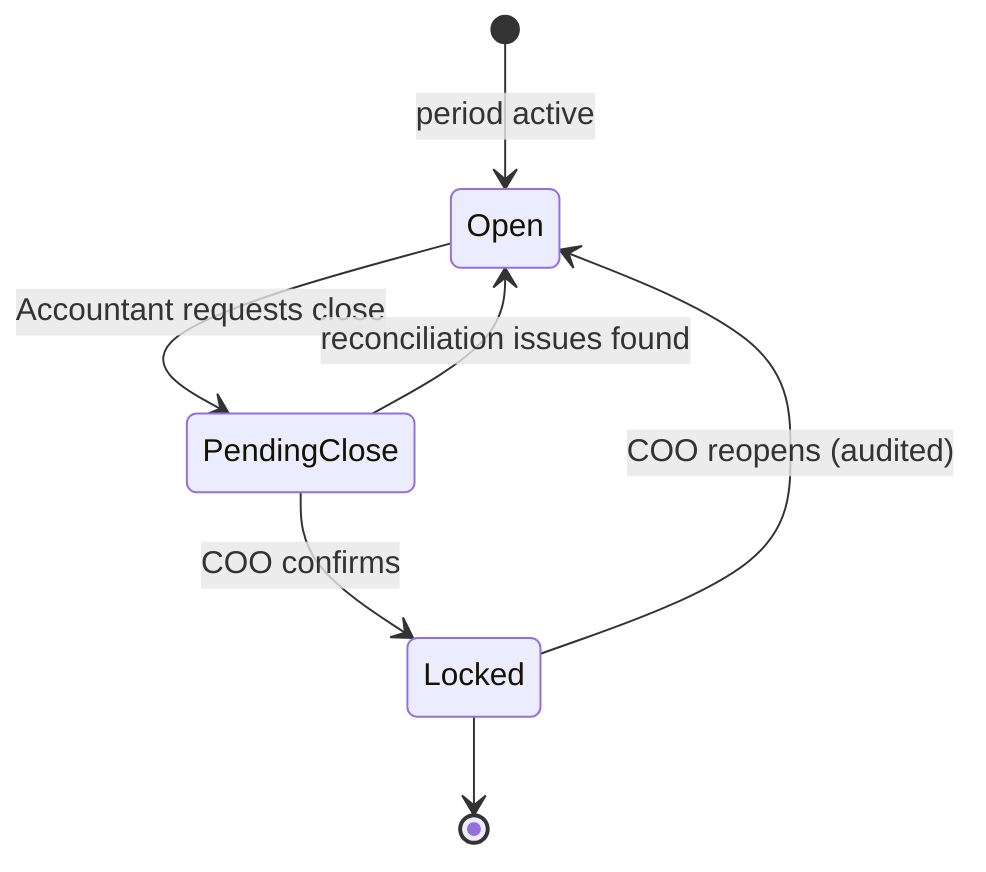

# Module 06 — Finance & Payroll

> **Status:** Draft v1 · **Owner:** BECS Analytics · **Module scope:** Revenue, Expenses, Payments, Payroll
>
> This spec **references** and must not contradict the [SSOT](../SSOT.md). Cross-cutting rules (approval matrix, scoping, numbering, business rules, NFRs) live there. This module is the **most under-specified** in the raw spec ("elaborate finance system with revenue and expenses"); the design below is an **industry-standard, pragmatic proposal**. Items requiring BECS stakeholder confirmation are flagged throughout and consolidated in [§11 Open Questions](#11-open-questions--assumptions).

---

## 1. Overview & Purpose

Finance & Payroll is the LIMS' **money ledger**. It does not originate most financial documents — it **recognizes, aggregates, settles, and reports** on financial events created upstream in other modules:

- **Revenue** flows in from **client invoices** issued by the Liaison Officer (Module 03 — Samples & Client).
- **Expenses (accounts payable)** flow in from **Purchase Orders** and **Utilities** (Module 02 — Inventory & Procurement), **calibration / equipment-repair POs** (Module 05 — Equipment & Traceability), and **payroll runs** (this module, sourced from Module 01 — Personnel).
- **Payments** record actual cash movement (incoming from clients, outgoing to vendors / utilities / staff) and drive **payment status** and **aging**.
- **Payroll** computes staff pay from the Personnel salary structure plus Attendance & Leave data, produces **payslips**, and disburses via approved **payroll runs**.

A **lightweight Chart of Accounts (CoA)** categorizes every financial event as revenue or expense for **P&L reporting** and a **monthly period close**. All financial reporting is **scoped per facility / section** ([SSOT §7](../SSOT.md#7-section--facility-scoping-rules)), and every disbursement of money respects **COO approval** ([SSOT §5](../SSOT.md#5-roles-designations--approval-matrix), [BR-1](../SSOT.md#12-global-business-rules-catalog)).

**Design intent:** this is an **operational finance/AR/AP + payroll** module, **not** a full double-entry general-ledger accounting package. It is deliberately scoped to what a lab needs to track money in/out and pay staff, with clean hooks to export to an external accounting system if BECS already runs one (see [§11](#11-open-questions--assumptions)).

---

## 2. Roles Involved

Authoritative role/approval definitions: [SSOT §5](../SSOT.md#5-roles-designations--approval-matrix). This module touches the following:

| Role | Responsibility in this module |
|---|---|
| **Accountant** | Primary operator. Records vendor invoices/AP, records incoming & outgoing payments, reconciles, maintains CoA, prepares payroll runs, generates financial reports. (Vendor registration & vendor-side invoice already assigned to Accountant in [SSOT §5](../SSOT.md#5-roles-designations--approval-matrix).) |
| **COO** | **Approving authority** for any **money disbursement**: payment runs above threshold, payroll runs, and period close ([BR-1](../SSOT.md#12-global-business-rules-catalog)). Has cross-scope financial visibility ([SSOT §7](../SSOT.md#7-section--facility-scoping-rules)). |
| **Operations Manager (OM)** | Operational oversight; cross-scope read of finance dashboards; may co-review payroll inputs (attendance exceptions). No disbursement authority. |
| **Liaison Officer (LO)** | **Originates client invoices** in Module 03 ([SSOT §5](../SSOT.md#5-roles-designations--approval-matrix), row "Client invoice"). Those invoices are the **revenue source** consumed (read-only) by this module. LO does not record payments here unless explicitly authorized (open question). |
| Sales & Marketing Officer | Prepares client quotations (Module 03); quotations are pre-revenue and informational here only. |
| Purchase Officer | Originates POs (Modules 02/05) and may co-record vendor invoices ([SSOT §5](../SSOT.md#5-roles-designations--approval-matrix)). POs are the AP source consumed here. |

> Tier-1 access (who can open the Finance module) and Tier-2 Function gating apply per [SSOT §6](../SSOT.md#6-authorization-model). Specific Finance Functions (e.g. `record-payment`, `run-payroll`, `close-period`) are proposed in [§9](#9-module-business-rules).

---

## 3. In-Scope / Out-of-Scope

### In scope

- Revenue recognition from **client invoices** (origin: Module 03); link revenue to **client** and **sample(s)**.
- **Accounts Receivable (AR):** receivables ledger, payment status, **aging buckets**.
- **Accounts Payable (AP):** vendor-invoice / PO-based payables, utilities payables, payroll payables; payment status.
- **Payments:** record incoming (client) and outgoing (vendor / utility / payroll) payments; allocate to invoices; update statuses.
- **Payroll:** payroll runs, per-employee computation (earnings, deductions, net pay), payslips, COO approval, disbursement.
- **Chart of Accounts (lightweight):** revenue & expense categories; mapping rules.
- **Period (monthly) close:** lock a financial period after reconciliation.
- **Financial dashboards & reports:** revenue vs expense, P&L summary, AR/AP, aging, payroll cost — scoped per facility/section.

### Out of scope (this build)

- Full **double-entry general ledger** with debit/credit journals, trial balance, balance sheet. (Lightweight single-purpose ledger only — [§11](#11-open-questions--assumptions).)
- **Tax computation & filing** (GST/sales tax, withholding, NTN/STN-based returns) — see open questions; fields captured, computation deferred pending confirmation.
- **Multi-currency** — assume **single currency PKR** unless BECS states otherwise ([§11](#11-open-questions--assumptions)).
- **Fixed-asset depreciation**, bank feed auto-reconciliation, and statutory provident-fund/EOBI/tax-slab engines (deferred; hooks only).
- Origination of client invoices/quotations (owned by Module 03) and PO origination (owned by Modules 02/05).

---

## 4. Feature List

| # | Feature | Description | Primary role |
|---|---|---|---|
| F-1 | **Revenue register** | Read-in client invoices from Module 03; recognize as revenue; link to client + sample(s); categorize via CoA revenue account. | Accountant |
| F-2 | **Accounts Receivable & aging** | Track each client invoice's outstanding balance, status, and aging bucket (0–30 / 31–60 / 61–90 / 90+ days). | Accountant |
| F-3 | **Incoming payment recording** | Record client payments (full/partial), allocate to one or more invoices, update AR status. | Accountant |
| F-4 | **Accounts Payable register** | Read-in POs (Modules 02/05) + utilities + payroll as payables; record vendor invoices against POs; track status. | Accountant |
| F-5 | **Outgoing payment recording** | Record vendor / utility / payroll payments; payments above threshold require COO approval before marked Paid. | Accountant → COO |
| F-6 | **Payroll run** | Create a monthly payroll run for a facility/section; compute per-employee gross, deductions, net from Personnel salary structure + Attendance/Leave. | Accountant |
| F-7 | **Payroll approval & disbursement** | COO approves payroll run; on approval, payroll posts as an expense and becomes a payable for disbursement. | COO |
| F-8 | **Payslip generation** | Produce per-employee PDF payslips for an approved run; visible to employee (Module 01 link). | Accountant / System |
| F-9 | **Chart of Accounts** | Maintain revenue & expense categories and mapping rules (e.g. PO category → expense account). | Accountant |
| F-10 | **Period (monthly) close** | Reconcile and lock a financial period per facility; locked periods are read-only. | Accountant → COO |
| F-11 | **Financial dashboards** | Revenue vs expense, P&L summary, AR/AP outstanding, payroll cost — scoped per facility/section. | Accountant / COO / OM |
| F-12 | **Financial reports / export** | P&L summary, AR aging, AP aging, payroll cost, payment register; export (PDF/CSV) for external accounting. | Accountant |
| F-13 | **Vendor invoice capture** | Record a vendor's invoice document/number/amount against a received PO (attachment via MinIO). | Accountant / Purchase Officer |

---

## 5. Workflows & State Transitions

### 5.1 Revenue & Accounts Receivable (client invoice → settled)

1. LO issues a **client invoice** in Module 03 (Invoice No per [SSOT §11](../SSOT.md#11-numbering--identifier-standards), e.g. `INV-LHR-2026-00045`).
2. Finance **recognizes** it as **Revenue**, mapping it to a CoA revenue account; it enters AR as **Unpaid**.
3. Accountant records **incoming payment(s)**; allocation reduces the outstanding balance.
4. Status advances **Unpaid → Partially Paid → Paid**; **Overdue** is a derived flag when past due date and not fully paid.
5. Disputed amounts may be flagged **Disputed** (links to a complaint in Module 03) and excluded from aging until resolved.



### 5.2 Accounts Payable & outgoing payment (PO/utility → paid)

1. A **PO** (Module 02 full/simplified path, or Module 05 calibration/repair) reaches **Received → GRN** ([SSOT §10](../SSOT.md#10-cross-cutting-workflows--state-machines)). Utilities follow the simplified path.
2. Accountant records the **vendor invoice** against the PO (number, amount, attachment) → payable enters AP as **Unpaid**.
3. Accountant initiates an **outgoing payment**. If amount **> approval threshold**, it routes to **COO** for approval ([BR-1](../SSOT.md#12-global-business-rules-catalog)); below threshold it may be recorded directly (threshold value is an open question).
4. On approval + execution, payable advances **Unpaid → (Approved) → Paid**; the expense is recognized against a CoA expense account.



### 5.3 Payroll run (compute → approve → disburse)

1. Accountant **creates a payroll run** for `{facility, section, period (month)}`.
2. System **computes** each active employee's pay from **salary structure** (Module 01) and **Attendance/Leave** (Module 01) — gross earnings, deductions (unpaid leave, advances, statutory placeholders), net pay.
3. Accountant reviews exceptions (missing attendance, unapproved leave) and finalizes the **draft run**.
4. Run is **submitted to COO**; COO **approves** or **rejects** ([BR-1](../SSOT.md#12-global-business-rules-catalog)).
5. On approval: payroll **posts as an expense**, becomes an **AP payable** (per employee), and **payslips** are generated. Disbursement is recorded as outgoing payment(s).



### 5.4 Monthly period close

1. Accountant verifies all revenue/expense for the month is recorded and reconciled.
2. Accountant requests **close** for `{facility, period}`; COO confirms.
3. Period is **Locked** — postings/edits are blocked (corrections require a reversing entry in the next open period). Reopen requires COO.



---

## 6. Data Entities & Fields

Module-specific entities. Cross-cutting entities (`AuditLog`, `Attachment`, `Approval`/`ApprovalStep`, `Signature`, `Sequence`, `Notification`) attach polymorphically per [SSOT §9](../SSOT.md#9-global-domain-model-erd). Every entity carries `facilityId`, `sectionId`, timestamps, and actor refs ([BR-5](../SSOT.md#12-global-business-rules-catalog), [BR-6](../SSOT.md#12-global-business-rules-catalog)). All monetary fields are PKR (single currency assumption — [§11](#11-open-questions--assumptions)).

The SSOT ERD already declares the finance backbone:
`INVOICE ||--o{ PAYMENT`, `INVOICE }o--|| REVENUE`, `PURCHASE_ORDER }o--|| EXPENSE`, `PAYROLL_RECORD }o--|| EXPENSE`. The entities below realize that backbone.

### 6.1 `Revenue`
| Field | Type | Notes |
|---|---|---|
| id | uuid/cuid | PK |
| invoiceId | FK → Invoice (Module 03) | source client invoice |
| clientId | FK → Client | for client-level reporting (blinding lifted post-decode/release) |
| sampleRefs | FK[] → Sample | linked sample(s)/report(s) the invoice bills |
| accountId | FK → ChartOfAccount | revenue category |
| amount | decimal(14,2) | PKR, gross of tax |
| taxAmount | decimal(14,2) | nullable; tax handling is an open question |
| recognizedOn | date | revenue recognition date |
| facilityId / sectionId | FK | scope |

### 6.2 `Receivable` (AR ledger view over invoices)
| Field | Type | Notes |
|---|---|---|
| invoiceId | FK → Invoice | one AR line per invoice |
| originalAmount | decimal(14,2) | |
| paidAmount | decimal(14,2) | running |
| outstanding | decimal(14,2) | derived |
| dueDate | date | from invoice terms (open: default credit days) |
| status | enum | `Unpaid · PartiallyPaid · Paid · Overdue · Disputed` |
| agingBucket | enum (derived) | `0-30 · 31-60 · 61-90 · 90+` |

### 6.3 `Payable` (AP ledger)
| Field | Type | Notes |
|---|---|---|
| id | uuid/cuid | PK |
| sourceType | enum | `PO · Utility · Payroll` |
| sourceRef | FK | PurchaseOrder / UtilityBill / PayrollRecord |
| vendorId | FK → Vendor | nullable for payroll/utility-by-meter |
| vendorInvoiceNo | string | vendor's own invoice number (for `PO`) |
| accountId | FK → ChartOfAccount | expense category |
| amount | decimal(14,2) | |
| dueDate | date | |
| status | enum | `Unpaid · PendingApproval · Approved · Paid · Rejected` |
| attachmentId | FK → Attachment | vendor invoice scan (MinIO) |

### 6.4 `Payment`
| Field | Type | Notes |
|---|---|---|
| id | uuid/cuid | PK |
| direction | enum | `Incoming · Outgoing` |
| method | enum | `Cash · BankTransfer · Cheque · Online` |
| amount | decimal(14,2) | |
| paidOn | date | server-authoritative ([BR-14](../SSOT.md#12-global-business-rules-catalog)) |
| reference | string | cheque/transaction no |
| allocations | json/relation | links to one or more Receivable or Payable lines |
| approvalId | FK → Approval | for outgoing > threshold ([BR-1](../SSOT.md#12-global-business-rules-catalog)) |

### 6.5 `PayrollRun`
| Field | Type | Notes |
|---|---|---|
| id | uuid/cuid | PK |
| runNo | string | `PAY-LHR-2026-06` (proposed; confirm format — [§11](#11-open-questions--assumptions)) |
| facilityId / sectionId | FK | scope |
| period | year-month | the payroll month |
| status | enum | `Draft · Computed · Submitted · Approved · Disbursed · Rejected` |
| approvalId | FK → Approval | COO ([BR-1](../SSOT.md#12-global-business-rules-catalog)) |
| grossTotal / deductionTotal / netTotal | decimal(14,2) | run totals |

### 6.6 `PayrollRecord` (per employee, per run)
| Field | Type | Notes |
|---|---|---|
| id | uuid/cuid | PK |
| payrollRunId | FK → PayrollRun | |
| userId | FK → User (Module 01) | |
| basicSalary | decimal(14,2) | from salary structure (Module 01 — open question on structure) |
| allowances | json | named earning lines |
| daysPresent / daysAbsent / unpaidLeaveDays | int | from Attendance/Leave (Module 01) |
| deductions | json | unpaid leave, advances, statutory placeholders |
| grossPay / netPay | decimal(14,2) | computed |
| payslipAttachmentId | FK → Attachment | generated PDF |

### 6.7 `SalaryStructure` (proposed; may live in Module 01 — confirm ownership)
| Field | Type | Notes |
|---|---|---|
| userId | FK → User | |
| basicSalary | decimal(14,2) | |
| allowances | json | house rent, conveyance, medical, etc. (structure TBC) |
| effectiveFrom / effectiveTo | date | versioned |

### 6.8 `ChartOfAccount`
| Field | Type | Notes |
|---|---|---|
| id | uuid/cuid | PK |
| code | string | e.g. `REV-TESTING`, `EXP-CHEMICALS`, `EXP-UTILITIES`, `EXP-PAYROLL`, `EXP-CALIBRATION` |
| name | string | |
| type | enum | `Revenue · Expense` |
| parentId | FK (self) | optional grouping |

### 6.9 `FinancialPeriod`
| Field | Type | Notes |
|---|---|---|
| facilityId | FK | per-facility close |
| period | year-month | |
| status | enum | `Open · PendingClose · Locked` |
| closedBy / reopenedBy | FK → User | audited ([BR-5](../SSOT.md#12-global-business-rules-catalog)) |

### 6.10 `UtilityBill` (bridge to Module 02 utilities)
| Field | Type | Notes |
|---|---|---|
| utilityType | enum | `Electricity · Gas · Telephone · Internet` |
| billingPeriod | string | |
| amount | decimal(14,2) | |
| dueDate | date | |
| → creates a `Payable` of `sourceType=Utility` | | |

---

## 7. Screens / Views

| Screen | Purpose | Primary role |
|---|---|---|
| **Finance Dashboard** | KPIs: revenue MTD/YTD, expense MTD/YTD, net, AR outstanding, AP outstanding, payroll cost — scoped/filterable by facility/section. | Accountant / COO / OM |
| **Revenue / AR Register** | List of recognized revenue & receivables; status, aging; drill to invoice → client → sample. | Accountant |
| **Aging Report (AR)** | Receivables by aging bucket and client. | Accountant / COO |
| **Accounts Payable Register** | All payables (PO / utility / payroll); status, due date; vendor-invoice capture. | Accountant |
| **Aging Report (AP)** | Payables by aging bucket and vendor. | Accountant / COO |
| **Record Payment** | Form to record incoming/outgoing payment and allocate to invoices/payables. | Accountant |
| **Payment Approvals** | Queue of outgoing payments / payroll runs awaiting COO approval. | COO |
| **Payroll Run** | Create run, view computed records, fix exceptions, submit. | Accountant |
| **Payroll Review/Approval** | COO review of a run with totals and per-employee breakdown. | COO |
| **Payslips** | Per-employee payslip list/PDF (also surfaced in Module 01 employee self-service). | Accountant / Employee |
| **Chart of Accounts** | Manage revenue/expense accounts and mapping rules. | Accountant |
| **Period Close** | Reconcile & lock monthly period. | Accountant / COO |
| **Reports & Export** | P&L summary, registers, payroll cost; PDF/CSV export. | Accountant |
| **Finance Logs** | Module audit-log view ([BR-5](../SSOT.md#12-global-business-rules-catalog)), server-side paginated. | Accountant / COO |

All list/log screens use server-side pagination/filtering; dashboards backed by indexed queries ([SSOT §13](../SSOT.md#13-non-functional-requirements)). Default visibility is own-section; COO/OM may switch scope where granted ([SSOT §7](../SSOT.md#7-section--facility-scoping-rules)).

---

## 8. User Stories with Gherkin Acceptance Criteria

### US-1 — Recognize client invoice as revenue
*As an Accountant, I want client invoices to appear as revenue and receivables so I can track what clients owe.*
```gherkin
Scenario: New client invoice becomes a receivable
  Given the Liaison Officer issued invoice "INV-LHR-2026-00045" in Module 03 for client "CLI-00123"
  When the invoice is read into Finance
  Then a Revenue record is created mapped to a Revenue chart-of-account
  And a Receivable line is created with status "Unpaid" and the invoice amount outstanding
  And the receivable is linked to client "CLI-00123" and the billed sample(s)
  And the record is stamped with the invoice's facility and section
```

### US-2 — Record a partial client payment
```gherkin
Scenario: Partial payment updates AR status and aging
  Given receivable for "INV-LHR-2026-00045" has outstanding 100000 PKR and status "Unpaid"
  When the Accountant records an incoming payment of 60000 PKR allocated to that invoice
  Then the outstanding becomes 40000 PKR
  And the status becomes "Partially Paid"
  And the aging bucket recalculates from the invoice due date
```

### US-3 — Outgoing vendor payment requires COO approval above threshold
```gherkin
Scenario: High-value payable routes to COO
  Given a payable for PO "PO-LHR-2026-00045" of 500000 PKR with status "Unpaid"
  And the approval threshold is configured below 500000 PKR
  When the Accountant initiates an outgoing payment
  Then the payable status becomes "Pending Approval"
  And an approval task is routed to the COO
  And the payment cannot be marked "Paid" until the COO approves
```

### US-4 — Compute a payroll run from attendance & salary
```gherkin
Scenario: Payroll run pulls salary and attendance
  Given active employees exist in section "Lahore Lab" with a salary structure
  And attendance and approved-leave data exist for June 2026
  When the Accountant creates a payroll run for facility "LHR", section "Lahore Lab", period "2026-06"
  Then each employee gets a PayrollRecord with basic salary, allowances, deductions, and net pay
  And unpaid-leave days reduce net pay
  And employees with missing attendance are flagged as exceptions
```

### US-5 — COO approves a payroll run before disbursement
```gherkin
Scenario: Payroll disbursement gated on COO approval
  Given a payroll run "PAY-LHR-2026-06" with status "Submitted"
  When the COO approves the run
  Then the run status becomes "Approved"
  And the payroll posts as an expense to the "EXP-PAYROLL" account
  And per-employee payables are created for disbursement
  And payslips are generated for each employee
```

### US-6 — Lock a financial period
```gherkin
Scenario: Locked period is read-only
  Given the financial period "2026-05" for facility "LHR" is "Locked"
  When the Accountant attempts to post a new payment dated in May 2026
  Then the system rejects the posting
  And advises recording a correction in the current open period
```

### US-7 — Scoped financial dashboard
```gherkin
Scenario: Section-scoped visibility
  Given the Accountant's session is scoped to section "Lahore Lab"
  When they open the Finance Dashboard
  Then only Lahore-Lab-scoped revenue, expense, AR and AP are shown
  And RYK-scoped figures are not visible
  But the COO can switch scope to view RYK or consolidated figures
```

---

## 9. Module Business Rules

These **reference** the global catalog ([SSOT §12](../SSOT.md#12-global-business-rules-catalog)) and add module-specific rules (`FBR-n`) consistent with it.

| Rule | Statement | Basis |
|---|---|---|
| **BR-1** | Any **money disbursement** (outgoing payment above threshold, payroll run, period reopen) requires **COO approval**. | [SSOT BR-1](../SSOT.md#12-global-business-rules-catalog) |
| **BR-5** | Every create/update/delete on a finance record writes an **immutable audit-log** entry. | [SSOT BR-5](../SSOT.md#12-global-business-rules-catalog) |
| **BR-6** | Every finance record is **scoped** to facility + section; cross-scope read requires explicit capability (COO/OM). | [SSOT BR-6](../SSOT.md#12-global-business-rules-catalog) |
| **BR-7** | Finance identifiers (payroll run no., payment ref) are **gap-free, unique, non-reusable**; Invoice No format is defined in [SSOT §11](../SSOT.md#11-numbering--identifier-standards). | [SSOT BR-7](../SSOT.md#12-global-business-rules-catalog) |
| **BR-12** | A resigned employee retains historical payroll records and is never hard-deleted; they are excluded from future payroll runs once non-active. | [SSOT BR-12](../SSOT.md#12-global-business-rules-catalog) |
| **BR-14** | Payment, recognition and payroll dates are **server-authoritative**; client-supplied times are not trusted for signed/approved records. | [SSOT BR-14](../SSOT.md#12-global-business-rules-catalog) |
| **FBR-1** | Revenue is recognized **only** from client invoices originated by the LO in Module 03 (Finance does not create client invoices). | module |
| **FBR-2** | A payment cannot allocate more than the outstanding balance of a receivable/payable; over-allocation is rejected. | module |
| **FBR-3** | An outgoing payment can only target a payable whose **PO is GRN-issued** (goods received) or whose **utility/payroll** source is finalized ([BR-11](../SSOT.md#12-global-business-rules-catalog)). | module |
| **FBR-4** | A **payroll run** is unique per `{facility, section, period}`; a second run for the same key requires the first to be voided (audited). | module |
| **FBR-5** | Payroll computation uses the salary structure **and** attendance/leave **effective for the run period** (time-anchored, in the spirit of [BR-13](../SSOT.md#12-global-business-rules-catalog)). | module |
| **FBR-6** | Postings into a **Locked** period are blocked; corrections post to the next open period. | module |
| **FBR-7** | Tax fields are **captured but not auto-computed** until tax handling is confirmed (see [§11](#11-open-questions--assumptions)). | module / open |

**Proposed Finance Functions** (Tier-2 gating, [SSOT §6](../SSOT.md#6-authorization-model)): `record-payment`, `approve-payment`, `run-payroll`, `approve-payroll`, `manage-coa`, `close-period`, `view-finance-crossscope`.

---

## 10. Dependencies & Integrations

| Direction | Module / system | Interface |
|---|---|---|
| **Inbound — revenue** | **Module 03 — Samples & Client** | Client invoices (Invoice No, amount, client, sample refs) → `Revenue` + `Receivable`. Complaints can flag invoices `Disputed`. |
| **Inbound — payables** | **Module 02 — Inventory & Procurement** | POs (full & simplified), Utilities, Vendor master, vendor invoices → `Payable`. |
| **Inbound — payables** | **Module 05 — Equipment & Traceability** | Calibration & equipment-repair POs (full path) → `Payable`. |
| **Inbound — payroll inputs** | **Module 01 — Personnel** | Active employees, designations, **salary structure**, **attendance & leave** → `PayrollRun`/`PayrollRecord`. |
| **Outbound — payslips** | **Module 01 — Personnel** | Generated payslips surfaced in employee self-service. |
| **Cross-cutting** | SSOT §9 engines | `Approval` (COO gates), `AuditLog`, `Attachment` (MinIO: vendor invoices, payslips), `Sequence` (numbering), `Notification` (approval/overdue alerts), `Signature`. |
| **Platform** | [SSOT §14](../SSOT.md#14-technology-stack--architecture-summary) | PostgreSQL+Prisma (RLS scoping), pg-boss (aging/overdue jobs, payroll compute), Recharts (dashboards), @react-pdf/renderer (payslips/reports). |
| **External (open)** | External accounting software | If BECS runs QuickBooks/Xero/SAP/local software, provide CSV/API export rather than duplicating GL — [§11](#11-open-questions--assumptions). |

---

## 11. Open Questions / Assumptions

> This module needs the **most stakeholder confirmation**. Defaults below are **assumptions** to unblock design; each must be confirmed with BECS.

### Open questions (require BECS confirmation)
| # | Question |
|---|---|
| OQ-1 | **Tax handling:** Are client invoices subject to **GST/sales tax** and/or **withholding tax**? At what rates? Should the system compute and report tax using **NTN/STN** (already captured for vendors in Module 02)? Are tax returns/challans in scope? |
| OQ-2 | **Salary structure:** What are the components (basic, house rent, conveyance, medical, allowances)? Are there statutory deductions — **income tax slabs, EOBI, Provident Fund, advances/loans**? Is pay monthly only? |
| OQ-3 | **Approval thresholds:** What PKR threshold triggers COO approval for an outgoing payment? Is there a tiered matrix (e.g. OM up to X, COO above)? Does **every** payment need approval, or only above a limit? |
| OQ-4 | **External accounting software:** Does BECS already use an accounting package? If so, is this module the system of record or a feeder (export only)? Preferred export format/API? |
| OQ-5 | **Multi-currency:** Any foreign-currency clients/vendors? (Default assumption: **none**.) |
| OQ-6 | **Credit terms / due dates:** Default client credit period (e.g. net-15/30)? Per-client overrides? Vendor payment terms? |
| OQ-7 | **Double-entry vs lightweight ledger:** Is a full GL (trial balance, balance sheet) required, or is the proposed revenue/expense categorization sufficient? |
| OQ-8 | **Who records client payments** — Accountant only, or also LO? Bank reconciliation needed? |
| OQ-9 | **Payroll run numbering** format and reset cadence (proposed `PAY-LHR-2026-06`). |
| OQ-10 | **Period close** ownership and reopen policy; fiscal year start month for YTD reporting. |
| OQ-11 | **RYK revenue:** RYK is an **on-site QC sub-lab** ([SSOT §4](../SSOT.md#4-organization-facilities--sections)) testing BECS's own products. Is RYK testing **billed as revenue** (internal cost transfer) or **internal/non-revenue**? This materially affects revenue reporting. |

### Working assumptions (unless BECS states otherwise)
| # | Assumption |
|---|---|
| A-1 | **Single currency PKR**; all monetary fields PKR. |
| A-2 | **Lightweight ledger** (revenue/expense categorization), **not** full double-entry GL. |
| A-3 | Tax fields **captured but not auto-computed** ([FBR-7](#9-module-business-rules)) pending OQ-1. |
| A-4 | **Monthly** payroll; one approved run per facility/section/period ([FBR-4](#9-module-business-rules)). |
| A-5 | Outgoing payments above a **configurable threshold** require COO approval; below may be recorded directly ([BR-1](../SSOT.md#12-global-business-rules-catalog), pending OQ-3). |
| A-6 | **Accountant** is the sole payment recorder; LO is read-only for revenue here (pending OQ-8). |
| A-7 | Salary structure stored as **basic + named allowances + deductions**, versioned by effective date (pending OQ-2). |
| A-8 | AR aging buckets: **0–30 / 31–60 / 61–90 / 90+** days from due date. |
| A-9 | Financial reporting is **facility/section-scoped** per [SSOT §7](../SSOT.md#7-section--facility-scoping-rules); COO/OM see consolidated. |
| A-10 | Module is a **feeder** to any external accounting software via export, not a replacement (pending OQ-4). |
